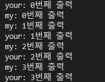
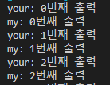

# 목표
자바의 멀티쓰레드 프로그래밍에 대해 학습하세요.

## 학습 내용
* [Process와 Thread](#Process와-Thread)
  * [Process란](#Process란)
  * [Thread란](#Thread란)
* [Thread](#Thread)
  * [Thread 선언과 실행](#Thread-선언과-실행)
    * [Runnable 인터페이스](#Runnable-인터페이스)
    * [Thread 객체](#Thread-객체)
    * [start, run, sleep, interrupt, join, yield](#start-run-sleep-interrupt-join-yield)
  * [Main Thread](#Main-Thread)
  * [데몬 Thread](#데몬-Thread)
  * [Thread 그룹](#Thread-그룹)
  * [Thread 상태](#Thread-상태)
  * [Thread 우선순위](#Thread-우선순위)
* [동기화](#동기화)
  * [synchronized 키워드](#synchronized-키워드)
  * [Lock 클래스](#Lock-클래스)
* [데드락](#데드락)
* [참고 사이트](#참고-사이트)
* [추가적 공부사항](#추가적-공부사항)

# Process와 Thread

## Process란
`Process`란 자기 자신의 메모리 영역과 runtime때 필요한 모든 리소스를 가진 실행환경을 말합니다. 쉽게 말해 우리가 프로그램이라고 하는 것을 실행하면 하나의 `Process`가 실행된다고 생각하시면 됩니다. `Process`는 실행될때, OS로부터 실행에 필요한 자원을 할당받습니다.

## Thread란
Thread란 독립적으로 관리될 수 있는 프로그래밍 된 명령어의 가장 작은 단위입니다. Process는 적어도 하나 이상의 Thread를 가지며, Thread는 Process의 리소스를 공유합니다.

# Thread 

## Thread 선언과 실행
`Thread`는 크게 `Runnable`인터페이스 혹은 `Thread` 클래스를 이용하여 선언할 수 있습니다.


## Thread 객체
`Thread` 객체를 상속한 후, `run`메서드를 오버라이딩하면 `Thread`를 선언할 수 있습니다.

```java
public class MyThread extends Thread {
    @Override
    public void run() {
        System.out.println("Sub thread!");
    }
}

public class Main {
    public static void main(String[] args) {
        Thread thread = new MyThread();
        thread.start();
    }
}
```

## Runnable 인터페이스
`Runnable` 인터페이스를 이용하여 선언할수도 있습니다.

`Runnable` 인터페이스의 `run` 메서드를 구현한 후, 이를 Thread 클래스 생성자의 파라미터로 전달합니다.

```java
public class MyThread implements Runnable {
    @Override
    public void run() {
        System.out.println("Sub thread!");
    }
}

public class Main {
    public static void main(String[] args) {
        Thread thread = new Thread(new MyThread());
        thread.start();
    }
}
```

## start, run, sleep, interrupt, join
`Thread` 클래스는 여러 메서드를 가지고 있습니다. 지금부터 각 메서드에 대해 알아보도록 하겠습니다.

1. start & run  
    `start` 메서드는 쓰레드를 실행시키는 메서드입니다(호출 스택을 하나 더 생성). `start`메서드를 호출하면 `Thread.State.NEW`상태가 되고 바로 실행되지는 않습니다. 또한 `start` 메서드는 단 한번만 호출될 수 있습니다. 2번이상 호출할 경우 `IllegalThreadStateException`이 발생합니다.

    `start`를 호출하지 않은 상태에서 `run`메서드를 호출할 경우, 이는 `main`쓰레드에서 단순히 메서드 호출을 할 뿐, 새로운 쓰레드로써 실행되지는 않습니다.

    `run` 메서드는 쓰레드가 실행된 후, 호출되는 실제 쓰레드의 동작을 담당하는 부분입니다. 필히 메서드를 오버라이딩하여 구현해야합니다.

    ```java
    public class MyThread implements Runnable {
        @Override
        public void run() { // 실제 쓰레드 실행시 작동되는 부분.
            System.out.println("Sub thread!");
        }
    }
    
    public class Main {
        public static void main(String[] args) {
            Thread thread = new Thread(new MyThread());
            thread.start(); // 쓰레드 실행.
        }
    }
    ```

1. sleep  
    `sleep` 메서드는 현재 쓰레드의 작동을 주어진 시간동안 미루는 메서드입니다. `sleep` 메서드로 인해 `Timed waiting`된 쓰레드는 외부에 의해 interrupted 될 수 있기때문에, `InterruptedException` 예외를 처리할 수 있도록 해야합니다.

    ```java
    public class MyThread implements Runnable {
        @Override
        public void run() { // 실제 쓰레드 실행시 작동되는 부분.
            try {
                Thread.sleep();
            } catch (InterruptedException e) {
                System.out.println("Interrupted!");
            }
            System.out.println("Sub thread!");
        }
    }
    
    public class Main {
        public static void main(String[] args) {
            Thread thread = new Thread(new MyThread());
            thread.start(); // 쓰레드 실행.
        }
    }
    ```

1. interrupt  
    `interrupt` 메서드는 쓰레드를 간섭하여, 현재 진행중인 일을 정지시킵니다.
    
    쓰레드를 간섭(interrupt)하기 위해선, 해당 쓰레드가 이를 지원해야합니다. 이를 지원하기위해선 `InterruptedException` 예외를 던지는 함수를 호출하고 있어야합니다. 앞서 이야기한 `sleep`는 이 예외를 던지고 있기때문에, `sleep`을 호출한 쓰레드는 간섭을 지원한다고 볼 수 있습니다. 

    ```java
    public class MyThread implements Runnable {
        @Override
        public void run() { // 실제 쓰레드 실행시 작동되는 부분.
            for (int i = 0; i < 10; i++) {
                System.out.println(i + "번째 출력");
                try {
                    Thread.sleep(5000);
                } catch (InterruptedException e) {
                    System.out.println("Interrupted!");
                    return; // 이 return이 없을경우, 'Interrupted!'를 출력하고 계속해서 남은 for 문을 실행하게 됩니다.
                }
            }
        }
    }

    public class Main {
        public static void main(String[] args) throws InterruptedException {
            Thread thread = new Thread(new MyThread());
            thread.start(); // 쓰레드 실행.
            Thread.sleep(13000); // 13초간 정지
            myThread.interrupt(); // myThread 정지
        }
    }
    ```

    만약 쓰레드가 `InterruptedException` 예외를 가진 메서드를 호출하지 않는다면, 해당 쓰레드는 무조건 `Thread.interrupted` 메서드를 주기적으로 호출해야합니다. 해당 메서드는 쓰레드가 간섭을 받을 경우 `true`를 반환하는 메서드입니다.

    ```java
    public class MyThread implements Runnable {
        @Override
        public void run() { // 실제 쓰레드 실행시 작동되는 부분.
            while(true) { // 계속해서 작동합니다.(무한루프)
                if(Thread.interrupted()) { // interrupt 메서드를 통해 간섭을 받을 경우 true를 반환합니다.
                    System.out.println("interrupted!");
                    break;
                }
            }
        }
    }

    public class Main {
        public static void main(String[] args) throws InterruptedException {
            Thread thread = new Thread(new MyThread());
            thread.start(); // 쓰레드 실행.
            Thread.sleep(5000); // 5초간 정지
            myThread.interrupt(); // myThread 정지
        }
    }
    ```

1. join  
    `join` 메서드는 현재 쓰레드를 호출되는 쓰레드가 완료될때까지 기다리게 하는 메서드입니다. overload된 메서드를 통해 특정 대기 시간을 줄 수도 있지만, 쓰레드는 OS에 의해 관리되기때문에, 주어진 특정 대기 시간동안만 정확하게 기다린다고 확신할 수는 없습니다.

    ```java
    public class MyThread implements Runnable {
        @Override
        public void run() { // 실제 쓰레드 실행시 작동되는 부분.
            for (int i = 0; i < 10; i++) {
                System.out.println(i + "번째 출력");
                try {
                    Thread.sleep(1000);
                } catch (InterruptedException e) {
                    System.out.println("Interrupted!");
                    return;
                }
            }
        }
    }

    public class Main {
        public static void main(String[] args) throws InterruptedException {
            Thread thread = new Thread(new MyThread());
            thread.start(); // 쓰레드 실행.
            System.out.println("Started Thread and call join");
            thread.join(); // MyThread가 끝날때까지 main쓰레드는 기다리게 됩니다.
            System.out.println("Finished");
        }
    }
    ```

1. yield  
    `yield` 메서드는 현재 쓰레드의 프로세서 사용을 포기하고 다른 쓰레드에게 프로세서를 양보하는 메서드입니다. 양보된 쓰레드는 대기 상태가 되어 추후 다시 스케줄러에 의해 호출됩니다. 하지만 이 동작은 플랫폼에 따라 다르게 동작할 수 있습니다.(비결정적 - 즉, 생각한 대로 되지 않을 수 있음)
    
    ```java
    public class YourThread implements Runnable {
        @Override
        public void run() { // 실제 쓰레드 실행시 작동되는 부분.
            for (int i = 0; i < 10; i++) {
                Thread.yield();
                System.out.println(Thread.currentThread().getName() + ": " + i + "번째 출력");
                try {
                    Thread.sleep(1000);
                } catch (InterruptedException e) {
                    System.out.println("Interrupted!");
                    return;
                }
            }
        }
    }

    public class MyThread implements Runnable {
        @Override
        public void run() { // 실제 쓰레드 실행시 작동되는 부분.
            for (int i = 0; i < 10; i++) {
                System.out.println(Thread.currentThread().getName() + ": " + i + "번째 출력");
                try {
                    Thread.sleep(1000);
                } catch (InterruptedException e) {
                    System.out.println("Interrupted!");
                    return;
                }
            }
        }
    }

    public class Main {
        public static void main(String[] args) {
            Thread thread = new Thread(new MyThread(), "my");
            Thread thread2 = new Thread(new YourThread(), "your");
            thread2.start();
            thread.start();
        }
    }
    ```
    
    < 첫번째 결과 >  
    

    < 두번째 결과 >  
    

## Main Thread
`main` 메서드의 작업을 수행하는 것도 쓰레드이며, 이를 main 쓰레드라고 합니다. 즉, 우리가 자바 프로그램을 실행하면 해당 프로그램의 process가 생기고 그 process 내부에 `main`메서드를 실행하는 쓰레드가 생기게되는 것입니다.

`main` 쓰레드가 종료되더라도, 다른 쓰레드가 계속해서 실행중이면, 해당 자바 프로그램은 종료되지 않고, 모든 쓰레드가 종료될때까지 실행됩니다.

## 데몬 Thread
`Daemon Thread`는 다른 쓰레드의 작업을 돕는 쓰레드를 의미합니다.

`Daemon Thread`는 일반적인 쓰레드와는 다르게, 모든 일반 쓰레드들이 종료되면, 자동적으로 종료됩니다. 

`Daemon Thread`를 만드는 방법은 만들어진 Thread의 `setDaemon` 메서드에 `true`를 주면됩니다. 또한 `Daemon Thread`가 만든 쓰레드들은 자동으로 데몬 쓰레드가 됩니다.

```java
public class ChildDeamonThread implements Runnable {
    @Override
    public void run() {
        for (int i = 0; i < 1000; i++) {
            System.out.println(i + "번째 출력 - child");
            try {
                Thread.sleep(1000);
            } catch (InterruptedException e) {
                System.out.println("Interrupted!");
                return;
            }
        }
    }
}

public class MyDeamonThread implements Runnable {
    @Override
    public void run() {
        Thread child = new Thread(new ChildDeamonThread());
        child.start(); // 해당 쓰레드는 자동으로 데몬 쓰레드가 됩니다.

        for (int i = 0; i < 1000; i++) {
            System.out.println(i + "번째 출력");
            try {
                Thread.sleep(1000);
            } catch (InterruptedException e) {
                System.out.println("Interrupted!");
                return;
            }
        }
    }
}

public class Main {
    public static void main(String[] args) throws InterruptedException {
        Thread myThread = new Thread(new MyDaemonThread());
        myThread.setDaemon(true); // 해당 쓰레드를 데몬쓰레드로 지정
        myThread.start();
        Thread.sleep(5000); // 5초후 main 쓰레드가 종료되면서, 데몬 쓰레드도 같이 종료됩니다.
    }
}
```

## Thread 그룹
`Thread Group`은 여러 쓰레드를 서로 관련된 쓰레드끼리 묶어서 관리할 목적으로 사용됩니다. 그룹화된 쓰레드는 하나의 객체로 취급할 수 있으며, 손쉽게 그룹화된 쓰레드들을 조작할 수 있습니다.

쓰레드 생성시, 그룹을 명시하지 않을 경우, 쓰레드를 생성한 부모 쓰레드의 그룹에 자동으로 속하게 됩니다.

```java
public class MyThread implements Runnable {
    @Override
    public void run() {
        for (int i = 0; i < 10; i++) {
            System.out.println(Thread.currentThread().getName() + ": " + i + "번째 출력");
            try {
                Thread.sleep(1000);
            } catch (InterruptedException e) {
                System.out.println("Interrupted!");
                return;
            }
        }
    }
}

public class Main {
    public static void main(String[] args) throws InterruptedException {
        ThreadGroup group = new ThreadGroup("ThreadGroup");
        Thread t1 = new Thread(group, new MyThread(), "First");
        Thread t2 = new Thread(group, new MyThread(), "Second");
        Thread t3 = new Thread(group, new MyThread(), "Third");

        t1.start();
        t2.start();
        t3.start();

        Thread.sleep(5000);
        group.interrupt(); // 그룹 객체의 interrupt를 호출하면 그룹 내 모든 쓰레드에 interrupt가 호출됩니다.
    }
}
```

## Thread 상태
`Thread`에 대한 상태는 여러가지가 존재하며, 모두 `JVM`에 의해 기록되고 관리됩니다. (자세한 내용은 Thread.State enum 클래스를 참고하시기 바랍니다.)

  
이미지출처: [Baeldung - Life Cycle of a Thread in Java](https://www.baeldung.com/java-thread-lifecycle)

- NEW - 쓰레드가 생성되었지만 아직 `start`메서드가 호출되지 않은 상태
- RUNNABLE - 쓰레드가 `JVM`에 의해 실행되고 있는 상태
- WAITING - 다른 쓰레드의 작업이 끝날때까지 대기중인 상태
- TIME_WAITING - 지정된 시간까지 다른 쓰레드의 작업이 수행되기를 기다리는 상태
- BLOCK - 쓰레드가 monitor lock을 기다리면서 차단된 상태
- TERMINATED - 쓰레드가 종료된 상태

## Thread 우선순위
각 쓰레드는 우선순위에 관한 정보를 가지고 있으며, 이를 통해 특정 쓰레드가 더 많은 시간동안 작업할 수 있도록 설정할 수 있습니다.

우선순위는 `getPriority`와 `setPriority` 메서드를 통해 관리할 수 있습니다.

우선순위의 값은 1부터 10까지이며, 숫자가 높을수록 우선순위도 높아집니다.

우선순위가 높다고 해당 쓰레드가 항상 먼저 실행되는 것은 아니며, 단지 상대적으로 다른 쓰레드보다 더 많이 선택될 수 있음을 의미합니다.

## 동기화
쓰레드들은 주로 필드 및 개체 참조 필드에 대한 접근을 공유하며 통신하게됩니다. 따라서 이러한 접근에 대한 제어권을 관리하지 않을 경우, 의도치 않은 결과가 발생할 수 있습니다.

잘못된 접근을 방지하기 위해 도입된 개념으로 `임계 영역(critical section)`과 `잠금(lock)`이 있습니다.

`임계 영역`이란, 여러 쓰레드가 동시에 접근해서는 안되는 공유 자원을 접근하는 코드부분을 의미합니다.

`잠금(락)`은 말그대로, 자원을 사용하고 있는 동안 해당 자원에 대한 접근을 차단하는 것을 의미합니다.

이렇게 임계역영과 lock을 통해 쓰레드간의 간섭을 막는 것을 `동기화(synchronization)`이라고 합니다.

## synchronized 키워드
`Java`에서는 `synchronized` 키워드를 통해 임계 영역을 지정할 수 있습니다. 

`synchronized` 키워드를 통한 임계 영역 설정은 멀티쓰레드 프로그램의 성능에 영향을 끼치게 되므로 최소한으로 설정하는 것이 성능이 좋습니다.

1. 메서드 전체  
    특정 메서드 전체에 임계 영역을 설정하기 위해선 메서드에 `synchronized` 키워드를 붙이면 됩니다. 이렇게 설정할 경우, 메서드가 호출된 시점부터 lock이 해당 쓰레드에게 주어지게 됩니다.

    ```java
    public synchronized void method() {
        // codes...
    }
    ```

2. 특정 영역  
    특정 영역에 한해 임계 영역을 설정하기 위해선 `synchronized` 키워드를 이용한 코드 블럭을 작성하면 됩니다. 이때, 참조 변수를 할당할 수 있으며, 이렇게 주어진 참조변수는 해당 코드 블럭안에서 lock됩니다.

    ```java
    public void method() {
        // codes...

        synchronized(참조 변수) {
            // codes...
        }

        /// codes...
    }
    ```

## Lock 인터페이스
`Lock` 인터페이스는 `java.util.concurrent` 패키지에서 제공되며 많은 concurrent 어플리케이션의 locking을 쉽게 지원합니다.

`Lock` 객체들은 `synchronized` 키워드를 통한 암시적 잠금과 매우 유사하게 작동합니다. 또한 `Condition` 객체들과 함께 사용함으로써, `wait`/`notify` 매커니즘을 지원합니다.

`Lock` 객체를 사용하는 이유는 lock을 획득하려는 요청을 취소할 수 있기때문입니다.

주요 메서드
- `lock`메서드 - 인스턴스에 잠금을 걸어둡니다.
- `tryLock`메서드 - 즉시 Lock 인스턴스에 잠금을 시도하고 성공 여부를 boolean타입으로 반환합니다.
- `lockInterruptibly`메서드 - 현재 쓰레드가 interrupted 상태가 아닐 때, Lock 인스턴스에 잠금을 건다. 현재 쓰레드가 interrupted 상태면 interruptedException을 발생시킵니다.
- `unlock` 메서드 - 인스턴스의 잠금을 해제합니다.

**Lock 객체를 사용할때는 `unlock` 메서드를 잊지 않도록 `try-catch-finally`형태로 작성하는 것을 추천합니다.**

`synchronized`와 `Lock`인터페이스를 구분짓는 키워드는 `공정성`입니다.  

여기서 공정성이란 모든 쓰레드가 자신의 작업을 수행할 기회를 공평하게 갖는 것을 의미합니다. 즉, 공정한 방법에선 모든 쓰레드들이 공평하게 lock을 획득할 수 있지만, 불공정한 방법에서는 특정 쓰레드가 대기열을 건너뛰어 lock을 획득하게 될 수도 있습니다. 이를 `경쟁 상태(race condition)`라고하며, 우선 순위가 계속 밀려 lock을 획득하지 못하는 상태를 `기아 상태(starvation)`라고 합니다.

따라서, `synchronized` 키워드를 사용하면 무조건 불공정한 상태가 되고, `Lock`인터페이스를 이용하면 생성자를 통해 공정 / 불공정을 선택할 수 있게됩니다.

`Lock` 인터페이스를 구현한, 구현체는 다음의 종류가 있습니다.

- `ReentrantLock` - 재진입이 가능한 lock 인터페이스 구현체입니다.
- `ReentrantReadWriteLock` - 읽기에는 공유적이고, 쓰기에는 배타적인 lock 인터페이스 구현체입니다.

그외 `Lock` 클래스
- `StampedLock` - `ReentrantReadWriteLock`에 낙관적인 lock 기능을 추가한 Lock 클래스입니다. **이 클래스는 `Lock`인터페이스를 구현하지 않았습니다.**

## 데드락
`Deadlock(교착 상태)`란, 둘 이상의 쓰레드가 lock을 획득하기 위해 대기할때, lock을 가진 쓰레드들도 다른 lock을 기다리면서 서로간에 block 상태에 놓이는 것을 말합니다. 

교착 상태에 빠지는 조건은 다음과 같습니다.
- 상호배제(Mutual exclusion): 프로세스들이 필요로 하는 자원에 대해 배타적인 통제권을 요구합니다.
- 점유대기(Hold and wait): 프로세스가 할당된 자원을 가진 상태에서 다른 자원을 기다립니다.
- 비선점(No preemption): 프로세스가 어떤 자원의 사용을 끝낼 때까지 그 자원을 뺏을 수 없습니다.
- 순환대기(Circular wait): 각 프로세스는 순환적으로 다음 프로세스가 요구하는 자원을 가지고 있습니다.

현재의 대부분 운영 체제들은 교착 상태를 막는 것이 불가능합니다. 따라서 각 운영 체제들은 자신들만의 방식으로 교착 상태에 대응합니다. 보통은 위 4가지 조건들 중 하나를 막는 방식으로 대응합니다.

## 참고 사이트
- [Oracle Document - Processes and Threads](https://docs.oracle.com/javase/tutorial/essential/concurrency/index.html)
- [https://sujl95.tistory.com/63](https://sujl95.tistory.com/63)
- [https://blog.naver.com/hsm622/222212364489](https://blog.naver.com/hsm622/222212364489)
- [https://www.notion.so/ac23f351403741959ec248b00ea6870e](https://www.notion.so/ac23f351403741959ec248b00ea6870e)

## 추가적 공부사항
- Condition 클래스
- Executor 인터페이스
- Atomic 변수
- Concurrent Collection
- Callable, Feature
- CompletableFuture