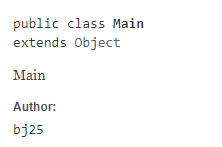
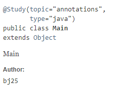

# 목표
자바의 애노테이션에 대해 학습하세요.

## 학습 내용
* [Annotations](#Annotations)
  * [annotation이란](#annotation이란)
  * [annotation의 기초](#annotation의-기초)
  * [annotation을 정의하는 방법](#annotation을-정의하는-방법)
  * [meta-annotation](#meta-annotation)
    * [@Retention](#Retention)
    * [@Target](#Target)
    * [@Documented](#Documented)
    * [@Inherited](#Inherited)
    * [@Repeatable](#Repeatable)
  * [Built-in annotations](#Built-in-annotations)
    * [@Override](#Override)
    * [@SuppressWarnings](#SuppressWarnings)
    * [@Deprecated](#Deprecated)
    * [@SafeVarargs](#SafeVarargs)
    * [@FuntionalInterface](#FuntionalInterface)
    * [@Native](#Native)
  * [annotation 프로세서](#annotation-프로세서)
    * [custom annotation processor](#custom-annotation-processor)
* [참고 사이트](#참고-사이트)

# Annotations

## annotation이란
`annotation`은 메타 데이터(metadata)의 한 형태로써, 프로그램에 대한 데이터를 제공합니다. **`annotation`은 그 자체로는 어떤한 조작도 이루어지지 않으며 프로그램에 대한 영향도 없습니다.**

`annotation`은 여러 용도로 다음과 같이 사용됩니다.

- Information for the compiler(컴파일러를 위한 정보) - 컴파일러는 `annotation`을 통해 에러를 감지하거나 경고를 숨길 수 있습니다.
- Compile-time and deployment-time processing(컴파일시점및 배포시점에서의 처리) - 소프트웨어 툴들이 `annotation` 정보를 이용하여 코드를 생성할 수 있습니다.
- Runtime Processing(런타임시점에서의 처리) - 몇몇 `annotation`은 런타임에 확인되어 처리될 수 있습니다.

`java.lang` 및 `java.lang.annotation` 패키지에는 `Java SE`가 제공하는 여러 `annotation`들이 정의되어 있습니다.

## annotation의 기초
`annotation`은 `@`을 이용하여 표시할 수 있습니다. `@` 기호는 컴파일러에게 다음에 오는 것이 `annotation`이라고 지시해줍니다. `annotation`의 기본 형태는 다음과 같습니다.

```java
public class Main extends Parent {

  @Override // 대표적인 `annotation`인 오버라이드 annotation입니다.
  void method() {
    // codes...
  }
}
```

`annotation`은 또한 `element`들을 가질 수 있습니다. `element`들은 이름을 가질 수도 있고 안 가질 수도 있으며, 각 `element`는 값을 가집니다.

```java
@Study(type="java", topic="annotation")
public class Main {
}
```

만약 `annotation`에 `value`라는 이름의 단 하나의 `element`만 있다면, `element`의 이름을 생략할 수 있습니다.

```java
public class Main {

  @SuppressWarnings("unchecked") // SuppressWarnings annotation은 value라는 단 한개의 요소만 가집니다.
  void method() {
    // codes..
  }
}
```

만약 `annotation`에 어떤한 `element`도 존재하지 않는다면, `annotation` 사용시, `()`을 생략할 수 있습니다.

```java
public class Main extends Parent {

  @Override // Override annotation은 어떤 요소도 가지고 있지 않습니다.
  void method() {
    // codes...
  }
}
```

## annotation을 정의하는 방법
`annotation`을 정의하는 방법은 `interface`를 정의하는 방법과 매우 비슷합니다.

```java
public @interface Study {
  String type() default "";
  String topic() default "";
}
```

위와 같이 `interface` 키워드에 `@`기호를 붙여주면 `annotation`을 정의할 수 있게됩니다. `annotation`의 각 요소는 마치 `method`를 정의하는것처럼 작성됩니다. 또한 `annotation`정의시 기본값이 필요한 경우, `default` 키워드를 이용하여 기본값을 정의할 수 있습니다.

## meta-annotation
`meta-annotation`이란 다른 `annotation`에 사용될 수 있는 `annotation`을 의미합니다. 

`java.lang.annotation` 패키지에는 다양한 `meta-annotation`이 정의되어 있습니다.

## @Retention
`@Retention`은 `@Retention`가 표시된(marked) 어노테이션이 어떻게 저장될지 지정하는 어노테이션입니다. `RetentionPolicy`라는 `enum`값을 요소로 가지고 있습니다.

- `RetentionPolicy.SOURCE` - 표시된 어노테이션은 소스 레벨에서만 유지되며, 컴파일러로부터는 무시됩니다.
- `RetentionPolicy.CLASS` - 표시된 어노테이션은 컴파일러에 의해 컴파일 타임에 유지되지만, `JVM`으로부터는 무시됩니다.
- `RetentionPolicy.RUNTIME` - 표시된 어노테이션은 `JVM`에 의해 유지되며, 런타임 환경에서 사용이 가능합니다.

```java
@Retention(RetentionPolicy.RUNTIME) // Retention은 RetentionPolicy가 RUNTIME으로 지정되어 있습니다.
public @interface Retention {
    /**
     * Returns the retention policy.
     * @return the retention policy
     */
    RetentionPolicy value();
}
```

## @Target
`@Target`은 `@Target`가 표시된 어노테이션이 어떤 자바 요소에만 적용이 가능한지 제한을 표시하기위한 메타 어노테이션입니다. `ElementType`라는 `enum`값을 요소로 가지고 있습니다.

- `ElementType.ANNOTATION_TYPE` - `annotation`타입에만 적용할 수 있습니다.
- `ElementType.CONSTRUCTOR` - 생성자에만 적용할 수 있습니다.
- `ElementType.FIELD` - 필드 혹은 property에만 적용할 수 있습니다.
- `ElementType.LOCAL_VARIABLE` - 지역 변수에만 적용할 수 있습니다.
- `ElementType.METHOD` - 메서드에만 적용할 수 있습니다.
- `ElementType.PACKAGE` - 패키지 선언에서만 적용할 수 있습니다.
- `ElementType.PARAMETER` - 메서드의 파라미터에서만 적용할 수 있습니다.
- `ElementType.TYPE` - 클래스 요소(`class`, `interface`, `enum`, `@interface`)에만 적용할 수 있습니다.

```java
@Target({ ElementType.TYPE })
public @interface Study {
  String type() default "";
  String topic() default "";
}

@Study(topic = "annotations", type = "java")
public class Main {

  @Study(topic = "annotations", type = "java") // 컴파일 에러가 발생합니다.
  void method();
}
```

## @Documented
`@Documented`은 `Javadoc`과 같은 툴을 사용할때, 문서내에 `@Documented`가 표시된 어노테이션이 사용되는 곳에서 표시되도록하는 메타 어노테이션입니다.

**기본적으로 `Javadoc`에는 `annotation`이 표기되지 않습니다. 따라서 특정 `annotation`이 문서에 표기되기를 바라면 필히 해당 어노테이션에 `@Documented`를 선언해야합니다.**

아래와 같이 `@Documented` 어노테이션이 없을경우, Main 클래스에 사용되었지만, `javadoc`에는 표기가 되지 않습니다.

```java
public @interface Study {
  String type() default "";
  String topic() default "";
}

@Study(topic = "annotations", type = "java")
public class Main {

}
```



하지만 아래와 같이 `@Documented` 어노테이션을 선언할 경우, Main 클래스의 문서에 어노테이션이 표기됩니다.

```java
@Documented
public @interface Study {
  String type() default "";
  String topic() default "";
}

@Study(topic = "annotations", type = "java")
public class Main {

}
```



## @Inherited
`@Inherited`은 `@Inherited`가 표시된 어노테이션이 상속될 수 있음을 나타냅니다. 기본적으로 어노테이션은 상속되지 않습니다. 따라서 `@Inherited`를 이용하면 자식 클래스에서 해당 어노테이션이 없을 경우, 부모 클래스의 해당 어노테이션을 이용하도록 합니다. 

## @Repeatable
`@Repeatable`은 `Java 8`에서 소개되었으며, 해당 어노테이션이 표시된 어노테이션이 같은 사용처에 여러번 사용될 수 있음을 나타냅니다.

`Java 8` 이전에는 여러개의 값을 어노테이션을 통해 정의하기 위해선 아래와 같이 했습니다.

```java
@Schedules({@Schedule(day = Day.MON), @Schedule(day = Day.FRI)}) // 또는 @Schedules(day = {Day.MON, Day.FRI})
void scheduledTask() {
  // codes 
}
```

하지만 `Java 8`이후부터 위의 코드를 `@Repeatable`을 이용해 다음과 같이 작성할 수 있습니다.
```java
@Schedule(day = Day.MON)
@Schedule(day = Day.FRI)
void scheduledTask() {
  // codes 
}
```

`@Repeatable`을 사용하기 위해선 다음과 같이 어노테이션을 선언해야합니다.

1. `container annotation`을 선언합니다. `container annotation`란 어노테이션 배열을 value로 가지는 어노테이션을 말합니다.
    
    ```java
    @Documented
    @Target({ ElementType.METHOD })
    @Retention(RetentionPolicy.RUNTIME)
    public @interface Schedules {
        Schedule[] value();
    }
    ```

2. `@Repeatable`을 사용하는 어노테이션에 `@Repeatable`선언 및 `container annotation`을 값으로 넘깁니다.  

    ```java
    @Repeatable(Schedules.class) // repeatable 선언 및 container annotation을 넘겨줍니다.
    @Documented
    @Target({ ElementType.METHOD })
    @Retention(RetentionPolicy.RUNTIME)
    public @interface Schedule {
        Day day();
    }
    ```

## Built-in annotations
앞서 언급했듯이, 자바에서 제공하는 기본 어노테이션이 있습니다. 이를 알아두고 적절히 사용할 수 있도록 합니다.

## @Override
`@Override`은 자식 클래스의 메서드가 부모 클래스의 메서드를 재정의했음을 표시해주는 어노테이션입니다. 이를 이용하면 `override`를 해야할 것을 `overload`하는 실수를 줄일 수 있습니다.

## @SuppressWarnings
`@SuppressWarnings`은 컴파일러가 알려주는 경고 메세지를 숨길 수 있도록 표시하는 어노테이션입니다. 컴파일러의 경고 메세지는 많은 경우 도움이 되지만, 때때로 방해가 될 때도 있습니다. (예를 들면, 사용의 안정성이 보장된 경우지만 경고를 표시하는 경우) 이러한 경우 `@SuppressWarnings`을 이용하여 경고메세지를 숨길 수 있습니다.

`@SuppressWarnings`이 받는 원소의 값은 사용하는 `IDE` 및 `Compiler`에 따라 다를 수 있습니다. (참고: [What is the list of valid @SuppressWarnings warning names in Java?](https://stackoverflow.com/questions/1205995/what-is-the-list-of-valid-suppresswarnings-warning-names-in-java))

하지만 다음과 같이 흔하게 사용되는 것은 대부분 공통적인 부분이니 외워두시면 편리합니다.

- `unchecked` - 확인되지 않은 작동(operation)과 관련된 경고를 숨깁니다.
- `unused` - 사용하지 않는 코드 및 불필요한 코드와 관련된 경고를 숨깁니다.
- `rawtypes` - 원시 유형 사용법과 관련된 경고를 숨깁니다.
- `deprecation` - deprecated된 기능 사용시 나타나는 경고를 숨깁니다.

## @Deprecated
`@Deprecated`는 프로젝트가 발전됨에 따라, 특정 기능을 더 이상 사용하지 않기를 바랄 때 사용되는 어노테이션입니다. 자바는 버전 호환성을 중요하게 생각하는 언어인 만큼, 어떤 특정 기능에 대해 쉽게 제거를 할 수가 없습니다. 하지만 언젠가 제거되어야 하고 사용자에게 더 이상의 이용을 금지하고 싶을 때, `@Deprecated`를 이용하여 알려줄 수 있습니다. `@Deprecated`를 사용하면 컴파일러가 해당 기능을 이용하는 개발자에게 경고 메시지를 보여주게 됩니다. 또한 이 어노테이션을 이용하면 `Javadoc`에서 `@Deprecated` 태그를 보여줌으로써 사용자에게 알릴 수도 있습니다.

`@Deprecated`는 `Java 9`에서 `since`과 `forRemoval`이라는 요소가 추가되었습니다. 

- `since` - 해당 기능이 `deprecated`된 버전을 명시합니다.
- `forRemoval` - 해당 기능이 다음 버전때 제거될 경우, `true`로 설정하여 사용자에게 정보를 제공하도록 합니다.

## @SafeVarargs
`@SafeVarargs`는 가변인자와 제네릭을 함께 사용할때, 잘못된 사용을 경고하기 위한 경고메세지를 숨기는데 사용되는 어노테이션입니다.

보다 자세한 내용은 [Baeldung - Java @SafeVarargs Annotation](https://www.baeldung.com/java-safevarargs)을 참고하시면 좋습니다.

## @FuntionalInterface
`@FuntionalInterface`은 `Single Abstract Method(SAM) interface`가 `lambda`로 사용될때, 선택적으로 사용할 수 있습니다.

`@FuntionalInterface`을 사용하면, `lambda`로 사용되는 `SAM interface`에 메서드가 추가될때, 컴파일 에러를 발생시킵니다. 따라서 이러한 실수를 쉽게 방지할 수 있습니다.

## @Native
`@Native`는 `Java 8`에서 소개되었습니다. 이 어노테이션은 필드에서만 사용가능하며, 해당 필드가 `native code`로부터 참조되는 상수라는 것을 표시합니다.

## annotation 프로세서
`Annotation Processing`은 `javac`에 있는 빌드 툴로써, **컴파일 시점**에 어노테이션에 대한 여러 다양한 처리를 위해 사용됩니다. 

`Java 5`에서부터 사용이 가능했으며, `Java 6`에서 유용한 API들이 제공되었습니다.

개별 커스텀한 `annotation processor`를 등록할 수 있으며, 특정 자바 코드나 혹은 컴파일된 바이트코드의 어노테이션에 대한 처리를 할 수 있습니다. 이를 통해, 새로운 자바 파일을 만들어 낼 수 있고, 생성된 자바코드는 자동으로 컴파일됩니다. **단, 기존에 존재하는 코드에 대해 변경은 불가능합니다.**

## custom annotation processor

1. 커스텀 `Processor`를 생성하기위해선 `AbstractProcessor`를 상속받아야합니다.  

    **Custom annotation processor의 경우, 무조건 빈생성자가 있어야합니다.**

    ```java
    public class CustomProcess extends AbstractProcessor {
      @Override
      public boolean process(Set<? extends TypeElement> annotations, RoundEnvironment roundEnv) {
        // codes...
      }
    }
    ```

    `AbstractProcessor`에는 다음의 4가지 중요 메소드가 있습니다.

    - `init(ProcessingEnvironment processingEnv)` - annotation processing툴에 의해 실행되는 메서드입니다. 이 메서드를 통해 초기화 작업을 할 수 있습니다.
    - `process(Set<? extends TypeElement> annotations, RoundEnvironment roundEnv)` - `main`메서드같은 기능을 하는 메서드입니다. 이 메서드를 통해 원하는 로직을 구성할 수 있고, 구성된 로직이 실행됩니다.
    - `getSupportedAnnotationTypes()` - 현재 annotation processor가 담당할 annotation을 등록하는 메서드입니다. **이 메서드를 통해 반환되는 값은 `FQN(Fully qualified name)`이어야 합니다.** 이 메서드는 `@SupportedAnnotationTypes`로 대체할 수 있습니다.
    - `getSupportedSourceVersion()` - 사용할 자바 버전을 지정하는 메서드입니다. 이 메서드는 `@SupportedSourceVersion`로 대체할 수 있습니다.

2. custom annotation processor 등록하기  

    직접 만든 `annotation processor`는 `javac`에 등록이 되어야합니다. 이를 위해서는 `.jar` 파일을 제공해야합니다. 또한 이 `.jar`파일은 커스텀 코드뿐만 아니라 `META-INF/services`에 `javax.annotation.processing.Processor`라는 특별한 파일을 포함해야합니다.

    `javax.annotation.processing.Processor` 파일은 프로세서에 대한 `FQN`을 리스트로 가지고 있어야합니다.

    앞의 사항을 모두 만족하면, `javac`가 buildpath에서 자동적으로 `javax.annotation.processing.Processor`파일을 감지하고 커스텀 annotation processor를 등록합니다.

3. 예제  

    그럼 지금부터 간단한 `annotation process`를 만들어 보도록 하겠습니다. 만들 Processor는 어노테이션이 붙은 클래스의 get메서드들을 이용해서 DTO 클래스를 만들어줍니다.

    1. 시작에 앞서 준비 사항은 다음과 같습니다.

        - Annotation 및 Processor를 정의할 모듈
        - Processor를 사용할 모듈
        - Google의 `auto-service` 라이브러리 - 자동으로 `javax.annotation.processing.Processor`파일을 만들어줍니다. [[참고 - Google/AutoService](https://github.com/google/auto/tree/master/service)]
        - JavaPoet 라이브러리 - `.java` 파일을 손쉽게 만들어주는 라이브러리입니다.[[참고 - JavaPoet](https://github.com/square/javapoet)]
    
    2. Annotation 정의
    
        ```java
        public @
        ```
    
    3. 


## 참고 사이트
- [Oracle - Annotations](https://docs.oracle.com/javase/tutorial/java/annotations/)
- [Baeldung - Overview of Java Built-in Annotations](https://www.baeldung.com/java-default-annotations)
- [Baeldung - Java Annotation Processing and Creating a Builder](https://www.baeldung.com/java-annotation-processing-builder)
- [Hannes Dorfmann - Annotation Processing 101](http://hannesdorfmann.com/annotation-processing/annotationprocessing101/)