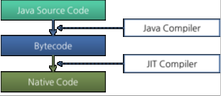
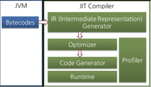
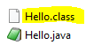

# 목표
자바 소스 파일(.java)을 JVM으로 실행하는 과정 이해하기.

## 학습 내용
* [JVM](#JVM)
  * [JVM이란](#JVM이란)
  * [JVM의 구성 요소](#JVM의-구성-요소)
    * [Class Loaders](#Class-Loaders)
      * [Bootstrap Class Loader](#Bootstrap-Class-Loader)
      * [Extension Class Loader](#Extension-Class-Loader)
      * [System Class Loader](#System-Class-Loader)
      * [Class Loader 동작 방식](#Class-Loader-동작-방식)
    * [Run-Time Data Areas](#Run-Time-Data-Areas)
      * [Method Area](#Method-Area)
      * [Heap Area](#Heap-Area)
      * [Stack Area](#Stack-Area)
      * [PC Registers](#PC-Registers)
      * [Native method stacks](#Native-method-stacks)
    * [Execution Engine](#Execution-Engine)
      * [Interpreter](#Interpreter)
      * [JIT Compiler](#JIT-Compiler)
        * [JIT 컴파일러란](#JIT-컴파일러란)
        * [JIT 컴파일러 동작 방식](#JIT-컴파일러-동작-방식)
      * [Garbage Collector](#Garbage-Collector)
    * [Java Native Interface](#Java-Native-Interface)
    * [Native Libraries](#Native-Libraries)
* [JDK와 JRE](#JDK와-JRE)
  * [JDK란](#JDK란)
  * [JRE란](#JRE란)
* [컴파일 및 실행](#컴파일-및-실행)
  * [컴파일이란](#컴파일이란)
  * [자바코드를 컴파일해보자](#자바코드를-컴파일해보자)
  * [자바코드를 실행하는 방법](#자바코드를-실행하는-방법)
* [바이트코드](#바이트코드)
  * [바이트코드란](#바이트코드란)
  * [바이트코드 보는법](#바이트코드-보는법)
    * `javap` 명령어
    * `-p` 옵션
    * `-c` 옵션
    * `-v` 옵션
* [참고사이트](#참고사이트)

# JVM

## JVM이란
`Java Virtual Machine(JVM)`은 자바 프로그램을 실행하는 가상 머신의 구현체입니다.

`JVM`은 바이트코드를 해석하고 클래스 정보를 메모리 영역에 저장하며, 이를 실행합니다.

`JVM`을 통해 자바 프로그램은 플랫폼에 종속적이지 않고 실행될 수 있습니다.

## JVM의 구성 요소
`JVM`은 다음과 같이 구성됩니다.
- 클래스 로더 시스템
- 실행 시점 메모리 영역
- 실행 엔진
- JNI(자바 네이티브 인터페이스)
- 네이티브 메소드 라이브러리

  
[이미지 출처: PlatformEngineer.com](https://medium.com/platform-engineer)

## Class Loaders
- `Class Loader`는 런타임 중에 Java 클래스를 JVM에 동적으로 로드합니다.
- `Class Loader`는 `JRE`의 구성 요소중 하나입니다.
- `Class Loader` 덕분에 `JVM`에서는 자바 프로그램을 실행하기위해 파일 시스템을 알 필요가 없습니다.
- `Class Loader`가 특정 클래스가 필요할때만 클래스를 로드하기때문에, 모든 클래스를 한번에 다 메모리에 로드할 필요가 없습니다.
- `Class Loader`에는 `Boostrap Class Loader`, `Extension Class Loader`, `System Class Loader`가 있습니다.

## Bootstrap Class Loader
- `Bootstrap Class Loader`는 모든 클래스 로더 인스턴스의 상위 클래스 역할을 담당합니다.
- `Bootstrap Class Loader`는 JDK 내부 클래스들(`$JAVA_HOME/jre/lib`에 위치한 코어 라이브러리)을 로드하는 역할을 담당합니다.
- `Bootstrap Class Loader`는 `core JVM`의 구성 요소이며 네이티브 코드로 작성되어 있습니다. 따라서 각 다른 플랫폼마다 구현이 다를 수 있습니다.

## Extension Class Loader
- `Extension Class Loader`는 `Bootstrap Class Loader`의 하위 클래스입니다.
- `Extension Class Loader`는 standard core 자바 클래스들의 확장 클래스들을 로드하는 역할을 담당합니다.
- `Extension Class Loader`는 `$JAVA_HOME/lib/ext` 폴더 또는 `java.ext.dirs`이라는 시스템 변수로 등록된 폴더의 확장 클래스들을 로드합니다.
- `Extension Class Loader`로 로드된 클래스들은 해당 플랫폼에서 실행되는 모든 어플리케이션에서 사용이 가능합니다.

## System Class Loader
- `System Class Loader`는 모든 application 레벨의 클래스들을 `JVM`으로 로드합니다.
- `System Class Loader`는 `classpath`로 주어진 경로에서 파일들을 로드합니다.
- `System Class Loader`는 `Extension Class Loader`의 하위 클래스입니다.

## Class Loader 동작 방식
`Class Loader`는 `JVM`으로부터 클래스를 요청받으면 해당 클래스에 대한 정의를 찾아서 런타임에 이를 로드하도록 합니다.  
해당 클래스를 찾을때는 패키지명을 포함한 클래스 이름인 `Fully Qualified Class Name`을 사용합니다.

`java.lang.ClassLoader.loadClass()` 메서드가 클래스 정의를 런타임에 로드하는 역할을 합니다. 만약 클래스가 로드되어 있지 않다면, 재귀적으로 부모 클래스 로더에 이를 위임합니다.

만약 클래스를 로드하지 못한다면 `NoClassDefFoundError`나 `ClassNotFoundException`이 발생하게 됩니다.

## Run-Time Data Areas
`JVM`은 자바 프로그램을 실행하기 위해 여러 다양한 메모리 영역을 정의하고 있습니다.

## Method Area
- `Method Area(메서드 영역)`는 `PermGen(permanent generation space)`이라고 불리며 `JVM`이 시작할때 생성됩니다.
- `Method Area`는 모든 클래스에 대해 필드나 메서드 데이터, 생성자, 런타임 constant pool등과 같은 구조를 저장합니다.
- `Method Area`는 `JVM`의 쓰레드가 이 영역을 공유합니다.
- `Method Area`를 위한 메모리는 연속적일 필요가 없습니다.

## Heap Area
- `Heap Area(힙 영역)`는 모든 클래스 인스턴스 및 배열에 메모리를 할당하기 위해 사용됩니다.
- `GC(Garbage Collector)`가 각 인스턴스의 힙 메모리를 회수합니다.
- `Heap Area`는 다음의 3가지로 구성됩니다.
    - Eden Space: `Young Generation space`의 한 부분이며, 객체를 생성할때 `JVM`이 이 영역으로부터 메모리를 할당합니다.
    - Survivor Space: `Young Generation space`의 한 부분이며, `Garbage Collector`의 `minor GC` 단계때 회수되지 않은 객체를 가지고 있습니다.
    - Tenured Space: `Old Generation space`라고 불리기도 하며, 오랜 기간 회수되지 않은 객체를 가지고 있습니다. 보통 `Young Generation object`에 대해 임계값이 설정되고, 설정된 임계값을 충족한 객체들이 이 공간으로 이동됩니다.
- `Heap Area`는 `JVM`이 시작될때 생성됩니다.
- `JVM`의 모든 쓰레드가 이 영역을 공유합니다.
- `Heap Area`를 위한 메모리는 연속적일 필요가 없습니다.

## Stack Area
- `Stack Area(스택 영역)`는 데이터를 프레임으로써 저장하며, 각 프레임은 지역 변수, 부분 결과값, 중첩된 메소드 호출을 저장합니다.
- `JVM`은 새 쓰레드를 생성할때마다 `Stack Area`를 생성합니다.
- `Stack Area`는 각 쓰레드별로 분리됩니다. (공유되지 않습니다.)
- 각 stack을 `Stack Frame` 혹은 `Activation record`라고 부릅니다. 각 프레임은 다음의 요소를 가지고 있습니다.
    - Local Variable Array: 모든 지역 변수 및 메소드의 파라미터를 가지고 있습니다.
    - Operand Stack: 중간 계산 결과를 저장하기위해 사용됩니다.
    - Frame Data: 부분 결과값을 저장하는데 사용되거나 메서드에 대한 값을 반환합니다. 예외 발생시, Exception 테이블에 대한 참조를 저장하는데 사용됩니다.
- `Stack Area`를 위한 메모리는 연속적일 필요가 없습니다.

## PC Registers
- `PC Registers`는 현재 실행중인 명령어의 주소를 저장합니다.
- 만약 현재 실행중인 명령어가 네이티브 메서드의 일부인 경우, 값이 정의되지 않습니다.
- `JVM`의 각 쓰레드는 별도의 `PC Register`를 가지고 있습니다. 

## Native method stacks
> 네이티브 메서드란 자바 언어 이외의 언어로 작성된 메서드를 의미합니다.

- `Native method stacks`는 `C stacks`라고 알려져있기도 하며, 네이티브 메서드에 대한 정보를 저장합니다.
- 네이티브 메서드가 기계 코드로 컴파일될때마다, `Native method stack`을 통해 네이티브 메서드의 상태를 추적합니다.

## Execution Engine
- `Execution Engine`은 메모리 영역에 있는 정보를 이용하여 명령을 실행합니다.

## Interpreter
- `Interpreter(인터프린터)`는 바이트코드를 한줄 한줄 읽어가며 실행합니다.
- `Interpreter`는 하나의 메서드가 여러번 호출될때, 매번 새롭게 해석하기때문에 느린 단점이 있습니다. 이러한 단점을 완화하기위해 `JIT Compiler`를 사용합니다.

## JIT Compiler

## JIT 컴파일러란
- `Just-In-Time(JIT) Compiler`는 인터프리터(`Interpreter`)의 단점을 보완하기 위해 도입된 컴파일러입니다. 
- `JIT Compiler`는 자주 호출되는 메서드의 바이트코드를 적절한 런타임 시점에 네이티브 코드(기계어)로 변환해주는 컴파일러입니다.
- 네이티브 코드는 캐시에 보관되기 때문에, 한번 컴파일된 코드는 계속 빠르게 수행될 수 있습니다.
- `JIT 컴파일러`는 또한 자바 프로그램의 최적화를 담당합니다.

      
    [이미지 출처 - NaverD2](https://d2.naver.com/helloworld/1230)

## JIT 컴파일러 동작 방식
JIT 컴파일러는 자주 호출되는 메서드를 파악하여, 바이트코드를 일단 중간 단계의 표현인 IR(Intermediate Representation)로 변환하고, 변환된 IR에 대한 최적화를 수행한 후, 네이티브 코드를 생성합니다. 이렇게 생성된 네이티브 코드는 캐시에 저장되며, 추후 재호출시 바로 네이티브 코드를 실행합니다.

  
[이미지 출처 - NaverD2](https://d2.naver.com/helloworld/1230)

> 보다 자세한 내용은 [Naver D2 - JVM Internal](https://d2.naver.com/helloworld/1230)를 참고하시길 바랍니다.

## Garbage Collector
- `Garbage Collector`는 메모리의 관리를 담당합니다.
- `Garbage Collector`는 `Heap Area`를 관측하며, 사용되는 객체와 사용되지 않는 객체를 식별합니다. 이후, 사용되지 않는 객체를 제거합니다.
- `Garbage Collector`는 데몬 쓰레드입니다.
    > 데몬 쓰레드는 다른 일반 쓰레드(데몬 쓰레드가 아닌 쓰레드)의 작업을 돕는 보조적인 역할을 수행하는 쓰레드를 의미합니다.

## Java Native Interface
- `Java Native Interface(JNI)`는 자바 코드와 네이티브 라이브러리사이에서 interface로 작동합니다.
- Java 언어만으로 어플리케이션을 만들기 힘들때, `JNI`를 이용하여 `JVM`에서 네이티브 코드를 실행할 수 있습니다. 또한 반대로 네이티브 메서드가 `JVM`에서 실행되는 코드를 호출할 수 있습니다.

## Native Libraries
- `Native Libraries`는 플랫폼 별 라이브러리이며, 네이티브 메서드 구현을 가지고 있습니다.

# JDK와 JRE

## JDK란
- `Java Development Kit(JDK)`는 자바 프로그램을 실행, 디버깅, 컴파일, 개발하기 위한 환경 및 툴을 제공합니다.
- `JDK`의 핵심 구성요소는 다음과 같습니다.
    - JRE
    - 개발 도구(Development Tools)
        > 각 Development Tool에 대한 내용은 [Baeldung - JDK](https://www.baeldung.com/jvm-vs-jre-vs-jdk#jdk) 에서 참고하실 수 있습니다.

## JRE란
- `Java Runtime Environment(JRE)`은 자바 어플리케이션을 실행하기위한 소프트웨어 컴포넌트 번들입니다.
- `JRE`의 핵심 구성요소는 다음과 같습니다.
    - `JVM` 구현체
    - 자바 프로그램을 실행하기위해 요구되는 클래스들
    - 속성 파일들(Property Files)  
    > `JRE`의 핵심 구성요소에 대한 보다 자세한 내용은 [Baeldung - JRE](https://www.baeldung.com/jvm-vs-jre-vs-jdk#jre) 에서 참고하실 수 있습니다.

# 컴파일 및 실행

## 컴파일이란
컴파일이란 고급언어로 작성된 코드를 컴퓨터가 이해할 수 있도록 기계어로 변환하는 과정을 의미합니다.

`Java`에서는 `.java`파일에 작성된 코드를 컴파일 하여 `JVM`이 읽을 수 있는 `.class`파일로 변환시킵니다.

## 자바코드를 컴파일해보자
자바 코드를 컴파일 하기 위해선 우선 `JDK`를 설치해야합니다. 설치후, `bin` 폴더에 가면 `javac.exe` 파일을 볼 수 있습니다. 이 실행 파일이 바로 자바 컴파일러입니다.

```java
// Hello.java
public class Hello {
    public static void main(String[] args) {
        System.out.println("Hello World!");
    }
}
```

위와 같이 `Hello.java`파일에 코드를 작성후, 해당 파일이 있는 곳에 터미널을 열고, `javac 파일명.java` 명령어를 사용하면 컴파일이 됩니다.  

```cmd
javac Hello.java
```

그리고 다시 폴더를 열어보면 `Hello.java`가 컴파일된 `Hello.class`파일이 생긴 것을 볼 수 있습니다.

 

## 자바코드를 실행하는 방법
앞서 컴파일된 `.class`파일을 실행하는 방법은, 해당 파일이 있는 곳에서 터미널을 열고 `java 클래스명` 명령어를 사용하면 실행이 됩니다.

```cmd
> java Hello

Hello World!
```

만약 `Could not find or load main class 클래스이름` 이라는 에러가 나올경우 다음의 경우를 의심해야합니다.

1. 클래스 이름  
    : `java` 명령어 사용 시 클래스명이 정확히 일치해야 합니다.(대소문자 모두 일치해야 합니다.)
    ```cmd
    # java hello -> 이름이 일치하지 않기때문에 에러가 나옵니다.
    
    java Hello
    ```
2. 파일 확장자 작성  
    : `java` 명령어 사용 시 `.class`라는 확장자를 붙여서는 안됩니다.
    ```cmd
    # java Hello.class -> 확장자를 작성하였기 때문에 에러가 나옵니다.
    
    java Hello
    ```
3. 패키지 이름  
    : 패키지를 명시하였다면, `.class` 파일은 패키 지명과 동일한 디렉터리 구조에 존재해야 하며, `java` 명령어 사용 시 패키지명을 모두 붙인 `Fully Qualified Class Name`을 사용해야 합니다.
    ```cmd
    # Hello.java 에 package com.example.demo; 이라고 패키지를 정의한 경우,
    # Hello.class 파일이 com/example/demo 에 존재하고 있어야합니다.
    # 명령어는 최상위 폴더에서 실행해야합니다. 즉, com의 상위 폴더에서 실행해야합니다.

    # java Hello -> Fully Qualified Class Name이 아니기 때문에 에러가 나옵니다.

    java com.example.demo.Hello
    ```
4. 클래스패스  
    : 만약 시스템 변수에 클래스 패스를 지정해둔 상태라면, `java` 명령어 사용 시 `-classpath` 옵션을 이용하여 클래스 패스를 재정의 해줘야 합니다.
    ```cmd
    java -classpath . Hello
    ```

# 바이트코드

## 바이트코드란
`바이트코드(Bytecode)`란 특정 하드웨어가 아닌 가상 컴퓨터에서 돌아가는 실행 프로그램을 위한 이진 표현법을 의미합니다.

컴파일되어 만들어진 `바이트코드`는 특정 하드웨어의 기계 코드(네이티브코드)를 만드는 컴파일러의 입력으로 사용되거나, 가상 컴퓨터에서 바로 실행됩니다.

`Java`에서는 `.class` 파일이 컴파일되어 만들어진 `바이트코드`를 가지고 있습니다. 이 바이트코드는 `JVM`에 의해 해석되고 실행됩니다.

## 바이트코드 보는법
컴파일된 `.class`를 통해 바이트코드를 보는 방법은 `JDK`에서 제공하는 `javap` 명령어를 이용하는 것입니다.

한번 예제를 통해 보도록 하겠습니다. 우선 아래와 같이 `Hello.java`에 코드를 작성합니다.

```java
package com.example.demo;

public class Hello {
    private int number = 10;

    public static void main(String[] args) {
        System.out.println("Hello World!");
    }

    public void print() {
        System.out.println("public Print - Number: "+this.number);
    }

    private void privatePrint() {
        System.out.println("private Print - Number: "+this.number);
    }
}
```

1. `javap` 명령어  
    ```cmd
    javap Hello.class
    ```

    위와 같이 기본 `javap` 명령어를 사용하면 아래와 같이 출력됩니다.

    기본 `javap` 명령어는 컴파일된 클래스의 최소 구성을 보여주며, `private` 타입의 정보는 출력하지 않습니다.

    ```cmd
    Compiled from "Hello.java"
    public class com.example.demo.Hello {
    public com.example.demo.Hello();
    public static void main(java.lang.String[]);
    public void print();
    }
    ```

2. `-p` 옵션  
`-p` 옵션을 사용하면 모든 클래스와 멤버가 출력됩니다.

    ```cmd
    javap -p Hello.class
    ```

    결과
    ```cmd
    Compiled from "Hello.java"
    public class com.example.demo.Hello {
    private int number;
    public com.example.demo.Hello();
    public static void main(java.lang.String[]);
    public void print();
    private void privatePrint();
    }
    ```

3. `-c` 옵션  
`-c` 옵션을 사용하면, 자바 클래스에 대해 전체 디스어셈블(disassemble)이 가능합니다.

    ```cmd
    javap -c Hello.class
    ```

    결과
    ```cmd
    Compiled from "Hello.java"
    public class com.example.demo.Hello {
    public com.example.demo.Hello();
        Code:
        0: aload_0
        1: invokespecial #1                  // Method java/lang/Object."<init>":()V
        4: aload_0
        5: bipush        10
        7: putfield      #2                  // Field number:I
        10: return

    public static void main(java.lang.String[]);
        Code:
        0: getstatic     #3                  // Field java/lang/System.out:Ljava/io/PrintStream;
        3: ldc           #4                  // String Hello World!
        5: invokevirtual #5                  // Method java/io/PrintStream.println:(Ljava/lang/String;)V
        8: new           #6                  // class com/example/demo/Hello
        11: dup
        12: invokespecial #7                  // Method "<init>":()V
        15: astore_1
        16: aload_1
        17: invokevirtual #8                  // Method print:()V
        20: return

    public void print();
        Code:
        0: getstatic     #3                  // Field java/lang/System.out:Ljava/io/PrintStream;
        3: new           #9                  // class java/lang/StringBuilder
        6: dup
        7: invokespecial #10                 // Method java/lang/StringBuilder."<init>":()V
        10: ldc           #11                 // String public Print - Number:
        12: invokevirtual #12                 // Method java/lang/StringBuilder.append:(Ljava/lang/String;)Ljava/lang/StringBuilder;
        15: aload_0
        16: getfield      #2                  // Field number:I
        19: invokevirtual #13                 // Method java/lang/StringBuilder.append:(I)Ljava/lang/StringBuilder;
        22: invokevirtual #14                 // Method java/lang/StringBuilder.toString:()Ljava/lang/String;
        25: invokevirtual #5                  // Method java/io/PrintStream.println:(Ljava/lang/String;)V
        28: return
    }
    ```


4. `-v` 옵션  
`-v` 옵션을 사용하면 디스어셈블(disassemble)뿐만 아니라 메서드에 대한 스택 크기 및 인수와 같은 자세한 정보가 출력됩니다.

    ```cmd
    javap -v Hello.class
    ```

    결과
    ```cmd
    Compiled from "Hello.java"
    public class com.example.demo.Hello
    minor version: 0
    major version: 52
    flags: ACC_PUBLIC, ACC_SUPER
    Constant pool:
    #1 = Methodref          #16.#29        // java/lang/Object."<init>":()V
    #2 = Fieldref           #6.#30         // com/example/demo/Hello.number:I
    #3 = Fieldref           #31.#32        // java/lang/System.out:Ljava/io/PrintStream;
    #4 = String             #33            // Hello World!
    #5 = Methodref          #34.#35        // java/io/PrintStream.println:(Ljava/lang/String;)V
    #6 = Class              #36            // com/example/demo/Hello
    #7 = Methodref          #6.#29         // com/example/demo/Hello."<init>":()V
    #8 = Methodref          #6.#37         // com/example/demo/Hello.print:()V
    #9 = Class              #38            // java/lang/StringBuilder
    #10 = Methodref          #9.#29         // java/lang/StringBuilder."<init>":()V
    #11 = String             #39            // public Print - Number:
    #12 = Methodref          #9.#40         // java/lang/StringBuilder.append:(Ljava/lang/String;)Ljava/lang/StringBuilder;
    #13 = Methodref          #9.#41         // java/lang/StringBuilder.append:(I)Ljava/lang/StringBuilder;
    #14 = Methodref          #9.#42         // java/lang/StringBuilder.toString:()Ljava/lang/String;
    #15 = String             #43            // private Print - Number:
    #16 = Class              #44            // java/lang/Object
    #17 = Utf8               number
    #18 = Utf8               I
    #19 = Utf8               <init>
    #20 = Utf8               ()V
    #21 = Utf8               Code
    #22 = Utf8               LineNumberTable
    #23 = Utf8               main
    #24 = Utf8               ([Ljava/lang/String;)V
    #25 = Utf8               print
    #26 = Utf8               privatePrint
    #27 = Utf8               SourceFile
    #28 = Utf8               Hello.java
    #29 = NameAndType        #19:#20        // "<init>":()V
    #30 = NameAndType        #17:#18        // number:I
    #31 = Class              #45            // java/lang/System
    #32 = NameAndType        #46:#47        // out:Ljava/io/PrintStream;
    #33 = Utf8               Hello World!
    #34 = Class              #48            // java/io/PrintStream
    #35 = NameAndType        #49:#50        // println:(Ljava/lang/String;)V
    #36 = Utf8               com/example/demo/Hello
    #37 = NameAndType        #25:#20        // print:()V
    #38 = Utf8               java/lang/StringBuilder
    #39 = Utf8               public Print - Number:
    #40 = NameAndType        #51:#52        // append:(Ljava/lang/String;)Ljava/lang/StringBuilder;
    #41 = NameAndType        #51:#53        // append:(I)Ljava/lang/StringBuilder;
    #42 = NameAndType        #54:#55        // toString:()Ljava/lang/String;
    #43 = Utf8               private Print - Number:
    #44 = Utf8               java/lang/Object
    #45 = Utf8               java/lang/System
    #46 = Utf8               out
    #47 = Utf8               Ljava/io/PrintStream;
    #48 = Utf8               java/io/PrintStream
    #49 = Utf8               println
    #50 = Utf8               (Ljava/lang/String;)V
    #51 = Utf8               append
    #52 = Utf8               (Ljava/lang/String;)Ljava/lang/StringBuilder;
    #53 = Utf8               (I)Ljava/lang/StringBuilder;
    #54 = Utf8               toString
    #55 = Utf8               ()Ljava/lang/String;
    {
    public com.example.demo.Hello();
        descriptor: ()V
        flags: ACC_PUBLIC
        Code:
        stack=2, locals=1, args_size=1
            0: aload_0
            1: invokespecial #1                  // Method java/lang/Object."<init>":()V
            4: aload_0
            5: bipush        10
            7: putfield      #2                  // Field number:I
            10: return
        LineNumberTable:
            line 3: 0
            line 4: 4

    public static void main(java.lang.String[]);
        descriptor: ([Ljava/lang/String;)V
        flags: ACC_PUBLIC, ACC_STATIC
        Code:
        stack=2, locals=2, args_size=1
            0: getstatic     #3                  // Field java/lang/System.out:Ljava/io/PrintStream;
            3: ldc           #4                  // String Hello World!
            5: invokevirtual #5                  // Method java/io/PrintStream.println:(Ljava/lang/String;)V
            8: new           #6                  // class com/example/demo/Hello
            11: dup
            12: invokespecial #7                  // Method "<init>":()V
            15: astore_1
            16: aload_1
            17: invokevirtual #8                  // Method print:()V
            20: return
        LineNumberTable:
            line 7: 0
            line 9: 8
            line 10: 16
            line 11: 20

    public void print();
        descriptor: ()V
        flags: ACC_PUBLIC
        Code:
        stack=3, locals=1, args_size=1
            0: getstatic     #3                  // Field java/lang/System.out:Ljava/io/PrintStream;
            3: new           #9                  // class java/lang/StringBuilder
            6: dup
            7: invokespecial #10                 // Method java/lang/StringBuilder."<init>":()V
            10: ldc           #11                 // String public Print - Number:
            12: invokevirtual #12                 // Method java/lang/StringBuilder.append:(Ljava/lang/String;)Ljava/lang/StringBuilder;
            15: aload_0
            16: getfield      #2                  // Field number:I
            19: invokevirtual #13                 // Method java/lang/StringBuilder.append:(I)Ljava/lang/StringBuilder;
            22: invokevirtual #14                 // Method java/lang/StringBuilder.toString:()Ljava/lang/String;
            25: invokevirtual #5                  // Method java/io/PrintStream.println:(Ljava/lang/String;)V
            28: return
        LineNumberTable:
            line 14: 0
            line 15: 28
    }
    SourceFile: "Hello.java"
    ```

## 참고사이트
* [Wikipedia - 바이트코드](https://ko.wikipedia.org/wiki/%EB%B0%94%EC%9D%B4%ED%8A%B8%EC%BD%94%EB%93%9C)
* [Naver D2 - JVM Internal](https://d2.naver.com/helloworld/1230)
* [뉴욕피자 - JVM Architecture란?](https://yeon-kr.tistory.com/112)
* [Baeldung - Class Loaders in Java](https://www.baeldung.com/java-classloaders)
* [Baeldung - Difference Between JVM, JRE, and JDK](https://www.baeldung.com/jvm-vs-jre-vs-jdk)
* [Baeldung - View Bytecode of a Class File in Java](https://www.baeldung.com/java-class-view-bytecode)