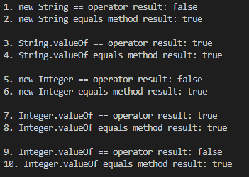

# 목표
자바의 프리미티브 타입, 변수 그리고 배열을 사용하는 방법을 익힙니다.

## 학습 내용
* [데이터 타입](#데이터-타입)
  * [Primitive 타입이란?](#1-primitive-타입이란)
  * [Reference 타입이란?](#2-reference-타입이란)
* [리터럴 이란](#리터럴-이란)
* [변수](#변수)
  * [선언](#1-선언)
  * [초기화](#2-초기화)
  * [종류](#3-종류)
  * [스코프](#4-스코프)
  * [라이프 타임](#5-라이프-타임)
* [타입변환, 캐스팅 그리고 타입 프로모션](#타입변환-캐스팅-그리고-타입-프로모션)
  * [타입 변환](#1-타입-변환)
  * [타입 프로모션](#2-타입-프로모션promotion)
  * [캐스팅](#3-캐스팅casting)
* [배열에 대해서](#배열에-대해서)
  * [1차 배열](#1-1차-배열)
  * [2차 배열](#2-2차-배열)
* [타입 추론](#타입-추론)
* [var 타입이란?](#var-타입이란)
* [참고사이트](#참고사이트)

### 데이터 타입

#### 1. **Primitive 타입이란?**  
Primitive 타입은 자바 언어에 내장된 기본 유형을 의미합니다.  
Primitive 타입에는 다음의 종류가 있습니다.  

|  |타입  |크기  |표현 범위|기본 값|
|---------|---------|---------|---------|---------|
|논리형|boolean|1 byte|true, false|false|
|정수형|byte|1 byte|-128 ~ 127|0|
|정수형|short|2 byte|-32,768 ~ 32,767|0|
|정수형|int|4 byte|-2,147,483,648 ~ 2,147,483,647|0|
|정수형|long|8 byte|-9,223,372,036,854,775,808 ~ 9,223,372,036,854,775,807|0L|
|실수형|float|4 byte|±(1.40 * 10<sup>-45</sup> ~ 3.40 * 10<sup>38</sup>)|0.0F|
|실수형|double|8 byte|±(4.94 * 10<sup>-324</sup> ~ 1.79 * 10<sup>308</sup>|0.0|
|문자형|char|2 byte (유니코드)|유니코드 ( 0 ~ 65535)|'\u0000'|

>**주의사항**
>1. 실수형은 정확한 값이 아닌 근사치를 표현하기 때문에, 소수점자리에서 오차가 생기는 경우가 있습니다. 따라서 금액 계산과 같이 정확한 값이 필요한 경우 `float` 이나 `double`을 사용해서는 안됩니다.
>2. 문자형을 빈 문자로 초기화 하고 싶으면 공백을 무조건 입력해야합니다.  
>

#### 2. **Reference 타입이란?**  
* 앞서 보았던 Primitive 타입이 아닌 타입이 모두 참조형 타입입니다.
* 데이터는 `힙(Heap)` 메모리에 저장되고, Reference 타입은 값이 저장된 주소값을 가집니다.
* `null` 값을 가질 수 있습니다.
* Reference 타입은 주소값을 가지고 있기때문에, 비교연산시 주의를 기울여야 합니다.
```java
public static void main(String[] args) {
    String s1 = new String("a");
    String s2 = new String("a");

    String s3 = String.valueOf("a");
    String s4 = String.valueOf("a");

    Integer n1 = new Integer(1);
    Integer n2 = new Integer(1);

    Integer n3 = Integer.valueOf(1);
    Integer n4 = Integer.valueOf(1);

    Integer n5 = Integer.valueOf(12345);
    Integer n6 = Integer.valueOf(12345);

    System.out.println("1. new String == operator result: "+(s1 == s2));
    System.out.println("2. new String equals method result: "+(s1.equals(s2)));
    System.out.println();

    System.out.println("3. String.valueOf == operator result: "+(s3 == s4));
    System.out.println("4. String.valueOf equals method result: "+(s3.equals(s4)));
    System.out.println();

    System.out.println("5. new Integer == operator result: "+(n1 == n2));
    System.out.println("6. new Integer equals method result: "+(n1.equals(n2)));
    System.out.println();

    System.out.println("7. Integer.valueOf == operator result: "+(n3 == n4));
    System.out.println("8. Integer.valueOf equals method result: "+(n3.equals(n4)));
    System.out.println();

    System.out.println("9. Integer.valueOf == operator result: "+(n5 == n6));
    System.out.println("10. Integer.valueOf equals method result: "+(n5.equals(n6)));
    System.out.println();
}
```

##### **결과**  
  
  
##### **결과를 통해 알 수 있는 점**  
1. new 키워드를 통해 reference 타입을 생성하면, 서로 다른 주소를 가지고 있기에, `==` 연산자로 비교시, `false`가 나옴을 알 수 있습니다.  
2. `equals`메소드를 통한 비교는 주소가 아닌, 실제 데이터를 비교하기 때문에 `true`가 나옴을 알 수 있습니다.  
3. `valueOf`로 Integer의 reference 타입을 생성한 경우, int형의 범위 내의 값은 IntegerCache라는 클래스의 static 변수를 가져오기 때문에 주소가 늘 똑같습니다. 따라서 `==` 연산자로 비교시 `true`가 반환되는 것입니다. 하지만 int형의 범위를 벗어날 경우(예시 9번), new 키워드를 통해 새롭게 만들어내기 때문에 `==` 연산자로 비교시 `false`가 반환되게됩니다.   

##### **결론**  
&nbsp;&nbsp;**Reference타입의 값을 비교하실에는 `equals` 메소드를 사용하는 것이 안전합니다.**  

### 리터럴 이란
위키피디아에서 다음과 같이 리터럴을 설명하고 있습니다.  
'**컴퓨터 과학 분야에서 리터럴(literal)이란 소스 코드의 고정된 값을 대표하는 용어다.**'  
즉, 우리가 변수를 초기화할때, 값(데이터)으로서 넣는 것이 리터럴입니다.
```java
int i = 1; //1이 리터럴입니다.
String s = "a"; //a가 리터럴입니다.
```

### 변수
변수란 값을 저장하기 위해 프로그램에 의해 '이름을 할당 받은 메모리 공간'입니다.  
예를들면, 우리가 `int a` 혹은 `String s` 라고 적을때, 이 `a`와 `s`가 변수입니다.  

#### 1. **선언**  
변수는 (타입 + 변수명)으로 선언할 수 있습니다.
```java
int a;
String b
```

#### 2. **초기화**  
변수를 선언한 후, 처음으로 값을 저장하는 것을 변수 초기화라고 합니다.  

* 멤버변수인 경우  
Primitive 타입의 변수의 경우, 초기화를 하지 않아도 변수의 자료형에 따라 기본 값으로 초기화가 되지만, reference 타입의 경우, 초기화를 하지 않으면 `null`로 초기화되기 때문에 초기화를 하지 않으면, `NullPointerException`이 발생하게 됩니다.  

* 지역변수인 경우  
초기화가 되어 있지 않으면, 컴파일 에러가 발생합니다.  

변수를 초기화 하는 방법은 다음과 같습니다.
* 명시적 초기화 - 변수를 선언과 동시에 초기화합니다.
```java
String s = "a";
Test t = new Test();
```

* 생성자를 통한 초기화 - 멤버변수의 경우, 인스턴스를 생성할때, 생성자를 통한 초기화가 가능합니다.
```java
public class Test {
    private String s;

    // 파라미터가 없기에 명시적 초기화를 통해 멤버변수를 초기화합니다.
    public Test() {
        this.s = "a";
    }

    // 파라미터를 통해 받은 값을 통해 멤버변수를 초기화합니다.
    public Test(String s) {
        this.s = s;
    }

    ...
}
```

* 초기화 블럭
생성자가 시작되기 전, 실행되는 블럭으로써, 이 블럭을 통해서 변수를 초기화 할 수 있습니다.  
```java
public class Test {
    public static String ss;
    private String s;
    private String a;

    static {
        System.out.println("static block");
        ss = "ss";
    }
    
    {
        System.out.println("normal block");
        s = "a";
    }

    public Test(String s) {
        System.out.println("constructor");
        this.a = s;
    }

    public void print() {
        System.out.println("ss: "+Test.ss);
        System.out.println("s: "+this.s);
        System.out.println("a: "+this.a);
    }
}
```

##### **결과**  
  

결과를 보면, static 블럭 초기화, 일반 블럭 초기화 그 후 생성자가 순으로 호출됨을 알 수 있습니다.   

#### 3. **종류**  
변수는 변수가 선언된 위치에 따라 `인스턴스` 변수, `클래스`변수 그리고 `지역`변수로 분류됩니다.

```java
public class Test {
    public static String classVar; //클래스 변수
    private String instanceVar; //인스턴스 변수
    
    ...

    public void method() {
        private String localVar = "s"; //지역 변수
    }
}
```

* **클래스 변수**  
클래스 변수는 클래스 영역에 선언하며 `static` 키워드를 사용합니다. 클래스 변수는 클래스가 로딩될때 생성되며, 메모리 **(메소드 영역)** 에 딱 한번만 올라가므로, 모든 클래스의 인스턴스들이 같은 값을 가지게 됩니다. 또한 이 값은 프로그램이 종료되기 전까지는 메모리에 유지됩니다.

* **인스턴스 변수**  
인스턴스 변수는 클래스 영역에 선언하며, 인스턴스가 생성될 때, 같이 생성됩니다.**(힙 영역)**  
따라서 인스턴스 변수를 사용하기 위해서는 인스턴스를 먼저 생성해야하며, 각 인스턴스별로 다른 값을 가질 수 있습니다. 인스턴스 변수는 인스턴스가 소멸할때 같이 소멸됩니다.

* **지역 변수**  
지역 변수는 메소드 내(블럭으로 감싸진 영역)에서 선언하며, 메소드가 호출될때 생성되며, 메소드 종료시 소멸됩니다.**(스택 영역)**

#### 4. **스코프**  
변수는 기본적으로 선언된 블럭내에서 사용이 가능하다고 생각하시면 됩니다.  
이는 각 변수가 어느 메모리에 올라가 있는지 알면 쉽게 이해하실 수 있습니다.  

* **클래스 변수**  
클래스 변수는 `class`의 블럭 안에 선언되지만, 프로그램 시작시 로딩되어 메소드 영역에 생성됩니다. 따라서 클래스 변수가 `public`으로 선언되어 있다면, `class`를 호출하는 어디에서나 사용이 가능합니다.

* **인스턴스 변수**  
인스턴스 변수는 `class`의 블럭 안에 선언하므로, 선언된 `class` 내에서 사용이 가능합니다. 하지만 `static` 메소드 내에서의 사용은 불가능 합니다. 이러한 이유는 인스턴스 변수는 인스턴스 생성시, 힙 영역에 생성되지만, `static` 메소드는 클래스가 로딩될때, 메소드 영역에 생성되기 때문입니다. 다르게 말하자면, `static` 메소드는 프로그램이 종료될때까지 유지되어야 하는데, 매 인스턴스의 생성과 소멸에 영향을 받는 인스턴스 변수를 사용한다는게 말이 안되기 때문입니다.

* **지역 변수**  
지역 변수는 특정 메소드의 블럭 안에 선언되고 스택 영역에 생성됩니다. 따라서 선언된 메소드 내에서만 실행이 가능합니다.(변수들 중 가장 작은 스코프를 가지고 있습니다.)

#### 5. **라이프 타임**  
변수의 종류에 따라 다음과 같은 라이프 타임을 가집니다.

* **클래스 변수**  
프로그램이 종료될때까지 유지됩니다.

* **인스턴스 변수**  
인스턴스가 소멸할때까지 유지됩니다.

* **지역 변수**  
메소드의 호출이 끝날때까지 유지됩니다.


### 타입변환, 캐스팅 그리고 타입 프로모션

#### 1. **타입 변환**  
타입 변환이란 말 그대로 변수의 데이터 타입이 변환하는 것을 말합니다.  
타입 변환에는 `자동 타입 변환(Promotion)` 과 `강제 타입 변환(Casting)`이 있습니다.

#### 2. **타입 프로모션(Promotion)**  
타입 프로모션이란 크기가 더 작은 자료형을 더 큰 자료형에 대입할 때, 자동적으로 큰 자료형에 맞춰서 타입이 변환하는 것을 말합니다.  
타입 프로모션은 앞서 정의에 따라, 작은 자료형에서 큰 자료형으로만 변환됩니다. 그 반대의 경우 컴파일 에러가 발생합니다.  

```java
public void method() {
    int i = 3;
    long l = 1L;
    
    l = i;

    System.out.println(l); // print 3
}
```

자료형의 크기는 아래와 같은 순입니다.  
   > byte < short / char < int < long < float < double

#### 3. **캐스팅(Casting)**  
캐스팅이란, 자동 형변환(타입 프로모션)이 일어날 수 없는 상황에서도 명시적으로 형변환을 할 수 있는 것을 말합니다.
> 자료형이 큰 것에서 작은것으로 형변환이 일어날때는, 데이터의 유실이 생길 수 있습니다.

```java
public void method() {
    int i = 3;
    float l = 5.1234f;
    
    i = (int) l;

    System.out.println(i); // print 5
}
```

### 배열에 대해서
배열이란, 자료형의 집합을 의미합니다. 배열은 자료형 타입 옆에 `[]`기호를 사용하여 선언할 수 있습니다.
차원의 갯수에 따라 n차 배열이라고 부를 수 있습니다.

#### 1. **1차 배열**  
* 선언 및 초기화

```java
//배열만 선언 - null이 할당됩니다.
int[] intArray; 

//배열을 선언과 동시에 초기화 - 크기가 10인 배열이 할당되고 내부 값은 기본값으로 초기화 됩니다.
int[] intArray = new int[10]; 

//배열을 선언과 동시에 초기화 - 배열의 크기는 뒤에 할당된 데이터만큼 정해지며, 주어진 데이터로 초기화 됩니다.
int[] intArray = new int[]{1, 2, 3}; 
```

#### 2. **2차 배열**  
* 선언 및 초기화

```java
//배열만 선언 - null이 할당됩니다.
int[][] intArray; 

//배열을 선언과 동시에 초기화 - 크기가 10 x 10인 배열이 할당되고 내부 값은 기본값으로 초기화 됩니다.
int[][] intArray = new int[10][10]; 

//배열을 선언과 동시에 초기화 - 배열의 크기는 뒤에 할당된 데이터만큼 정해지며, 주어진 데이터로 초기화 됩니다.
// 이 경우, 3 x 2 크기가 할당됩니다. 
int[][] intArray = new int[][]{{1,2}, {3,4}, {5,6}}; 
```

### 타입 추론  
타입 추론이란, 타입이 명시되어 있지 않지만 컴파일러가 메소드의 호출과 선언을 보고 파라미터의 타입형을 결정하는 것을 말합니다.  
대표적인 타입 추론으로는 `Generic 메소드`가 있습니다.

```java
public class Test<T> {
    private T t;

    public Test() {
    }

    public Test(T t) {
        this.t = t;
    }

    public void method() {
        System.out.println(t.getClass());
    }
}

public static void main(String[] args) {
    Test<String> t = new Test<>("test");
    t.method(); //print class java.lang.String
}
```

### var 타입이란? 
var 타입은 Java 10에서 도입되었으며, 지역 변수에 대한 타입 추론 초기화를 위한 타입입니다.  
**var 타입은 지역 변수에서만 쓸 수 있습니다.**  
따라서 var 타입을 사용한다고 해서 런타임시점에 동적인 데이터를 받을 수 있는 것이 아니고, 컴파일 단계에서 타입은 정해져 버립니다. 이로 인해, 런타임시에는 기존에 var 타입이 없었을때와 동일한 성능을 보입니다.  
이에 따라 아래와 같이 몇가지 제한 사항이 있습니다.
* 초기화 없이는 사용이 불가능합니다.
* null 값을 통한 초기화는 불가능합니다.
* 지역 변수가 아닌 다른 변수에서 var을 사용할 순 없습니다.
* var 사용시, lambda expression을 통한 초기화가 불가능합니다.
* 배열의 초기화에 사용할 수 없습니다.

> **var 사용시 유의 사항**  
> var 타입을 이용하여 메소드의 결과값을 받게되면, 메소드를 직접 보지 않는 한 결과 값에 대한 타입을 알 수 없게됩니다. 이러한 경우에는 필히 명시적으로 표현을 할 것인지 말지에 대해 고민을 해봐야합니다.
openjdk쪽에서 var 타입의 가이드라인에 대해 아티클을 쓴 것이 있습니다. 참고하시면 좋을 것 같습니다.  
> 참고: [Local Variable Type Inference: Style Guidelines](https://openjdk.java.net/projects/amber/LVTIstyle.html)

### 참고사이트
* 타입 추론: [https://docs.oracle.com/javase/tutorial/java/generics/genTypeInference.html](https://docs.oracle.com/javase/tutorial/java/generics/genTypeInference.html)
* var 타입: [https://www.baeldung.com/java-10-local-variable-type-inference](https://www.baeldung.com/java-10-local-variable-type-inference)
* casting: [https://www.w3schools.com/java/java_type_casting.asp](https://www.w3schools.com/java/java_type_casting.asp)
* 변수: [https://itmining.tistory.com/20](https://itmining.tistory.com/20)
* 초기화 블럭: [https://mdago.tistory.com/1](https://mdago.tistory.com/1)
* 데이터 타입: [https://wikidocs.net/81370](https://wikidocs.net/81370)
* 데이터 타입: [https://gbsb.tistory.com/6](https://gbsb.tistory.com/6)
* 리터럴: [https://mommoo.tistory.com/14](https://mommoo.tistory.com/14)
* [https://github.com/yeo311/java-study-with-whiteship/tree/main/week2](https://github.com/yeo311/java-study-with-whiteship/tree/main/week2)