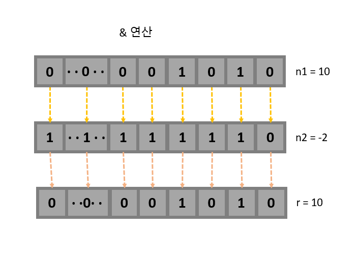
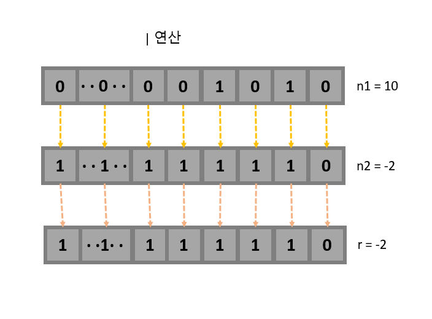
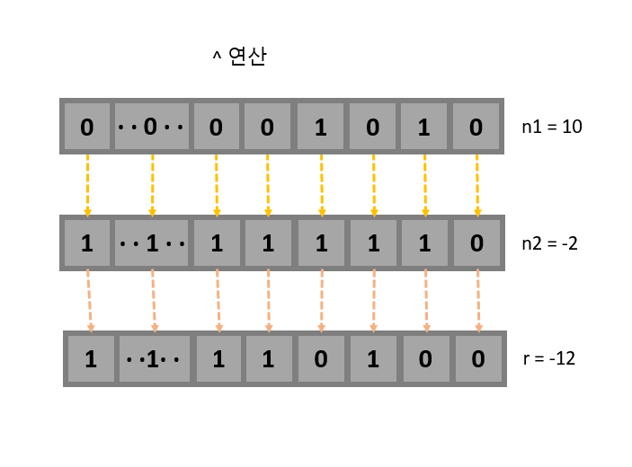
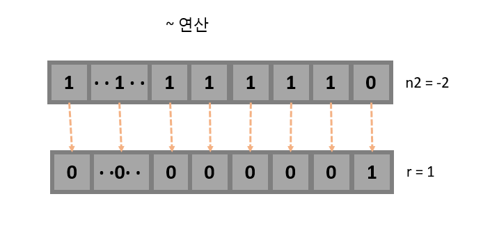
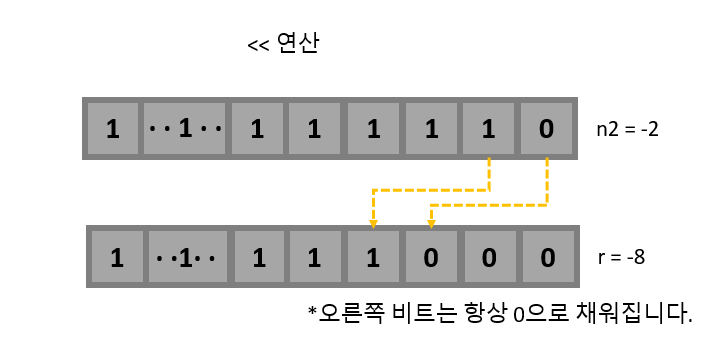
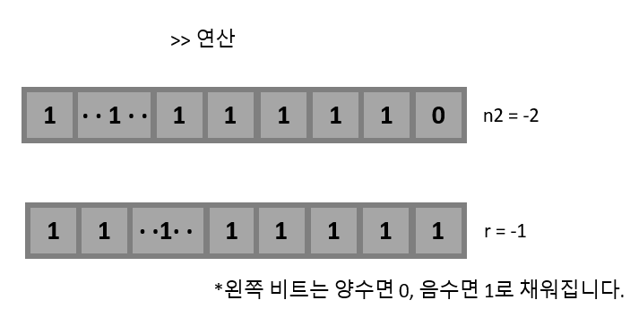
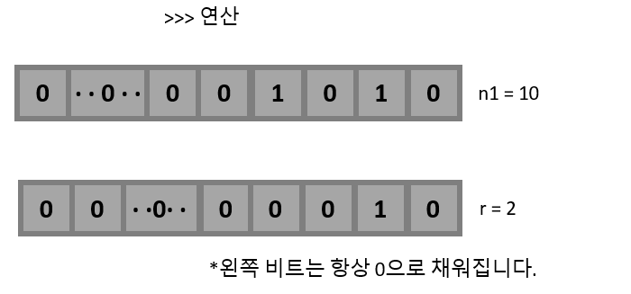
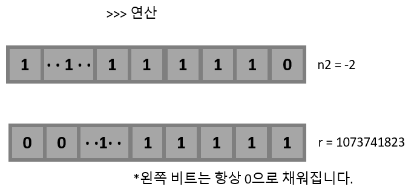

# 목표
자바가 제공하는 다양한 연산자를 학습하세요.

## 학습 내용
* [산술 연산자](#산술-연산자)
* [비트 연산자](#비트-연산자)
* [관계 연산자](#관계-연산자)
* [논리 연산자](#논리-연산자)
* [instanceof](#instanceof)
* [assignment(=) operator](##assignment-operator)
* [화살표(->) 연산자(람다 표현식)](#화살표--연산자)
* [3항 연산자](#3항-연산자)
* [연산자 우선 순위](#연산자-우선-순위)
* [switch 연산자(Java13)](#switch-연산자java13)
* [참고사이트](#참고사이트)

### 연산자란?
연산자란 연산을 수행하는 기호를 의미합니다.

### 산술 연산자
산술 연산자는 사칙연산을 다루는 기본 연산자를 말합니다. 산술 연산자는 두 개의 피연산자를 가지는 이항 연산자이며, 피연산자들의 결합 방향은 왼쪽에서 오른쪽입니다.  
연산자의 종류는 다음과 같습니다.

|산술 연산자|설명|
|---------|---------|
|`+`| 왼쪽의 피연산자에 오른쪽의 피연산자를 더합니다.|
|`-`| 왼쪽의 피연산자에서 오른쪽의 피연산자를 뺍니다.|
|`*`| 왼쪽의 피연산자에 오른쪽의 피연산자를 곱합니다.|
|`/`| 왼쪽의 피연산자를 오른쪽의 피연산자로 나눕니다.|
|`%`| 왼쪽의 피연산자를 오른쪽의 피연산자로 나눈 후, 나머지를 반환합니다.|

```java
public static main(String[] args) {
    int n1 = 10;
    int n2 = 2;

    int plusOp = n1 + n2;
    int minusOp = n1 - n2;
    int applyOp = n1 * n2;
    int divideOp = n1 / n2;
    int modulusOp = n1 % n2;

    System.out.println("(+) 연산자 결과: "+plusOp); // (+) 연산자 결과: 12
    System.out.println("(-) 연산자 결과: "+minusOp); // (-) 연산자 결과: 8
    System.out.println("(*) 연산자 결과: "+applyOp); // (*) 연산자 결과: 20
    System.out.println("(/) 연산자 결과: "+divideOp); // (/) 연산자 결과: 5
    System.out.println("(%) 연산자 결과: "+modulusOp); // (%) 연산자 결과: 0
}
```

### 비트 연산자
비트 연산자는 비트(bit) 단위로 논리 연산을 할 때 사용하는 연산자입니다.  
비트 단위로 왼쪽이나 오른쪽으로 전체 비트를 이동하거나, 1의 보수를 만들 때도 사용됩니다.  
비트 연산자의 종류는 다음과 같습니다.

|비트 연산자|설명|
|---------|---------|
|`&`| 대응되는 비트가 모두 1이면 1을 반환합니다.(비트 AND 연산)|
|`\|`| 대응되는 비트 중에서 하나라도 1이면 1을 반환합니다.(비트 OR 연산)|
|`^`| 대응되는 비트가 서로 다르면 1을 반환합니다.(비트 XOR 연산)|
|`~`| 비트를 1이면 0으로, 0이면 1로 반전시킵니다.(비트 NOT 연산)|
|`<<`| 명시된 수만큼 비트들을 전부 왼쪽으로 이동시킵니다.(LEFT SHIFT 연산)|
|`>>`| 부호를 유지하면서 지정한 수만큼 비트를 전부 오른쪽으로 이동시킵니다.(RIGHT SHIFT 연산)|
|`>>>`| 지정한 수만큼 비트를 전부 오른쪽으로 이동시키며, 새로운 비트는 0으로 만듭니다.|

```java
public static main(String[] args) {
    int n1 = 10;
    int n2 = -2;

    int andOp = n1 & n2;
    int orOp = n1 | n2;
    int xorOp = n1 ^ n2;
    int notOp = ~n2;

    int leftShiftOp = n2 << 2;
    int rightShiftOp = n2 >> 2;
    int logicalshiftrightOp1 = n1 >>> 2;
    int logicalshiftrightOp2 = n2 >>> 2;

    System.out.println("10과 -2의 (&) 연산자 결과: "+andOp); // 10과 -2의 (&) 연산자 결과: 10
    System.out.println("10과 -2의 (|) 연산자 결과: "+orOp); // 10과 -2의 (|) 연산자 결과: -2
    System.out.println("10과 -2의 (^) 연산자 결과: "+xorOp); // 10과 -2의 (^) 연산자 결과: -12
    System.out.println("-2의 (~) 연산자 결과: "+notOp); // -2의 (~) 연산자 결과: 1
    System.out.println("-2의 (<<) 연산자 결과: "+leftShiftOp); // -2의 (<<) 연산자 결과: -8
    System.out.println("-2의 (>>) 연산자 결과: "+rightShiftOp); // -2의 (>>) 연산자 결과: -1
    System.out.println("10의 (>>>) 연산자 결과: "+logicalshiftrightOp1); // 10의 (>>>) 연산자 결과: 2
    System.out.println("-2의 (>>>) 연산자 결과: "+logicalshiftrightOp2); // -2의 (>>>) 연산자 결과: 1073741823
}
```
* **AND 연산**  
  

* **OR 연산**  
  

* **XOR 연산**  
  

* **NOT 연산**  
  

* **LEFT SHIFT 연산**  
  

* **RIGHT SHIFT 연산**  
  

* **LOGICAL RIGHT SHIFT 연산**  
  

* **LOGICAL RIGHT SHIFT 연산**  
  


### 관계 연산자
관계 연산자는 피연자 사이의 관계를 시험하거나 정의하는 연산자입니다.  
관계 연산자의 종류는 다음과 같습니다.  

|관계 연산자|설명|
|---------|---------|
|`==`| 피연산자가 서로 같을 경우 `true`를 반환합니다.|
|`!=`| 피연산자가 서로 다를 경우 `true`를 반환합니다.|
|`>`| 왼쪽의 피연산자가 오른쪽의 피연산자보다 크면 `true`를 반환합니다.|
|`>=`| 왼쪽의 피연산자가 오른쪽의 피연산자보다 크거나 같으면 `true`를 반환합니다.|
|`<`| 왼쪽의 피연산자가 오른쪽의 피연산자보다 작으면 `true`를 반환합니다.|
|`<=`| 왼쪽의 피연산자가 오른쪽의 피연산자보다 작거나 같으면 `true`를 반환합니다.|

```java
public static main(String[] args) {
    char c1 = 'a';
    char c2 = 'A';
    
    System.out.println("== 연산자 결과: "+ (c1 == c2));  // == 연산자 결과: false
    System.out.println("!= 연산자 결과: "+ (c1 != c2));  // != 연산자 결과: true
    System.out.println("> 연산자 결과: "+ (c1 > c2));  // > 연산자 결과: true
    System.out.println(">= 연산자 결과: "+ (c1 >= c2));  // >= 연산자 결과: true
    System.out.println("< 연산자 결과: "+ (c1 < c2));  // < 연산자 결과: false
    System.out.println("<= 연산자 결과: "+ (c1 <= c2));  // <= 연산자 결과: false
}
```
> `a` 가 `A`보다 큰 이유는, `a`의 아스키코드가 97이고 `A`의 아스키코드가 65이기 때문입니다.

### 논리 연산자
논리 연산자는 주어진 논리식을 판단하여, `true` 혹은 `false`를 결정하는 연산자입니다.  
논리 연산자의 종류는 다음과 같습니다.
|논리 연산자|설명|
|---------|---------|
|`&&`| 논리식이 모두 `true`이면 `true`를 반환합니다. (논리 AND 연산)|
|`\|\|`| 논리식 중에서 하나라도 `true`이면 `true`를 반환합니다. (논리 OR 연산)|
|`!`| 논리식이 `true`면 `false`를, `false`면 `true`를 반환합니다. (논리 NOT 연산)|
  

**진리표**  
|A|B|A && B|A \|\| B|!A|
|---------|---------|---------|---------|---------|
|true|true|true|true|false|
|true|false|false|true|false|
|false|true|false|true|true|
|false|false|false|false|true|


### instanceof
`instanceof` 연산자는 인스턴스의 실제 타입을 대상 클래스 타입인지 판별해주는 연산자입니다.  
`instanceof` 연산자는 다음과 같이 사용합니다.  
```java
// 문법: (인스턴스 변수) `instanceof` (클래스 or 인터페이스) 

public static void main(String[] args) {
    String s = "";
    if(s instanceof String) { // return true
        //...
    }
}
```

**`instanceof` 연산자를 어떻게 활용하는 것일까요?**  

IDE에 다음과 같이 `instanceof`를 적으면 컴파일 에러가 나는 것을 볼 수 있습니다.
```java
public static void main(String[] args) {
    String s = "";
    if(s instanceof Integer) { // Incompatible conditional operand types String and Integer
        //...
    }
}
```

그리고 java는 언어의 특징상 타입을 표기하도록 되어있기때문에, method의 parameter 역시 이미 타입이 체크되고 있습니다.  
그렇다면 `instanceof`가 있는 이유는 무엇일까요?   
이 부분을 설명하기 위해서는 상속 및 다형성에 관한 이해가 필요합니다. 추후 상속 부분에서 자세히 언급할 예정이기에 여기서 짧게 예시를 들어 설명하겠습니다.  

상속이란 기존의 클래스의 메소드 및 필드를 물려받아, 이를 재정의 하거나 새 기능을 추가하여 새로운 클래스를 정의하는 것을 의미합니다.  
다형성이란 하나의 인스턴스가 여러 타입을 가질 수 있는 것을 의미하는데, 이로인해 하나의 인스턴스는 상속한 상위 클래스 타입으로 표현 할 수 있습니다.  
**또한 java의 모든 참조 타입은 `Object`라는 클래스를 상속합니다.**  
즉, 우리는 모든 참조 변수를 `Object`라는 타입으로 표현할 수 있습니다. 이제 아래의 예시를 보겠습니다.
```java
public class Test {
    //...
}

public class Main {
    public static void main(String[] args) {
        Test t = new Test();
        String s = "";

        print(t); // object 변수는 Test 타입입니다.
        print(s); // object 변수는 Test 타입이 아닙니다.
        
    }

    public static void print(Object object) {
        if(object instanceof Test) {
            System.out.println("object 변수는 Test 타입입니다.");
        } else {
            System.out.println("object 변수는 Test 타입이 아닙니다.");
        }
    }
}
```
위의 예시를 보면, `print`메소드는 `Object` 타입의 파라미터를 받고 있습니다. 앞서 말했다시피, 모든 참조변수는 `Object`를 상속하고 있기때문에, 우리는 `Test`타입 변수와 `String` 타입 변수를 `print`메소드에 넘겨줄 수 있습니다. 그리고 메소드 내부에 보면 이 `Object` 타입의 변수가 `Test`타입인지 아닌지 판별하여 각기 다른 문자열을 출력하고 있습니다.  
이처럼 **다형성 및 상속을 이용한 부분에서 `instanceof`는 타입을 판단하기 위한 중요한 판별도구가 될 수 있음을 확인할 수 있습니다. 또한 `instanceof`를 이용하면 `Casting`을 통한 타입변환전에 타입을 검증할 수 있기때문에, 데이터가 달라 발생하는 타입변환 에러를 쉽게 막을 수 있습니다.**  

### assignment(=) operator
대입(할당) 연산자는 변수에 값을 대입할 때 사용하는 연산자입니다.  
java에서는 대입 연산자를 다른 연산자와 함께 결합한 복합 대입 연산자를 제공합니다.  
대입 연산자의 종류는 다음과 같습니다.

|대입 연산자|설명|
|---------|---------|
|`=`| 왼쪽의 피연산자에 오른쪽의 피연산자를 대입합니다. |
|`+=`| 왼쪽의 피연산자에 오른쪽의 피연산자를 더한 후, 결과값을 왼쪽의 피연산자에 대입합니다. |
|`-=`| 왼쪽의 피연산자에서 오른쪽의 피연산자를 뺀 후, 결과값을 왼쪽의 피연산자에 대입합니다. |
|`*=`| 왼쪽의 피연산자에 오른쪽의 피연산자를 곱한 후, 결과값을 왼쪽의 피연산자에 대입합니다. |
|`/=`| 왼쪽의 피연산자를 오른쪽의 피연산자로 나눈 후, 결과값을 왼쪽의 피연산자에 대입합니다. |
|`%=`| 왼쪽의 피연산자를 오른쪽의 피연산자로 나눈 후, 나머지값을 왼쪽의 피연산자에 대입합니다. |
|`&=`| 왼쪽의 피연산자를 오른쪽의 피연산자와 `&`(비트 AND)연산을 한 후, 결과값을 왼쪽의 피연산자에 대입합니다. |
|`\|=`| 왼쪽의 피연산자를 오른쪽의 피연산자와 `\|`(비트 OR)연산을 한 후, 결과값을 왼쪽의 피연산자에 대입합니다. |
|`^=`| 왼쪽의 피연산자를 오른쪽의 피연산자와 `^`(비트 XOR)연산을 한 후, 결과값을 왼쪽의 피연산자에 대입합니다. |
|`<<=`| 왼쪽의 피연산자를 오른쪽의 피연산자만큼 `<<`(LEFT SHIFT)연산을 한 후, 결과값을 왼쪽의 피연산자에 대입합니다. |
|`>>=`| 왼쪽의 피연산자를 오른쪽의 피연산자만큼 `>>`(RIGHT SHIFT)연산을 한 후, 결과값을 왼쪽의 피연산자에 대입합니다. |
|`>>>=`| 왼쪽의 피연산자를 오른쪽의 피연산자만큼 `>>>`(LOGICAL RIGHT SHIFT)연산을 한 후, 결과값을 왼쪽의 피연산자에 대입합니다. |

```java
public static void main(String[] args) {
    int n1 = 10;
    System.out.println("= 연산의 결과: "+ n1); // = 연산의 결과: 10

    int n2 = 3;
    n2 += 5;
    System.out.println("+= 연산의 결과: "+n2); // += 연산의 결과: 8

    int n3 = 5;
    n3 -= 3;
    System.out.println("-= 연산의 결과: "+ n3); // -= 연산의 결과: 2

    int n4 = 7;
    n4 /= 5;
    System.out.println("/= 연산의 결과: "+ n4); // /= 연산의 결과: 1

    int n5 = 11;
    n5 %= 3;
    System.out.println("%= 연산의 결과: "+ n5); // %= 연산의 결과: 2

    int n6 = 8;
    n6 &= 3;
    System.out.println("&= 연산의 결과: "+ n6); // &= 연산의 결과: 0

    int n7 = 4;
    n7 |= 3;
    System.out.println("|= 연산의 결과: "+ n7); // |= 연산의 결과: 7

    int n8 = 9;
    n8 ^= 3;
    System.out.println("^= 연산의 결과: "+ n8); // ^= 연산의 결과: 10

    int n9 = 13;
    n9 <<= 2;
    System.out.println("<<= 연산의 결과: "+ n9); // <<= 연산의 결과: 52

    int n10 = -8;
    n10 >>= 2;
    System.out.println(">>= 연산의 결과: "+ n10); // >>= 연산의 결과: -2
    
    int n11 = -2;
    n11 >>>= 2;
    System.out.println(">>>= 연산의 결과: "+ n11); // >>>= 연산의 결과: 1073741823
}
```

### 화살표(->) 연산자
람다 표현식이란 파라미터를 받고 결과 값을 돌려주는 짧은 블록코드를 말합니다.  
람다 표현식은 java 8부터 도입되었습니다. 람다 표현식이 도입되기 전에는 익명 클래스를 사용하여 비슷한 동작을 구현해왔습니다.  
람다 표현식의 문법은 다음과 같습니다.  
1. 1개의 파라미터와 1개의 표현식을 가지는 경우  
`parameter -> expression`
2. 2개 이상의 파라미터와 1개의 표현식을 가지는 경우  
`(parameter1, parameter2, ...) -> expression`
3. 2개 이상의 파라미터와 코드블럭을 가지는 경우
`(parameter1, parameter2, ...) -> { code block }`

```java
public static void main(String[] args) {
  ArrayList<Integer> numbers = new ArrayList<>();
  numbers.add(1);
  numbers.add(2);
  numbers.add(3);
  numbers.add(4);
  numbers.add(5);

  numbers.forEach(n -> System.out.println("number: "+n));

  // number: 1
  // number: 2
  // number: 3
  // number: 4
  // number: 5
}
```

람다 표현식은 파라미터로 전달될 수도 있고, 메소드의 결과값으로도 사용할 수 있습니다.  
이때, 람다 표현식을 저장하기 위한 참조 변수가 필요한데, 이 참조 변수의 타입을 `함수형 인터페이스`라고 합니다.  
`함수형 인터페이스`는 일반적인 인터페이스와는 다르게 단 하나의 추상 메소드만 가져야 합니다.  
또한 `@FunctionalInterface` 어노테이션을 통해 `함수형 인터페이스`임을 명시할 수 있습니다.  
어노테이션을 사용하지 않아도 함수를 하나만 가지면 `함수형 인터페이스`로 사용할 수 있지만, 이 경우 컴파일러가 일반 인터페이스로 인식하기때문에 
인터페이스에 메소드 추가가 가능합니다.(단, 할당하는 쪽에서는 컴파일 에러가 발생합니다.) 하지만 어노테이션을 사용하면 인터페이스에 메소드 추가가 아예 
불가능하기때문에 보다 코드를 관리하기 좋습니다. 따라서 `함수형 인터페이스`를 정의할때, 항상 어노테이션을 붙이는게 좋습니다.

**익명 클래스와 람다 표현식의 차이점**  
앞서 java8 이전에는 익명 클래스를 이용하여 비슷한 동작을 구현해왔다고 했는데, 그럼 익명 클래스와 람다 표현식은 어떻게 다른지 알아보도록 하겠습니다.  
우선 다음의 코드를 먼저 보도록 하겠습니다.
```java
@FunctionalInterface
public interface FunctionalClass1 {
  public void run();
}

@FunctionalInterface
public interface FunctionalClass2 {
  public void run();
}

public interface AnonymousClass {
  public void run();
}

public class Main {
  public static void main(String[] args) {
    
  }
}
```

### 3항 연산자


### 연산자 우선 순위


### switch 연산자(Java13)


### 참고사이트
[TCPSchool](http://www.tcpschool.com/java/intro)