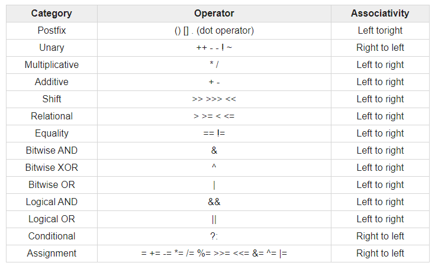

# 목표
자바가 제공하는 다양한 연산자를 학습하세요.

## 학습 내용
* [산술 연산자](#산술-연산자)
* [비트 연산자](#비트-연산자)
* [관계 연산자](#관계-연산자)
* [논리 연산자](#논리-연산자)
* [instanceof](#instanceof)
* [assignment(=) operator](##assignment-operator)
* [화살표(->) 연산자(람다 표현식)](#화살표--연산자)
* [3항 연산자](#3항-연산자)
* [연산자 우선 순위](#연산자-우선-순위)
* [switch 연산자(Java13)](#switch-연산자java13)
  * [switch 문](#switch-문)
  * [switch 표현식](#switch-표현식)
* [참고사이트](#참고사이트)

### 연산자란?
연산자란 연산을 수행하는 기호를 의미합니다.

### 산술 연산자
산술 연산자는 사칙연산을 다루는 기본 연산자를 말합니다. 산술 연산자는 두 개의 피연산자를 가지는 이항 연산자이며, 피연산자들의 결합 방향은 왼쪽에서 오른쪽입니다.  
연산자의 종류는 다음과 같습니다.

|산술 연산자|설명|
|---------|---------|
|`+`| 왼쪽의 피연산자에 오른쪽의 피연산자를 더합니다.|
|`-`| 왼쪽의 피연산자에서 오른쪽의 피연산자를 뺍니다.|
|`*`| 왼쪽의 피연산자에 오른쪽의 피연산자를 곱합니다.|
|`/`| 왼쪽의 피연산자를 오른쪽의 피연산자로 나눕니다.|
|`%`| 왼쪽의 피연산자를 오른쪽의 피연산자로 나눈 후, 나머지를 반환합니다.|

```java
public static main(String[] args) {
    int n1 = 10;
    int n2 = 2;

    int plusOp = n1 + n2;
    int minusOp = n1 - n2;
    int applyOp = n1 * n2;
    int divideOp = n1 / n2;
    int modulusOp = n1 % n2;

    System.out.println("(+) 연산자 결과: "+plusOp); // (+) 연산자 결과: 12
    System.out.println("(-) 연산자 결과: "+minusOp); // (-) 연산자 결과: 8
    System.out.println("(*) 연산자 결과: "+applyOp); // (*) 연산자 결과: 20
    System.out.println("(/) 연산자 결과: "+divideOp); // (/) 연산자 결과: 5
    System.out.println("(%) 연산자 결과: "+modulusOp); // (%) 연산자 결과: 0
}
```

### 비트 연산자
비트 연산자는 비트(bit) 단위로 논리 연산을 할 때 사용하는 연산자입니다.  
비트 단위로 왼쪽이나 오른쪽으로 전체 비트를 이동하거나, 1의 보수를 만들 때도 사용됩니다.  
비트 연산자의 종류는 다음과 같습니다.

|비트 연산자|설명|
|---------|---------|
|`&`| 대응되는 비트가 모두 1이면 1을 반환합니다.(비트 AND 연산)|
|`\|`| 대응되는 비트 중에서 하나라도 1이면 1을 반환합니다.(비트 OR 연산)|
|`^`| 대응되는 비트가 서로 다르면 1을 반환합니다.(비트 XOR 연산)|
|`~`| 비트를 1이면 0으로, 0이면 1로 반전시킵니다.(비트 NOT 연산)|
|`<<`| 명시된 수만큼 비트들을 전부 왼쪽으로 이동시킵니다.(LEFT SHIFT 연산)|
|`>>`| 부호를 유지하면서 지정한 수만큼 비트를 전부 오른쪽으로 이동시킵니다.(RIGHT SHIFT 연산)|
|`>>>`| 지정한 수만큼 비트를 전부 오른쪽으로 이동시키며, 새로운 비트는 0으로 만듭니다.|

```java
public static main(String[] args) {
    int n1 = 10;
    int n2 = -2;

    int andOp = n1 & n2;
    int orOp = n1 | n2;
    int xorOp = n1 ^ n2;
    int notOp = ~n2;

    int leftShiftOp = n2 << 2;
    int rightShiftOp = n2 >> 2;
    int logicalshiftrightOp1 = n1 >>> 2;
    int logicalshiftrightOp2 = n2 >>> 2;

    System.out.println("10과 -2의 (&) 연산자 결과: "+andOp); // 10과 -2의 (&) 연산자 결과: 10
    System.out.println("10과 -2의 (|) 연산자 결과: "+orOp); // 10과 -2의 (|) 연산자 결과: -2
    System.out.println("10과 -2의 (^) 연산자 결과: "+xorOp); // 10과 -2의 (^) 연산자 결과: -12
    System.out.println("-2의 (~) 연산자 결과: "+notOp); // -2의 (~) 연산자 결과: 1
    System.out.println("-2의 (<<) 연산자 결과: "+leftShiftOp); // -2의 (<<) 연산자 결과: -8
    System.out.println("-2의 (>>) 연산자 결과: "+rightShiftOp); // -2의 (>>) 연산자 결과: -1
    System.out.println("10의 (>>>) 연산자 결과: "+logicalshiftrightOp1); // 10의 (>>>) 연산자 결과: 2
    System.out.println("-2의 (>>>) 연산자 결과: "+logicalshiftrightOp2); // -2의 (>>>) 연산자 결과: 1073741823
}
```
* **AND 연산**  
  

* **OR 연산**  
  

* **XOR 연산**  
  

* **NOT 연산**  
  

* **LEFT SHIFT 연산**  
  

* **RIGHT SHIFT 연산**  
  

* **LOGICAL RIGHT SHIFT 연산**  
  

* **LOGICAL RIGHT SHIFT 연산**  
  


### 관계 연산자
관계 연산자는 피연자 사이의 관계를 시험하거나 정의하는 연산자입니다.  
관계 연산자의 종류는 다음과 같습니다.  

|관계 연산자|설명|
|---------|---------|
|`==`| 피연산자가 서로 같을 경우 `true`를 반환합니다.|
|`!=`| 피연산자가 서로 다를 경우 `true`를 반환합니다.|
|`>`| 왼쪽의 피연산자가 오른쪽의 피연산자보다 크면 `true`를 반환합니다.|
|`>=`| 왼쪽의 피연산자가 오른쪽의 피연산자보다 크거나 같으면 `true`를 반환합니다.|
|`<`| 왼쪽의 피연산자가 오른쪽의 피연산자보다 작으면 `true`를 반환합니다.|
|`<=`| 왼쪽의 피연산자가 오른쪽의 피연산자보다 작거나 같으면 `true`를 반환합니다.|

```java
public static main(String[] args) {
    char c1 = 'a';
    char c2 = 'A';
    
    System.out.println("== 연산자 결과: "+ (c1 == c2));  // == 연산자 결과: false
    System.out.println("!= 연산자 결과: "+ (c1 != c2));  // != 연산자 결과: true
    System.out.println("> 연산자 결과: "+ (c1 > c2));  // > 연산자 결과: true
    System.out.println(">= 연산자 결과: "+ (c1 >= c2));  // >= 연산자 결과: true
    System.out.println("< 연산자 결과: "+ (c1 < c2));  // < 연산자 결과: false
    System.out.println("<= 연산자 결과: "+ (c1 <= c2));  // <= 연산자 결과: false
}
```
> `a` 가 `A`보다 큰 이유는, `a`의 아스키코드가 97이고 `A`의 아스키코드가 65이기 때문입니다.

### 논리 연산자
논리 연산자는 주어진 논리식을 판단하여, `true` 혹은 `false`를 결정하는 연산자입니다.  
논리 연산자의 종류는 다음과 같습니다.
|논리 연산자|설명|
|---------|---------|
|`&&`| 논리식이 모두 `true`이면 `true`를 반환합니다. (논리 AND 연산)|
|`\|\|`| 논리식 중에서 하나라도 `true`이면 `true`를 반환합니다. (논리 OR 연산)|
|`!`| 논리식이 `true`면 `false`를, `false`면 `true`를 반환합니다. (논리 NOT 연산)|
  

**진리표**  
|A|B|A && B|A \|\| B|!A|
|---------|---------|---------|---------|---------|
|true|true|true|true|false|
|true|false|false|true|false|
|false|true|false|true|true|
|false|false|false|false|true|


### instanceof
`instanceof` 연산자는 인스턴스의 실제 타입을 대상 클래스 타입인지 판별해주는 연산자입니다.  
`instanceof` 연산자는 다음과 같이 사용합니다.  
```java
// 문법: (인스턴스 변수) `instanceof` (클래스 or 인터페이스) 

public static void main(String[] args) {
    String s = "";
    if(s instanceof String) { // return true
        //...
    }
}
```

**`instanceof` 연산자를 어떻게 활용하는 것일까요?**  

IDE에 다음과 같이 `instanceof`를 적으면 컴파일 에러가 나는 것을 볼 수 있습니다.
```java
public static void main(String[] args) {
    String s = "";
    if(s instanceof Integer) { // Incompatible conditional operand types String and Integer
        //...
    }
}
```

그리고 java는 언어의 특징상 타입을 표기하도록 되어있기때문에, method의 parameter 역시 이미 타입이 체크되고 있습니다.  
그렇다면 `instanceof`가 있는 이유는 무엇일까요?   
이 부분을 설명하기 위해서는 상속 및 다형성에 관한 이해가 필요합니다. 추후 상속 부분에서 자세히 언급할 예정이기에 여기서 짧게 예시를 들어 설명하겠습니다.  

상속이란 기존의 클래스의 메소드 및 필드를 물려받아, 이를 재정의 하거나 새 기능을 추가하여 새로운 클래스를 정의하는 것을 의미합니다.  
다형성이란 하나의 인스턴스가 여러 타입을 가질 수 있는 것을 의미하는데, 이로인해 하나의 인스턴스는 상속한 상위 클래스 타입으로 표현 할 수 있습니다.  
**또한 java의 모든 참조 타입은 `Object`라는 클래스를 상속합니다.**  
즉, 우리는 모든 참조 변수를 `Object`라는 타입으로 표현할 수 있습니다. 이제 아래의 예시를 보겠습니다.
```java
public class Test {
    //...
}

public class Main {
    public static void main(String[] args) {
        Test t = new Test();
        String s = "";

        print(t); // object 변수는 Test 타입입니다.
        print(s); // object 변수는 Test 타입이 아닙니다.
        
    }

    public static void print(Object object) {
        if(object instanceof Test) {
            System.out.println("object 변수는 Test 타입입니다.");
        } else {
            System.out.println("object 변수는 Test 타입이 아닙니다.");
        }
    }
}
```
위의 예시를 보면, `print`메소드는 `Object` 타입의 파라미터를 받고 있습니다. 앞서 말했다시피, 모든 참조변수는 `Object`를 상속하고 있기때문에, 우리는 `Test`타입 변수와 `String` 타입 변수를 `print`메소드에 넘겨줄 수 있습니다. 그리고 메소드 내부에 보면 이 `Object` 타입의 변수가 `Test`타입인지 아닌지 판별하여 각기 다른 문자열을 출력하고 있습니다.  
이처럼 **다형성 및 상속을 이용한 부분에서 `instanceof`는 타입을 판단하기 위한 중요한 판별도구가 될 수 있음을 확인할 수 있습니다. 또한 `instanceof`를 이용하면 `Casting`을 통한 타입변환전에 타입을 검증할 수 있기때문에, 데이터가 달라 발생하는 타입변환 에러를 쉽게 막을 수 있습니다.**  

### assignment(=) operator
대입(할당) 연산자는 변수에 값을 대입할 때 사용하는 연산자입니다.  
java에서는 대입 연산자를 다른 연산자와 함께 결합한 복합 대입 연산자를 제공합니다.  
대입 연산자의 종류는 다음과 같습니다.

|대입 연산자|설명|
|---------|---------|
|`=`| 왼쪽의 피연산자에 오른쪽의 피연산자를 대입합니다. |
|`+=`| 왼쪽의 피연산자에 오른쪽의 피연산자를 더한 후, 결과값을 왼쪽의 피연산자에 대입합니다. |
|`-=`| 왼쪽의 피연산자에서 오른쪽의 피연산자를 뺀 후, 결과값을 왼쪽의 피연산자에 대입합니다. |
|`*=`| 왼쪽의 피연산자에 오른쪽의 피연산자를 곱한 후, 결과값을 왼쪽의 피연산자에 대입합니다. |
|`/=`| 왼쪽의 피연산자를 오른쪽의 피연산자로 나눈 후, 결과값을 왼쪽의 피연산자에 대입합니다. |
|`%=`| 왼쪽의 피연산자를 오른쪽의 피연산자로 나눈 후, 나머지값을 왼쪽의 피연산자에 대입합니다. |
|`&=`| 왼쪽의 피연산자를 오른쪽의 피연산자와 `&`(비트 AND)연산을 한 후, 결과값을 왼쪽의 피연산자에 대입합니다. |
|`\|=`| 왼쪽의 피연산자를 오른쪽의 피연산자와 `\|`(비트 OR)연산을 한 후, 결과값을 왼쪽의 피연산자에 대입합니다. |
|`^=`| 왼쪽의 피연산자를 오른쪽의 피연산자와 `^`(비트 XOR)연산을 한 후, 결과값을 왼쪽의 피연산자에 대입합니다. |
|`<<=`| 왼쪽의 피연산자를 오른쪽의 피연산자만큼 `<<`(LEFT SHIFT)연산을 한 후, 결과값을 왼쪽의 피연산자에 대입합니다. |
|`>>=`| 왼쪽의 피연산자를 오른쪽의 피연산자만큼 `>>`(RIGHT SHIFT)연산을 한 후, 결과값을 왼쪽의 피연산자에 대입합니다. |
|`>>>=`| 왼쪽의 피연산자를 오른쪽의 피연산자만큼 `>>>`(LOGICAL RIGHT SHIFT)연산을 한 후, 결과값을 왼쪽의 피연산자에 대입합니다. |

```java
public static void main(String[] args) {
    int n1 = 10;
    System.out.println("= 연산의 결과: "+ n1); // = 연산의 결과: 10

    int n2 = 3;
    n2 += 5;
    System.out.println("+= 연산의 결과: "+n2); // += 연산의 결과: 8

    int n3 = 5;
    n3 -= 3;
    System.out.println("-= 연산의 결과: "+ n3); // -= 연산의 결과: 2

    int n4 = 7;
    n4 /= 5;
    System.out.println("/= 연산의 결과: "+ n4); // /= 연산의 결과: 1

    int n5 = 11;
    n5 %= 3;
    System.out.println("%= 연산의 결과: "+ n5); // %= 연산의 결과: 2

    int n6 = 8;
    n6 &= 3;
    System.out.println("&= 연산의 결과: "+ n6); // &= 연산의 결과: 0

    int n7 = 4;
    n7 |= 3;
    System.out.println("|= 연산의 결과: "+ n7); // |= 연산의 결과: 7

    int n8 = 9;
    n8 ^= 3;
    System.out.println("^= 연산의 결과: "+ n8); // ^= 연산의 결과: 10

    int n9 = 13;
    n9 <<= 2;
    System.out.println("<<= 연산의 결과: "+ n9); // <<= 연산의 결과: 52

    int n10 = -8;
    n10 >>= 2;
    System.out.println(">>= 연산의 결과: "+ n10); // >>= 연산의 결과: -2
    
    int n11 = -2;
    n11 >>>= 2;
    System.out.println(">>>= 연산의 결과: "+ n11); // >>>= 연산의 결과: 1073741823
}
```

### 화살표(->) 연산자
화살표 연산자란 java 8에서 람다 표현식이 도입되면서 도입된 연산자입니다.  
화살표 연산자는 파라미터와 구현체(메소드)를 분리하는데 사용됩니다.  
화살표 연산자를 사용하는 방법은 화살표 왼쪽에 파라미터를 적고 오른쪽에 이를 이용하는 람다식을 적습니다.  
화살표 연산자는 `람다 표현식`과 아래 설명된 `switch 표현식`에서 사용됩니다.  

> **아래 내용은 람다 표현식과 관련된 내용입니다.**

람다 표현식이란 파라미터를 받고 결과 값을 돌려주는 짧은 블록코드를 말합니다.  
람다 표현식은 java 8부터 도입되었습니다. 람다 표현식이 도입되기 전에는 익명 클래스를 사용하여 비슷한 동작을 구현해왔습니다.  
람다 표현식의 문법은 다음과 같습니다.  
1. 1개의 파라미터와 1개의 표현식을 가지는 경우  
`parameter -> expression`
2. 2개 이상의 파라미터와 1개의 표현식을 가지는 경우  
`(parameter1, parameter2, ...) -> expression`
3. 2개 이상의 파라미터와 코드블럭을 가지는 경우
`(parameter1, parameter2, ...) -> { code block }`

```java
public static void main(String[] args) {
  ArrayList<Integer> numbers = new ArrayList<>();
  numbers.add(1);
  numbers.add(2);
  numbers.add(3);
  numbers.add(4);
  numbers.add(5);

  numbers.forEach(n -> System.out.println("number: "+n));

  // number: 1
  // number: 2
  // number: 3
  // number: 4
  // number: 5
}
```

람다 표현식은 파라미터로 전달될 수도 있고, 메소드의 결과값으로도 사용할 수 있습니다.  
이때, 람다 표현식을 저장하기 위한 참조 변수가 필요한데, 이 참조 변수의 타입을 `함수형 인터페이스`라고 합니다.  
`함수형 인터페이스`는 일반적인 인터페이스와는 다르게 **단 하나의 추상 메소드만 가져야 합니다**.  
또한 `@FunctionalInterface` 어노테이션을 통해 `함수형 인터페이스`임을 명시할 수 있습니다.  
어노테이션을 사용하지 않아도 함수를 하나만 가지면 `함수형 인터페이스`로 사용할 수 있지만, 이 경우 컴파일러가 일반 인터페이스로 인식하기때문에 
인터페이스에 메소드 추가가 가능합니다.(단, 할당하는 쪽에서는 컴파일 에러가 발생합니다.) 하지만 어노테이션을 사용하면 인터페이스에 메소드 추가가 아예 
불가능하기때문에 보다 코드를 관리하기 좋습니다. 따라서 `함수형 인터페이스`를 정의할때, 항상 어노테이션을 붙이는게 좋습니다.

**익명 클래스와 람다 표현식의 차이점**  
앞서 java8 이전에는 익명 클래스를 이용하여 비슷한 동작을 구현해왔다고 했는데, 그럼 익명 클래스와 람다 표현식은 어떻게 다른지 알아보도록 하겠습니다.  
우선 다음의 코드를 먼저 보도록 하겠습니다.
```java
@FunctionalInterface
public interface FunctionalClass1 {
  public void run();
}

@FunctionalInterface
public interface FunctionalClass2 {
  public void run();
}

public interface AnonymousClass {
  public void run();
  public void run2();
}

public class Main {
  public static void main(String[] args) {
    FunctionalClass1 fc1 = () -> {
      System.out.println("FunctionalClass1 입니다.");
      //System.out.println("this는 누구? - " + this.toString()); // 컴파일 에러
    };
    FunctionalClass1 fc2 = () -> System.out.println("FunctionalClass2 입니다.");
    
    run(fc1);
    run(fc2);
    run(new AnonymousClass() {
      public void run() {
        System.out.println("AnonymousClass 입니다.");
        this.run2();
      }
      public void run2() {
        System.out.println("call by this!");
      }
    });
    
    // run(() -> System.out.println("어떤 일이 발생할까요?")); // 타입을 모르기 때문에 컴파일 에러가 발생합니다.
    run((FunctionalClass1)() -> System.out.println("FunctionalClass1로 캐스팅."));
  }
  
  public static void run(FunctionalClass1 fc1) {
    fc1.run();
  }
  
  public static void run(FunctionalClass2 fc2) {
    fc2.run();
  }
  
  public static void run(AnonymousClass anc) {
    anc.run();
  }
  
  public void print() {
    String variable = "var";
    FunctionalClass1 fc1 = () -> {
      //String variable = "var";  // 컴파일 에러 - 상위 스코프에 있는 변수 재정의 시도.
      //variable = "test";  // 컴파일 에러 - 접근가능한 변수는 무조건 final or effectively final 이여야 합니다.
      System.out.println(variable); // 상위 스코프의 final or effectively final 변수 접근이 가능합니다.
    };
  }
}
```

1. 위의 코드에는 람다 `함수형 인터페이스`를 파라미터로 받는 메서드가 있습니다. 하지만 같은 시그니처를 가지고 있는 경우, `람다 표현식`을 그대로 사용하면 어떤 메서드를 호출해야 하는지 알 수 없게 되어 컴파일 에러가 발생하게 됩니다. 따라서 이러한 경우에는 `람다 표현식` 앞에 타입을 명시해 줘야 합니다. 
2. `람다 표현식` 내의 `this`는 선언된 클래스를 가리키며, `익명 클래스`내의 `this`는 `익명 클래스` 자신을 가리킵니다. 따라서 위의 코드 내에서 `fc1`변수 내에서 `this`를 호출할 수 없는 반면(static이기 때문에), `익명 클래스`내에서는 `this`를 호출할 수 있는 것을 볼 수 있습니다. 
3. `람다 표현식`은 새로운 레벨의 스코프를 만들어내지 않기 때문에, 상위 스코프의 변수에 접근이 가능하게됩니다. 하지만 `람다 표현식`에서 접근 가능한 변수는 상위 스코프내의 사실상 final인 지역 변수나 파라미터 제한됩니다.(final로 명시가 되어있든, 아니면 final처럼 변수의 값의 변화가 없는 경우를 뜻함.)

### 3항 연산자
3항 연산자는 조건식의 결과값에 따라 선택적으로 값을 반환하는 연산자입니다.  
3항 연산자는 피연산자를 3개를 가집니다.  
3항 연산자를 사용하는 방법은 아래와 같습니다.

```java
public static void main(String[] args) {
  // 문법: (조건식) ? 반환값1 : 반환값2

  String result = isGreaterThanTen(1) ? "10보다 큽니다." : "10보다 작습니다.";

  System.out.println(result); // 10보다 작습니다.
}

public static boolean isGreaterThanTen(int num) {
  return num > 10;
}
``` 

### 연산자 우선 순위
모든 연산자에게는 우선 순위가 부여되어 있습니다. 우선 순위는 많이 쓰이는 것은 외우면 좋고, 일반적으로 필요할때마다 참고하시면 됩니다.  
아래 표에서 위에서부터 아래로 우선순위가 부여됩니다.



표 출처: [https://www.tutorialspoint.com/Java-Operators-Precedence](https://www.tutorialspoint.com/Java-Operators-Precedence)

### switch 연산자(Java13)
#### **switch 문**

`switch 연산자`란 어떤 변수의 값에 따라 여러 다양한 실행문을 작동시키는 연산자입니다.  
`switch 연산자`를 사용하면 다중 `if-else`문을 보다 읽기 쉽게 만들수 있기때문에, 다중 `if-else` 대신에 사용하면 좋습니다.  
`switch 연산자`에는 `primitive` 타입과 `primitive wrapper` 클래스들 그리고 `enum`과 `String` 클래스를 사용할 수 있습니다.  
`switch 연산자`에는 `null` 값을 줄 수 없습니다. 만약 `null` 값을 보내게 되면, `NullPointerException` 에러를 발생시킵니다.  
`switch 연산자`는 다음과 같이 사용할 수 있습니다.

```java
public enum Language {
  JAVA, C, CPP, CS, JS, 
}

public static void main(String[] args) {
  System.out.println(basic(Language.JAVA.name())); // java 언어입니다.
  System.out.println(basic(Language.C.name()));  // c 언어입니다.
  System.out.println(basic(Language.CPP.name()));  // c++ 언어입니다.
  System.out.println(basic(Language.CS.name()));  // c# 언어입니다.
  System.out.println(basic(Language.JS.name()));  // javascript 언어입니다.
  System.out.println(basic("PHP"));  // 정의되지 않은 언어입니다.
  System.out.println(basic(null));  // NullPointerException
}

public static String basic(String language) {
    String result = "";

    switch(language) {
      case "JAVA":
        result = "java 언어입니다.";
        break;
      case "C":
        result = "c 언어입니다.";
        break;
      case "CPP":
        result = "c++ 언어입니다.";
        break;
      case "CS":
        result = "c# 언어입니다.";
        break;
      case "JS":
        result = "javascript 언어입니다.";
        break;
      default:
        result = "정의되지 않은 언어입니다.";
    }

    return result;
}
```

**`switch 연산자`를 작성할때 `break`를 쓰지 않으면, 그 하위 모든 블럭이 실행되어버립니다.**
```java
public enum Language {
  JAVA, C, CPP, CS, JS
}

public static void main(String[] args) {
  System.out.println(basic(Language.JAVA.name())); // c 언어입니다. -> break가 없어서 다음 case의 실행문이 작동하고 이후 break문을 통해 중지되었기 때문입니다.
}

public static String basic(String language) {
    String result = "";

    switch(language) {
      case "JAVA":
        result = "java 언어입니다.";
      case "C":
        result = "c 언어입니다.";
        break;
      case "CPP":
        result = "c++ 언어입니다.";
        break;
      case "CS":
        result = "c# 언어입니다.";
        break;
      case "JS":
        result = "javascript 언어입니다.";
        break;
      default:
        result = "정의되지 않은 언어입니다.";
    }

    return result;
}
```

`switch 연산자`를 사용할때 여러 case에 하나의 실행문을 실행하고자 한다면 다음과 같이 여러 case를 연달아 작성하면 됩니다.
```java
public static void main(String[] args) {
  System.out.println(multiCase("DOG")); // DOG 아니면 CAT인 경우입니다.
  System.out.println(multiCase("CAT")); // DOG 아니면 CAT인 경우입니다.
  System.out.println(multiCase("FISH")); // FISH인 경우입니다.
}

public static String multiCase(String animal) {
    String result = "";

    switch(animal) {
      case "DOG":
      case "CAT":
        result = "DOG 아니면 CAT인 경우입니다.";
        break;
      case "FISH":
        result = "FISH인 경우입니다.";
        break;
      default:
        result = "정의되지 않은 경우입니다.";
    }

    return result;
}
```

#### **switch 표현식**
> **`switch 표현식`은 JAVA 14부터 정식 기능으로 도입되었습니다. 따라서 12 혹은 13에서 사용을 원하시면 `preview feature`을 사용할 수 있도록 설정해야 합니다.(Default로 비활성화되어 있습니다.)**  

JDK 12부터 `switch 연산자`에 `switch 표현식`이라는 것이 도입되었습니다. 이를 통해 switch문을 보다 더 간편하게 작성할 수 있습니다.  
`switch 표현식`을 통해 작성할 경우 `break`가 필요없습니다. 왜냐하면 `switch 표현식`은 더이상 하위의 case를 실행하지 않기때문입니다.  
또한 쉼표를 통해 하나의 case에 다양한 기준조건을 넣을 수 있게되었습니다.
```java
public static void main(String[] args) {
  System.out.println(multiCaseWithExpression("DOG")); // DOG 아니면 CAT인 경우입니다.
  System.out.println(multiCaseWithExpression("CAT")); // DOG 아니면 CAT인 경우입니다.
  System.out.println(multiCaseWithExpression("FISH")); // FISH인 경우입니다.
}

public static String multiCaseWithExpression(String animal) {
    return switch(animal) {
      case "DOG", "CAT" -> "DOG 아니면 CAT인 경우입니다.";
      case "FISH" -> "FISH인 경우입니다.";
      default -> "정의되지 않은 경우입니다.";
    }
}
```

JDK 13부터 `switch 연산자`에 `yield` 키워드가 도입되었습니다. 이를 통해 이제 `switch 표현식`에 다양한 로직을 추가하고 값을 반환 할 수 있게되었습니다.  
`yield` 키워드를 사용하는 방법은 다음과 같습니다.
```java
public static void main(String[] args) {
  System.out.println(switchExpressWithYield("DOG")); // DOG인 경우입니다.
  System.out.println(switchExpressWithYield("CAT")); // CAT인 경우입니다.
  System.out.println(switchExpressWithYield("FISH")); // FISH인 경우입니다.
}

public static String switchExpressWithYield(String animal) {
    return switch(animal) {
      case "DOG", "CAT" -> {
        String result = animal + "인 경우입니다.";
        yield result;
      }
      case "FISH" -> "FISH인 경우입니다.";
      default -> "정의되지 않은 경우입니다.";
    };
}
```

**`switch`문을 이용하는 경우와 `switch 표현식`을 이용할때 차이점**
```java
public enum Language {
  JAVA, C, CPP, CS, JS
}

public static void main(String[] args) {
    Language language = Language.JAVA;
    String animal = "DOG";
    
    switch(animal) {
      case "DOG", "CAT" -> System.out.println("DOG or CAT");
      case "FISH" -> System.out.println("FISH");
    }
    
    String result = switch(animal) {
      case "DOG", "CAT" -> {
        System.out.println("DOG or CAT");
        yield animal;
      }
      case "FISH" -> "FISH";
      //default -> "default"; // default를 주석처리하면 모든 경우를 고려하지 않았기때문에 컴파일 에러가 발생합니다.
    };
    
    // 이 경우에는 모든 경우의 수를 고려하였기 때문에 default가 없더라도 컴파일 에러가 발생하지 않습니다.
    String result2 = switch (language) {
      case JAVA -> {
        yield language.name();
      }
      case C, CPP, CS -> {
        yield language.name();
      }
      case JS -> {
        yield language.name();
      }
    };
}

```
위의 코드에서 `switch 표현식`에서 default를 선언하지 않으면 컴파일 에러가 발생하게 됩니다. 이러한 이유는 일반적인 switch문의 경우, 모든 경우를 고려할 필요가 없지만, `switch 표현식`의 경우 모든 경우를 고려하도록 설계되어있기 때문입니다. 따라서 `switch 표현식`을 사용할때는 모든 경우를 고려하도록 코드를 짜야합니다. (enum의 경우 모든 경우를 적게되면 default를 작성하지 않더라도 컴파일 에러가 생기지 않습니다.)

### 참고사이트
[TCPSchool](http://www.tcpschool.com/java/intro)  
[switch(JDK 13) - Baeldung](https://www.baeldung.com/java-switch)  
[switch(JDK 13) - mkyong](https://mkyong.com/java/java-13-switch-expressions/)  