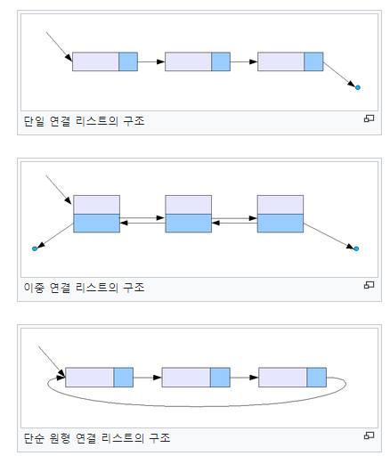
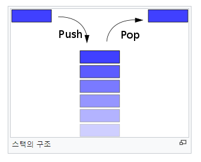

# 목표
자바가 제공하는 제어문을 학습하세요.

## 학습 내용
* [선택문](#선택문)
  * [if](#if)
  * [if~else](#ifelse)
  * [switch](#switch)
* [반복문](#반복문)
  * [while](#while)
  * [do~while](#dowhile)
  * [for](#for)
  * [enhanced for](#enhanced-for)
* [분기문](#분기문)
  * [break](#break)
  * [continue](#continue)
  * [return](#return)

## 과제
* [JUnit 5](#JUnit-5)
  * [JUnit 5란](#JUnit-5란)
  * [JUnit 사용법](#JUnit-사용법)
    * [JUnit 5 설치](#JUnit-5-설치)
    * [JUnit 5 주요 어노테이션](#JUnit-5-주요-어노테이션)
    * [JUnit 5 테스트 코드 작성](#JUnit-5-테스트-코드-작성)
  * [JUnit 5 in VSCode](#JUnit-5-in-VSCode)
* [GitHub API를 이용한 대시보드 만들기](#GitHub-API를-이용한-대시보드-만들기)
  * [GitHub API for Java 설정](#GitHub-API-for-Java-설정)
  * [정보 탐색 및 대시보드 생성](#정보-탐색-및-대시보드-생성)
  * [결과](#결과)
* [LinkedList](#LinkedList)
  * [LinkedList란](#LinkedList란)
  * [LinkedList 구현](#LinkedList-구현)
* [Stack](#Stack)
  * [Stack이란](#Stack이란)
  * [Stack 구현](#Stack-구현)
* [Queue](#Queue)
  * [Queue란](#Queue란)
  * [Queue 구현](#Queue-구현)
* [참고 사이트](#참고-사이트)

### 선택문
선택문이란, 어떤 특정 조건에 따라 실행 순서를 변경하도록 제어하는 구문을 말합니다.  
선택문에는 `if`,`if ~ else`, `switch`문이 있습니다.  

#### if
`if`문은 조건식이 참일 경우, 코드를 실행하는 구문을 말합니다.

```java
public static void main(String[] args) {

  int value = 2;
  
  if(value % 2 == 0) { // 조건을 만족하기때문에, 다음의 문장을 출력합니다.
    System.out.println("value는 2의 배수입니다.");
  }
  
  if(value % 3 == 0) { // 조건을 만족하지 않기때문에, 다음의 문장을 출력하지 않습니다.
    System.out.println("value는 2의 배수입니다.");
  }

}
```

#### if~else
앞서 `if`문은 조건식이 참일 경우, 코드를 실행하는 구문이라고 설명했습니다.  
`else`는 `if`의 조건을 만족하지 않을 경우 실행하는 부분입니다.  
`if`문의 경우 중첩 사용이 얼마든지 가능합니다.

```java
public static void main(String[] args) {
  int value = 15;
  
  // if ~ else 경우
  if (value % 2 == 0) {
    System.out.println("value는 2의 배수입니다.");
  } else {
    System.out.println("value는 2의 배수가 아닙니다.");
  }
  
  // 중첩 if문
  if (value % 5 == 0) {
    if (value % 3 == 0) {
      System.out.println("value는 5의 배수이면서, 3의 배수입니다.");
    } else {
      System.out.println("value는 5의 배수이지만, 3의 배수가 아닙니다.");
    }
  }
  
  // if ~ else if ~ else 의 경우
  if (value % 2 == 0) {
    System.out.println("value는 2의 배수입니다.");
  } else if (value % 5 == 0) {
    System.out.println("value는 5의 배수입니다.");
  } else {
    System.out.println("value는 2의 배수도 5의 배수도 아닙니다.");
  }
}
```

#### switch
`switch`문의 경우 앞서 3주차에 설명한 것으로 대신하도록 하겠습니다.  
(**switch 연산자를 이용한 구문을 switch문이라고 합니다.**)  
[switch operator 설명 바로가기](https://github.com/ByungJun25/study/tree/main/java/whiteship-study/3week#switch-%EC%97%B0%EC%82%B0%EC%9E%90java13)  
> `if`문이 여러개일 경우, `switch`문을 사용하는 것이 가독성도 더 좋고, 실행 속도도 더 빠릅니다.

### 반복문
반복문이란, 어떤 특정 조건이 만족하는한 계속해서 실행하는 구문을 말합니다.  
반복문에는 `while`, `do ~ while`, `for` 문이 있습니다.

#### while
`while`문은 조건이 참인 동안, 계속해서 실행하는 구문을 말합니다.  
`while`문은 계속해서 조건식의 결과를 판별하며, 조건이 `false`가 될때까지 코드를 실행합니다.  

```java
public static void main(String[] args) {
  int num = 1;
  while (num < 11) { // num의 값이 11미만일때까지 실행합니다.
    System.out.println("Number is: " + num);
    num++;
  }
}
```

`while`문은 다음과 같이 무한 루프로 사용할 수도 있습니다.
```java
public static void main(String[] args) {
  while (true) {
    // Some codes.
  }
}
```

#### do~while
`do ~ while`문은 `while`문과 달리 조건식을 루프의 바닥에 적는데, 이로 인해 `do`블럭안에 적힌 코드가 항상 최소 한번은 실행되도록 하는 구문입니다.  
```java
public static void main(String[] args) {
  int num = 1;
  do {
    System.out.println("Number is: " + num); // Number is: 1 은 조건에 관계없이 무조건 출력됩니다.
    num++;
  } while (num < 11)
}
```

#### for
`for` 문은 어떤 값의 범위동안만 반복해서 실행하는 구문을 말합니다.  
`for`문은 종종 `for loop`라고 불리는데, 이는 `for`문이 특정 조건을 만족할때까지만 반복적으로 실행되기 때문입니다.  
`for`문의 문법은 다음과 같습니다.  
```java
for(initialization; termination; increment) {
  statement(s)
}
```

위와 같은 `for`문을 사용할때 다음의 내용을 명심하셔야 합니다.
* 초기화 표현식(initialization 부분)는 루프를 초기화 합니다. 또한 이 초기화는 루프가 실행될때 딱 한번만 실행됩니다.
* 초기화 표현식에 선언된 변수는 `for`문 내에서만 유효합니다.
* 종료 표현식(termination 부분)의 결과가 `false`이면, 루프는 종료됩니다.
* 증감 표현식(increment 부분)은 각 반복 후에 실행됩니다.
* 모든 표현식은 옵션이므로 생략이 가능합니다.

```java
public static void main(String[] args) {
    for(int i = 0; i < 10; i++) {
      System.out.println("i is: " + i); //총 10번 출력하게됩니다.
    }
}
```

#### enhanced for
`for`문은 `Collection`이나 `Array`를 통해서 다르게 표현될수도 있습니다. 이러한 표현방식을 `enhanced for`문이라고 말하기도 합니다.  
```java
public static void main(String[] args) {
    int[] numbers = {1,2,3,4,5,6,7,8};

    for(int number: numbers) {
      System.out.println("number is: " + number); //numbers 배열의 크기만큼, 총 8번 출력하게됩니다.
    }
}
```

### 분기문
#### break
반복문에서 `break`문을 만나면 코드의 실행을 중단하고 반복문을 밖으로 나갑니다.  
`break`문은 `labeled break`와 `unlabeled break`가 있습니다.

**1. unlabeled break**  
반복문내에서 `break`문을 만나 루프를 탈출 할때, 가장 가까운 반복문만 탈출하는 `break`문입니다.
```java
public static void main(String[] args) {
  for(int i = 0; i < 3; i++) {
    System.out.println("i is: " + i); // 0부터 2까지 3번 출력됩니다.
    for(int j = 0; j < 5; j++) {
      if(j == 3) {
        break;
      }
      System.out.println("j is: " + j); // 0,1,2만 출력됩니다. 왜냐하면 3일경우 break문을 통해 for문을 벗어나기 때문입니다.
    }
  }
}
```

**2. labeled break**  
반복문내에서 `break`문을 만나 루프를 탈출 할때, 어느 반복문까지 탈출할 것인지를 명시하는 `break`문입니다. 
```java
public static void main(String[] args) {
  PARENT:
  for(int i = 0; i < 10; i++) {
    System.out.println("i is: " + i); // i is 0 만 출력됩니다. 왜냐하면 아래의 내부 for문에서 상위 for문까지 함께 벗어나도록 break문을 사용하였기 때문입니다.
    for(int j = 0; j < 10; j++) {
      if(j == 3) {
        break PARENT;
      }
      System.out.println("j is: " + j);
    }
  }
}
```

#### continue
반복문에서 `continue`문을 만나면, 현재 반복을 넘어가고 다음 반복을 실행하도록 합니다.  
`continue`문은 `labeled continue`와 `unlabeled continue`가 있습니다.

**1. unlabeled continue**  
반복문내에서 `continue`문을 만나 루프를 건너뛸때, 가장 가까운 반복문만 건너뛰는 `continue`문입니다.
```java
public static void main(String[] args) {
  for (int j = 0; j < 10; j++) {
    if (j % 3 != 0) {
      continue;
    }
    System.out.println("j is: " + j); // 0, 3, 6, 9가 출력됩니다. 나머지는 앞의 continue 문을 만나 건너뛰기때문에 출력되지 않습니다.
  }
}
```

**2. labeled continue**  
반복문내에서 `continue`문을 만나 루프를 건너뛸때, 어느 반복문까지 건너뛸지 명시하는 `continue`문입니다.
```java
public static void main(String[] args) {
  PARENT:
  for (int i = 0; i < 3; i++) {
    for (int j = 0; j < 10; j++) {
      if (j % 3 != 0) {
        continue PARENT;
      }
      System.out.println("j is: " + j); // 오로지 0만 3번 출력합니다. 왜냐하면 앞의 continue 문을 통해 상위 for문을 건너뛰기 때문입니다.
    }
    System.out.println("i is: " + i); // 내부 for문의 continue로 인해 출력되지 않습니다.
  }
}
```

#### return
반복문에서 `return`을 만나면, 반복문을 호출한 메서드를 종료합니다.  
`return`문은 메서드의 반환값 정의에 따라 반환값을 가질수도 있고 안 가질수도 있습니다.
```java
public static void main(String[] args) {
  for (int i = 0; i < 3; i++) {
    for (int j = 0; j < 10; j++) {
      if (j % 3 != 0) {
        return;
      }
      System.out.println("j is: " + j); // 오로지 0만 한번 출력합니다. 왜냐하면 앞의 return 문을 통해 메서드가 종료되기 때문입니다.
    }
    System.out.println("i is: " + i); // 내부 for문의 return으로 인해 출력되지 않습니다.
  }
}
```

### JUnit 5
> JUnit은 자바 프로그래밍 언어용 유닛 테스트 프레임워크입니다.

#### JUnit 5란
`JUnit 5`는 다음의 세가지 프로젝트로 구성됩니다.  

**JUnit 5 = JUnit Platform + JUnit Jupiter + JUnit Vintage**  

* `JUnit Platform`은 테스트 프레임워크를 실행시키기 위한 기반이며, 테스트 프레임워크를 개발하기위한 테스트 엔진 API입니다.
* `Junit Jupiter`은 JUnit 5 테스트를 작성 혹은 확장하기위한 새 프로그래밍 모델과 확장 모델의 조합입니다.
* `JUnit Vintage`는 `JUnit Platform`에 이전의 `Junit3` 와 `Junit4` 기반의 테스트를 실행시키기 위한 테스트 엔진입니다.

#### JUnit 사용법

##### JUnit 5 설치
> `JUnit 5`는 Java 8 이상의 버전을 요구합니다.(runtime)
1. Gradle (version 4.6+)
    1. JUnit 활성화
    ```java
    test {
      userJUnitPlatform()
    }
    ```
    2. Test Engine 설정
    ```java
    dependencies {
      testImplementation("org.junit.jupiter:junit-jupiter-api:5.7.0")
      testRuntimeOnly("org.junit.jupiter:junit-jupiter-engine:5.7.0")
    }
    ```

2. Maven (version 2.22.0+)
    1. Dependency 추가
    ```xml
    <dependencies>
      <dependency>
          <groupId>org.junit.jupiter</groupId>
          <artifactId>junit-jupiter-api</artifactId>
          <version>5.7.0</version>
          <scope>test</scope>
      </dependency>
      <dependency>
          <groupId>org.junit.jupiter</groupId>
          <artifactId>junit-jupiter-engine</artifactId>
          <version>5.7.0</version>
          <scope>test</scope>
      </dependency>
    </dependencies>
    ```

##### JUnit 5 주요 어노테이션
|Annotation|Description|
|----------|-----------|
|`@Test`| 메서드가 테스트 메서드임을 표시합니다.|
|`@ParameterizedTest`| 메서드가 Parameterized 테스트 메서드임을 표시합니다.|
|`@RepeatedTest`| 메서드가 반복 테스트를 위한 테스트 템플릿임을 표시합니다.|
|`@TestFactory`| 메서드가 동적 테스트를 위한 테스트 팩토리임을 표시합니다.|
|`@TestTemplate`| 메서드가 여러번 수행될 수 있는 테스트 케이스를 위한 템플릿임을 표시합니다.|
|`@TestMethodOrder`| 테스트 메서드의 실행 순서를 설정하기위해 사용됩니다.|
|`@TestInstance`| 테스트 인스턴스의 생명 주기를 설정하기위해 사용됩니다.|
|`@DisplayName`| 테스트 클래스나 테스트 메서드의 커스텀 이름을 정의합니다.|
|`@DisplayNameGeneration`| 테스트 클래스를 위한 커스텀 display name generator를 정의합니다.|
|`@BeforeEach`| 이 어노테이션이 붙은 메서드는 매번 `@Test`, `@RepeatedTest`, `@ParameterizedTest`, `@TestFactory` 가 붙은 메서드가 실행되기 전에 실행됩니다. |
|`@AfterEach`| 이 어노테이션이 붙은 메서드는 매번 `@Test`, `@RepeatedTest`, `@ParameterizedTest`, `@TestFactory` 가 붙은 메서드가 실행된 후에 실행됩니다.|
|`@BeforeAll`| 이 어노테이션이 붙은 메서드는 `@Test`, `@RepeatedTest`, `@ParameterizedTest`, `@TestFactory` 가 붙은 모든 메서드가 실행되기 전에 실행됩니다.|
|`@AfterAll`| 이 어노테이션이 붙은 메서드는 `@Test`, `@RepeatedTest`, `@ParameterizedTest`, `@TestFactory` 가 붙은 모든 메서드가 실행된 후에 실행됩니다.|
|`@Nested`| 이 어노테이션이 붙은 클래스는 non-static nested 테스트 클래스임을 표시합니다. 이 어노테이션이 붙은 클래스에서 `@BeforeAll` 과 `@AfterAll` 이 붙은 메소드를 사용하기 위해선, "per-class"라는 테스트 인스턴스 생명주기를 사용해야합니다.|
|`@Tag`| 클래스 혹은 메서드에 필터링을 위한 태그를 표시합니다. |
|`@Disabled`| 테스트 클래스 혹은 테스트 메서드를 비활성화 하기위해 사용됩니다. |
|`@Timeout`| 제한시간을 선언하는데 사용됩니다. 테스트 메서드 혹은 테스트 팩토리, 테스트 템플릿, 생명주기 메서드가 선언된 시간보다 오래걸리면, 테스트는 실패하게됩니다.|
|`@ExtendWith`| 확장을 선언적으로 하기위해 사용됩니다.|
|`@RegisterExtension`| 확장을 필드를 통한 프로그래밍적으로 하기위해 사용됩니다.|
|`@TempDir`| 임시 폴더를 제공하기위해 사용됩니다. 이는 필드 인젝션이나 파라미터 인젝션을 통해 이루어집니다.|

##### JUnit 5 테스트 코드 작성
1. 프로젝트 생성  
  > JAVA 개발을 위한 기본적인 vscode 설정 및 관련 extension 설치를 다 하였다고 가정하고 설명하겠습니다.  

    1. `ctrl` + `schift` + `p` 단축키를 이용하여 vscode 명령 단축창을 연 후, `Maven: Create Maven Project` 를 클릭합니다.
    2. 원하는 archetype을 선택합니다.
    3. version을 선택합니다.
    4. 프로젝트를 만들 폴더를 선택합니다.
    5. Terminal을 통한 인터렉션(상호작용)을 통해 프로젝트 생성 작업을 시작합니다.

2. JUnit 사용을 위한 Maven 설정  
아래의 의존성을 `pom.xml`에 추가합니다.

```xml
<dependency>
  <groupId>org.junit.jupiter</groupId>
  <artifactId>junit-jupiter-api</artifactId>
  <version>5.7.0</version> <!-- 작성 시점(2020.12.07) 기준 최신 버전 -->
  <scope>test</scope>
</dependency>
<dependency>
  <groupId>org.junit.jupiter</groupId>
  <artifactId>junit-jupiter-engine</artifactId>
  <version>5.7.0</version>
  <scope>test</scope>
</dependency>
<!-- (Optional) Params 관련 API 디펜던시. 필요에 따라 넣으시면 됩니다. -->
<dependency>
  <groupId>org.junit.jupiter</groupId>
  <artifactId>junit-jupiter-params</artifactId>
  <version>5.7.0</version>
  <scope>test</scope>
</dependency>
```
2. 코드 작성
JUnit 테스트 코드는 다음과 같은 형식으로 작성하시면 됩니다.

```java
class JunitTest {
  
  @BeforeAll
  static void initAll() {
    
  }
  
  @BeforeEach
  void init() {
    
  }
  
  @Test
  void succeedingTest() {
    
  }
  
  @Test
  void failingTest() {
    fail("a failing test");
  }
  
  @Test
  @Disabled("for demonstration purposes")
  void skippedTest() {
    // not executed
  }
  
  @Test
  void abortedTest() {
    assumeTrue("abc".contains("Z"));
    fail("test should have been aborted");
  }
  
  @AfterEach
  void tearDown() {
    
  }
  
  @AfterAll
  static void tearDownAll() {
    
  }
}
```
**보다 많은 코드 예제는 JUnit 5 의 UserGuide에서 보실수 있습니다.**
예시 코드 출처: [JUnit 5 UserGuide](https://junit.org/junit5/docs/current/user-guide/#writing-tests-classes-and-methods)  

#### JUnit 5 in VSCode
> VSCode에서 JUnit을 설정하는 방법에 대해 적어봤습니다.

VSCode에서는 JUnit 5를 `Java Test Runner` extenstion을 통해 지원하고 있습니다.  
VSCode에서는 `CodeLens`라는 시스템을 통해 테스트 코드를 보다 쉽게 실행하고 디버깅할 수 있도록 지원하고 있습니다.  

보다 자세한 내용은 [Visual Studio Code java Testing](https://code.visualstudio.com/docs/java/java-testing)에서 참고하실 수 있습니다.

### GitHub API를 이용한 대시보드 만들기
> GitHub API for JAVA 라이브러리를 이용하여 프로젝트 각 이슈별 참여자 및 참여자의 참여율을 표로 만드는 과제입니다.

#### GitHub API for Java 설정
1. 아래와 같이 디펜던시를 추가합니다.
```xml
<dependency>
  <groupId>org.kohsuke</groupId>
  <artifactId>github-api</artifactId>
  <version>1.116</version> <!-- 작성 시점 기준 최신 버전-->
</dependency>
```

2. GitHub API 사용을 위한 개인 토큰 발행
    1. GitHub 로그인합니다.
    2. 프로필을 눌러 개인 설정(`Settings`) 화면으로 이동합니다.
    3. 좌측 메뉴에서 `Developer settings`로 이동합니다.
    4. 좌측 메뉴에서 `Personal access tokens`로 이동합니다.
    5. `Generate new token`을 클릭합니다.
    6. `Note`에 원하는 이름을 적습니다.
    7. 이번 과제에서 필요한 권한이 없기때문에, 아래 `scopes`는 아무것도 선택하지 않습니다.
    8. `Generate token` 버튼을 눌러 토큰을 생성합니다.

3. GitHub API for JAVA 라이브러리 사용을 위한 토큰 설정 (설정은 Property file로 하도록 하겠습니다.)
    1. 사용자 폴더(Windows 시스템의 경우 보통 `C:/Users/{profile}`입니다.)로 이동합니다.
    2. `.github` 라는 파일을 생성합니다.
    3. 파일에 `oauth=개인토큰값` 과 같이 발행한 토큰값을 적고 저장합니다.  
      example) `oauth=123456789`
    4. `GitHub github = GitHubBuilder.fromPropertyFile().build();`을 통해 GitHub 라이브러리를 초기화합니다.

> 여담으로 Postman을 이용하여 아무런 토큰값없이 Get 호출이 가능하길래 권한이 필요없는 줄 알고, `GitHub.connectAnonymously()` 메소드를 통해
  익명으로 생성하여 사용해보았지만, 403 코드를 리턴받았습니다. 아마 Postman을 통한 방식에서는 이미 무언가 설정이 되어있는걸로 생각됩니다.

#### 정보 탐색 및 대시보드 생성
1. 레퍼지토리 가져오기  
`github.getRepository("whiteship/live-study")` 호출
> GitHub API for JAVA 문서를 보면, `getRepository` 호출시, 파라미터로 주는 이름값을 `owner/repo` 로 주도록 되어있습니다. 따라서 호출시, 필히 `owner/repo` 형식으로 작성해서 파라미터를 넘기도록 합니다.

2. 이슈 목록 가져오기  
앞서 가져온 `GHRepository` 데이터의 `getIssues` 메소드를 이용합니다.
이때 파라미터로 던질 데이터는 `GHIssueState`로 이슈의 상태를 가진 `enum` 값입니다. 이 과제에서는 전체 다 필요하므로 `GHIssueState.ALL`을 사용하도록 하겠습니다.

3. 이슈내의 코멘트 목록 가져오기  
앞서 가져온 `GHIssue` 리스트 데이터를 순회하면서, `getComments` 메소드를 통해 이슈내의 코멘트 목록을 가져올 수 있습니다. 저는 코멘트를 가져오기전에 `getCommentsCount` 메소드를 통해 코멘트가 존재하는지 여부를 먼저 판단했습니다.  
이후 각 `GHIssueComment` 데이터로 부터 `getUser` 메소드를 통해 유저 정보를 가져오고 `GHUser` 데이터내에서 `getLogin`메소드를 통해 아이디 값을 수집하였습니다.

4. 대시보드 생성  
저의 경우, 라이브러리를 통해 가져온 데이터를 다시 필요에 따라 재분류(Project, Issue, Participant)하고, 재분류된 데이터를 통해 Dashboard를 생성하였습니다.  
아래에 구현된 소스코드 링크가 있으니, 자세한 내용은 코드를 보시면 되겠습니다.(주석을 달아놨습니다.) 

**링크**  
* [전체 구현 소스코드](https://github.com/ByungJun25/study/tree/main/java/whiteship-study/4week/java/src/main/java/com/bj25/study/java/dashboard)
* [테스트 코드](https://github.com/ByungJun25/study/tree/main/java/whiteship-study/4week/java/src/test/java/com/bj25/study/java/dashboard)

#### 결과

링크: [결과 페이지 바로가기](https://github.com/ByungJun25/study/tree/main/java/whiteship-study/4week/dashboard)

### LinkedList
#### LinkedList란
연결 리스트는 각 노드가 데이터와 포인터를 가지고 한 줄로 연결되어 있는 방식으로 데이터를 저장하는 자료구조입니다.  
연결 리스트에는 `단일 연결 리스트`, `이중 연결 리스트`, `원형 연결 리스트`가 있습니다.  



<이미지 출처 - [wikipedia](https://ko.wikipedia.org/wiki/%EC%97%B0%EA%B2%B0_%EB%A6%AC%EC%8A%A4%ED%8A%B8)>

#### LinkedList 구현
> 단일 연결 리스트로 구현하였습니다. 주어진 과제의 조건에 맞춰 작성되었습니다.

**링크**  
* [전체 구현 소스코드](https://github.com/ByungJun25/study/tree/main/java/whiteship-study/4week/java/src/main/java/com/bj25/study/java/linkedlist)
* [테스트 코드](https://github.com/ByungJun25/study/tree/main/java/whiteship-study/4week/java/src/test/java/com/bj25/study/java/linkedlist)

### Stack
#### Stack이란
스택은 제한적으로 접근할 수 있는 나열 구조를 말합니다.  
즉 나중에 들어간 값이 먼저 나오는 구조입니다.(LIFO - Last In First Out)  
쉽게 말해 컵에 어떤 데이터를 담는 것이라고 생각하면됩니다.  



<이미지 출처 - [wikipedia](https://ko.wikipedia.org/wiki/%EC%8A%A4%ED%83%9D)>

#### Stack 구현
> 주어진 과제의 조건에 맞춰 `Stack` / `ListNodeStack` 으로 나누어 구현하였습니다.

**링크**  
* [전체 구현 소스코드](https://github.com/ByungJun25/study/tree/main/java/whiteship-study/4week/java/src/main/java/com/bj25/study/java/stack)
* [테스트 코드](https://github.com/ByungJun25/study/tree/main/java/whiteship-study/4week/java/src/test/java/com/bj25/study/java/stack)

### Queue
#### Queue란
큐는 스택과 달리 먼저 집어 넣은 데이터가 먼저나오는 FIFO(First In First Out)구조로 저장하는 형식을 말합니다.  
쉽게 말해 일반적으로 입장을 위해 사람들이 줄을 선 것이라고 생각하면됩니다.  

#### Queue 구현
> 주어진 과제의 조건에 맞춰 `Queue` / `ListNodeQueue`로 나누어 구현하였습니다.

**링크**  
* [전체 구현 소스코드](https://github.com/ByungJun25/study/tree/main/java/whiteship-study/4week/java/src/main/java/com/bj25/study/java/queue)
* [테스트 코드](https://github.com/ByungJun25/study/tree/main/java/whiteship-study/4week/java/src/test/java/com/bj25/study/java/queue)

### 참고 사이트
[Oracle Java Documentation](https://docs.oracle.com/javase/tutorial/java/nutsandbolts/flow.html)  
[JUnit5 User Guide](https://junit.org/junit5/docs/current/user-guide/)  
[Visual Studio Code java Testing](https://code.visualstudio.com/docs/java/java-testing)  
