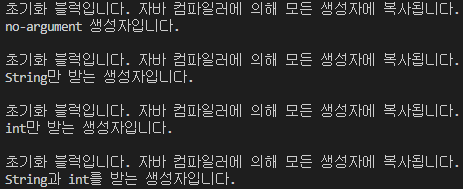
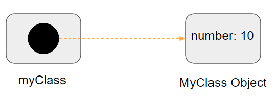

# 목표
자바의 Class에 대해 학습하세요.

## 학습 내용
* [Class](#class)
  * [Class란](#Class란)
  * [Class 선언](#Class-선언)
  * [메서드 정의](#메서드-정의)
  * [메서드 Overloading](#메서드-Overloading)
  * [생성자 선언](#생성자-선언)
  * [필드 선언](#필드-선언)
  * [필드의 접근 제한](#필드의-접근-제한)
  * [필드 초기화](#필드-초기화)
  * [파라미터에 대해](#파라미터에-대해)
* [Object](#Object)
  * [Object 생성](#Object-생성)
  * [Object 사용](#Object-사용)
* [this 키워드](#this-키워드)
* [Nested Class](#Nested-Class)
  * [Static Nested Class](#Static-Nested-Class)
  * [Inner Class](#Inner-Class)
  * [Local Class](#Local-Class)
  * [Anonymous Class](#Anonymous-Class)
* [참고 사이트](#참고-사이트)

## 과제
* [BinaryTree 구현](#BinaryTree-구현)

### Class

#### Class란?
`Class`는 각 `instance`을 만들기위한 청사진 혹은 프로토타입입니다. 쉽게 비유하자면, 붕어빵(`Object`)이 있고 그 붕어빵을 만들기 위한 붕어빵 틀이 있는데 이 붕어빵 틀을 `Class` 라고 합니다. 붕어빵 틀을 통해 만들어진 각 붕어빵들을 `instance` 라고 합니다.

#### Class 선언
`Class`는 다음과 같이 선언할 수 있습니다.

```java
public class ClassExample {
    // 생성자, 필드, 메서드 등등
}
```

최상위 레벨의 `Class`에는 오로지 `public` 과 `default(no modifier)` 접근제어 지시자만 사용할 수 있습니다.  

`Class`의 body부분(`{}`로 감싸진 부분)에는 `instance`의 life cycle동안 제공될 모든 코드들이 존재하게 됩니다.  
> 새 객체를 초기화할 생성자, 클래스 및 객체의 상태를 표현하는 필드 그리고 클래스 및 객체의 행동을 구현하는 메서드.

`Class`는 또한 `extends` 키워드와 `implements` 키워드를 통해 상위 클래스 및 인터페이스의 정보를 제공할 수 있습니다.

```java
public class ClassExample extends SuperClassExample implements InterfaceExample {
    // 생성자, 필드, 메서드 등등
}
```

#### 메서드 정의
`method`란 클래스 내부에 선언되며, 객체와 관련된 서브 루틴입니다.  
`method`는 선언된 클래스의 멤버 변수에 대한 접근 권한을 갖습니다.  
`method`는 다음과 같이 선언할 수 있습니다.

```java
public class ClassExample {

    public void methodExample(int number, String text) throws Exception {
        //...
    }
}
```

메서드는 보통 다음의 요소를 가지고 있습니다.
- 접근제어 지시자
- 반환 타입: `void`일 경우 반환값을 갖지 않습니다.
- 메서드 이름
- 파라미터 리스트: `()`로 감싸진 부분에 작성됩니다.
- 예외 리스트: `throws` 키워드를 통해 명시할 수 있습니다.
- 메서드 body: `{}`로 감싸진 부분입니다.

위의 요소중 `메서드 이름`과 `파라미터 타입`을 `메서드 시그니처`라고 합니다.  
위의 코드를 예로 들면 `메서드 시그니처`는 `methodExample(int , String)`가 됩니다.

#### 메서드 Overloading
자바에서는 메서드를 `메서드 시그니처`를 통해 구별할 수 있기때문에, `method overloading`을 지원합니다. 따라서 같은 이름의 메서드여도 파라미터 타입이 다르거나 파라미터의 갯수가 다르면 선언이 가능합니다. 하지만 `반환 타입`은 `메서드 시그니처`가 아니기때문에 `반환 타입`만 다른 경우는 선언할 수 없습니다.

```java
public class ClassExample {

    public void methodExample(int number, String text) {
        //...
    }

    public void methodExample(int number) {
        //...
    }

    public void methodExample(String text) {
        //...
    }
}
```
  

#### 생성자 선언
- 생성자(Constructor)란 `Class`를 통해 인스턴스를 생성시 호출되는 서브루틴을 말합니다.
- 생성자는 메서드의 선언과 비슷하지만, 반환값을 가지고 있지 않기때문에 엄밀히 말하면 함수라고 할 수 없습니다.
- **생성자를 통해 여러 필드를 초기화할 수 있습니다.**
- 생성자의 파라미터 갯수, 혹은 파라미터 타입이 다르다면 여러 생성자를 가질 수 있습니다.
- **어떠한 생성자도 선언하지 않을 경우, 컴파일러가 자동적으로 어떠한 파라미터도 가지지 않는 `디폴트 생성자`를 만들어줍니다.**
- **컴파일러가 만들어주는 `디폴트 생성자`의 경우, 상위클래스(super class)의 `no-argument 생성자`를 호출하기 때문에, 상위 클래스의 `no-argument 생성자`를 확인하는 것이 좋습니다.**
- **만약 상위 클래스에서 `no-argument 생성자`가 존재하지않고, 하위 클래스는 컴파일러에 의해 `디폴트 생성자`가 생성되는 경우에는 컴파일러 에러가 발생합니다.**
- **어떤한 생성자라도 선언되어있다면, 컴파일러는 디폴트 생성자를 만들지 않습니다.**

생성자는 다음과 같이 선언할 수 있습니다.  
생성자는 **반환값을 가지지 않고, 이름은 클래스의 이름과 동일해야합니다.**
```java
public class ClassExample {

    private int number;
    
    // 기본 생성자 선언입니다.
    public ClassExample() {
        System.out.println("ClassExample constructor!");
    }

    // int 값을 파라미터로 받는 생성자입니다.
    public ClassExample(int number) {
        this.number = number;
    }
}
```

#### 필드 선언
변수에는 다음과 같은 종류가 존재합니다.
* 클래스내의 멤버 변수 - `필드`라고 불립니다.
* 메서드나 코드 블럭내의 변수 - `지역 변수`라고 불립니다.
* 메서드 선언에 있는 변수 - `파라미터`라고 불립니다.

`필드(Field)`는 접근제어 지시자, 타입 그리고 이름으로 구성됩니다.  
필드를 선언하는 방법은 기존의 지역변수를 선언하듯이 `Class`의 body부분에 변수를 선언하면 됩니다.

```java
public class ClassExample {
    private int number;
    private String text;
}
```

#### 필드의 접근 제한
`Class`의 필드는 접근제어 지시자를 통해 외부로부터의 접근을 제한할 수 있습니다.  
제한되는 범위는 다음 표와 같습니다.

||클래스내부|동일패키지|상속받은클래스|이외의 영역|
|---|---|---|---|---|
|private| O | X | X | X |
|default(no modifier)| O | O | X | X |
|protected| O | O | O | X |
|public| O | O | O | O |

#### 필드 초기화
필드를 초기화하는 방법은 여러가지가 있습니다.  

* **필드 선언과 동시에 초기화**
  - 가장 간단한 방법입니다. 필드를 선언하자 마자 초기 값을 같이 선언하는 방식입니다.  
  - 클래스의 모든 인스턴스는 동일한 초기화 값을 가지는 장점이 있습니다.

```java
public class ClassExample {
    private int number = 10; //number 필드를 10으로 초기화 합니다.
}
```

* **생성자를 통한 초기화**
  - 필드를 선언하고 필드의 초기화는 생성자에 작성하는 방식입니다.  
  - 이 방식을 통해 인스턴스 생성시, 원하는 값으로 초기화를 할 수 있는 장점이 있습니다.

```java
public class ClassExample {
    private int number;

    public ClassExample(int number) {
        this.number = number; //생성자의 파라미터를 통해 필드를 초기화합니다.
    }
}
```

* **Static 초기화 블럭을 통한 초기화**
  - 클래스 변수(static이 붙은 멤버 변수)를 초기화 하는 방법입니다.  
  - 이 방법을 통해 클래스 변수 초기화시, 다양한 로직을 함께 적용할 수 있는 장점이 있습니다.
  - static 초기화 블럭은 클래스내 어느곳이든 작성이 가능하며, 여러개 작성할 수 있습니다. 또한 static 초기화 블럭은 작성된 순서에 따라 호출되는것이 보장됩니다.
  - static 초기화 블럭을 대체하는 방법으로는 `private static 메서드`를 사용하는 것입니다. `private static 메서드`를 사용하면 static 변수를 다시 초기화할때 재사용할 수 있는 장점이 있습니다.

```java
public class ClassExample {
    private static final String text;
    private static final int number = init();

    static {
        // 코드 블럭을 통해, 단순히 값의 주입뿐만 아니라 다양한 로직을 사용할 수 있습니다.
        text = "test";
    }

    // private static 메서드를 통해 static 초기화 블럭을 대체할 수 있습니다.
    private static int init() {
        return 10;
    }
}
```

* **초기화 블럭을 통한 초기화**
    - 인스턴스 변수를 초기화 하는 방법입니다.
    - 보통 생성자를 통해 초기화할수도 있지만, 초기화 블럭을 통해 필드를 초기화할수도 있습니다.
    - **초기화 블럭은 자바 컴파일러를 통해 모든 생성자에 복사됩니다. 따라서 여러 생성자안에 공유하고자 하는 코드를 초기화 블럭으로 분리할 수 있습니다.**
    - 초기화 블럭을 대체하는 방법으로는 `final 메서드`를 선언하는 방법입니다. 

초기화 블럭은 다음과 같이 선언할 수 있습니다. 앞서 봤던 `static 초기화 블럭`과 형태는 같지만 `static` 키워드는 존재하지 않습니다.

```java
public class ClassExample {

    {
        System.out.println("초기화 블럭입니다. 자바 컴파일러에 의해 모든 생성자에 복사됩니다.");
    }

    public ClassExample() {
        System.out.println("no-argument 생성자입니다.");
    }

    public ClassExample(String str) {
        System.out.println("String만 받는 생성자입니다.");
    }

    public ClassExample(int number) {
        System.out.println("int만 받는 생성자입니다.");
    }

    public ClassExample(String str, int number) {
        System.out.println("String과 int를 받는 생성자입니다.");
    }
}
```

위 생성자를 각 실행한 결과는 다음과 같습니다.  



#### 파라미터에 대해
파라미터는 메서드를 선언에 있는 변수들을 의미합니다. `Argument`는 실제 메서드가 실행될때 전달되는 실제 값을 의미합니다.

1. 파라미터 타입  
    - 메서드에 사용되는 파라미터는 어떤한 타입이든 지정할 수 있습니다.
    - 만약 메서드를 전달하고 싶으면, `lambda 표현식` 이나 `메서드 참조`를 사용해야합니다.

2. Arbitrary Number of Arguments  
    - `vargargs`라는 구조(`...` 키워드)를 이용하여 메서드에 여러갯수의 값을 전달할 수 있습니다.
    - 이러한 방식은 몇개의 argument가 필요한지 알 수 없을때, 유용하게 사용할 수 있습니다.
    - 전달된 변수는 배열로 취급되어 다루어지게됩니다.
    
    ```java
    public class MyClass {
        // ... 을 이용하여 vargargs 구조를 선언합니다.
        public void arbitraryNumberOfArgumentsMethod(String... texts) {
            //전달된 texts 변수는 배열로 취급됩니다.
            if(texts[0] != null) {
                System.out.println(texts);
            }
        }
    }

    public class Main {
        public static void main(String[] args) {
            MyClass myClass = new MyClass();
            myClass.arbitraryNumberOfArgumentsMethod("text1", "text2", "text3"); // 필요한 만큼 데이터를 추가할 수 있습니다.
        }
    }
    ```

3. 파라미터 이름  
    - 메서드나 생성자를 선언할때, 파라미터의 이름을 정의할 수 있습니다. 이때 정의된 파라미터의 이름은 메서드 내에서 전달된 argument를 참조할때 사용됩니다.  
    - 파라미터의 이름은 메서드의 범위내에서 유니크해야합니다. 따라서 메서드나 생성자내에서 동일한 이름의 지역 변수를 선언할 수 없습니다.  
    - **만약 파라미터의 이름이 클래스의 필드 이름과 동일할 경우, 파라미터는 메서드의 범위내에서 필드를 가려버립니다. 이런 경우 이름을 통해 필드에 접근할 수 없게되기 때문에, 필드에 접근하기 위해 `this` 키워드를 사용해야합니다.**  
    
    ```java
    public class MyClass {
        private int number;
    
        public MyClass(int number) {
            // 파라미터에 사용된 number라는 이름이 필드의 이름과 동일하여 필드를 가려버리게 됩니다.
            // 아래와 같이호출할 경우, number는 파라미터의 number를 의미합니다.
            number = number;
        }
    }
    ```

4. Primitive 데이터 타입의 Arguments  
Primitive 데이터 타입의 arugment는 메서드에 `value`로써 전달됩니다. 즉 **전달된 argument의 데이터를 변화시키더라도 그 유효성은 메서드 내에서만 한정되기때문에 메서드 외부에는 영향을 끼치지 않습니다.**  

    ```java
    public class Main {
        public static void main(String[] args) {
            int number = 10;
            method1(number);
    
            System.out.println(number);  // 10을 출력합니다.
        }
    
        public static void method1(int number) {
            number = 20;
    
            System.out.println(number); // 20을 출력합니다.
        }
    }
    ```

5. **Reference 데이터 타입의 Arguments**  
Reference 데이터 타입의 파라미터 또한 메서드에 **`value`로써 전달됩니다.** 즉, **전달된 참조는 메서드가 종료되고 나서도 여전히 똑같은 객체를 참조하고 있다는 의미입니다.** 하지만 전달된 객체의 **필드 값을 메서드 내에서 변경할 경우, 이 변경 사항은 적용되게 됩니다.**  

    ```java
    public class MyClass {
        public int number;
    
        public MyClass(int number) {
            this.number = number;
        }
    
    }
    
    public class Main {
        public static void main(String[] args) {
            MyClass myClass = new MyClass(10);
            MyClass myClass2 = new MyClass(10);
    
            method1(myClass, 20);
            System.out.println(myClass.number);  // 20을 출력합니다. 참조되는 객체의 필드값이 변경되었고, 이는 적용됩니다.
    
            method2(myClass2);
            System.out.println(myClass2.number);  // 10을 출력합니다. 참조 객체는 변경되지 않기때문에 최초 10의 값을 그대로 가집니다.
        }
    
        public static void method1(MyClass myClass, int number) {
            myClass.number = number;
            System.out.println(myClass.number); // 20을 출력합니다. 위에서 20으로 변경하였기 때문입니다.
    
            myClass = new MyClass(30);
    
            System.out.println(myClass.number); // 새로운 객체를 할당하였기때문에, 30을 출력합니다.
        }
    
        public static void method2(MyClass myClass) {
            myClass = new MyClass(40);
    
            System.out.println(myClass.number); // 새로운 객체를 할당하였기때문에, 40을 출력합니다.
        }
    }
    ```

### Object
`Object(객체)`란 물리적으로 존재하거나 추상적으로 생각할 수 있는 것을 말합니다. 자바 프로그램에서는 메서드를 호출하여 상호작용하는 여러 수많은 객체를 생성하게됩니다.

#### Object 생성
이미 앞서 우리는 `Class`가 생성자를 제공하고, 이 생성자를 통해 객체를 생성할 수 있다는 것을 배웠습니다. 보통 객체를 생성할 때, 우리는 다음과 같이 코드를 작성하게됩니다.

```java
public class MyClass {
    private int number;

    public MyClass(int number) {
        this.number = number;
    }
}

public class Main {

    public static void main(String[] args) {
        MyClass myClass = new MyClass(10); // 객체를 생성하는 코드
    }
}
```

위 코드에서 Object의 생성과정은 총 3가지의 파트로 나누어집니다.

1. 선언
    - `MyClass myClass`는 사용할 `MyClass` 타입의 `myClass`라는 이름의 변수를 선언한 코드입니다.
    - **단순히 원하는 클래스 타입의 변수를 선언한다고 객체가 생성되지 않습니다. 일반적으로 클래스 타입의 변수만 선언하게되면, 선언된 변수는 어떤한 참조도 가지고 있지 않게됩니다. 따라서 선언만된 변수에 접근하려고 하면 컴파일 에러가 발생하게됩니다.**

2. 인스턴스화 
    - `new` 연산자를 통해 클래스로부터 객체가 생성되게 됩니다. 이를 인스턴스화라고 합니다.
    - `new` 연산자는 생성자라고 불리는 단 하나의 argument가 요구합니다.
    - **`new` 연산자를 사용하게되면 새 객체를 위해 메모리가 할당되며, 해당 메모리에 대한 참조를 반환합니다.**
    - **`new` 연산자를 통해 반환되는 참조는 꼭 변수에 할당될 필요는 없습니다. 반환되는 참조는 표현식에서 바로 사용할 수도 있습니다. 이런 경우, 반환된 참조는 JVM에 의해 메모리가 해제됩니다.**
    - **`new` 연산자는 클래스의 생성자와는 상관이 없습니다. 쉽게 이야기하자면, `new`연산자는 자바 버전의 `malloc`이라고 할 수 있습니다.**
    - 위 코드에서는 `new` 연산자를 통해 반환된 참조를 `myClass`라는 변수에 할당한 것입니다.
    - 인스턴스화라는 말의 의미는 객체를 생성한다는 의미입니다.

3. 초기화
    - `new` 연산자가 호출된 후, 클래스의 생성자가 호출됨으로써, 생성될 객체가 가질 데이터가 초기화됩니다.

즉 위의 코드에서 생성되는 변수 및 객체는 다음과 같이 그려질 수 있습니다.



#### Object 사용

1. 필드 참조
    - 객체의 필드는 각 필드의 이름에 의해 접근할 수 있습니다.
    - 객체 외부의 코드에서 객체의 필드에 접근하는 방법은 객체의 참조나 표현식에서 `dot(.)` 연산자를 사용하여 할 수 있습니다.
    - 필드 참조는 접근제어 지시자에 의해 접근이 제한 될 수 있습니다.

2. 메서드 호출
    - 객체의 메서드 또한 각 메서드 이름을 통해 호출할 수 있습니다.
    - 객체의 메서드 호출 또한 `dot(.)`연산자를 사용하여 할 수 있습니다.
    - 메서드 호출 또한 접근제어 지시자에 의해 접근이 제한 될 수 있습니다.

```java
public class MyClass {
    private int number;
    public String text;

    public MyClass(int number) {
        this.number = number;
    }

    public void method1() {
        System.out.println("method1 호출!");
    }

    private void method2() {
        System.out.println("method1 호출!");
    }
}

public class Main {

    public static void main(String[] args) {
        MyClass myClass = new MyClass(10); // 객체를 생성하는 코드

        //System.out.println(myClass.number); //접근 제어 지시자가 private이기 때문에 컴파일 에러가 발생합니다.
        
        System.out.println(myClass.text); //접근제어 지시자가 public이기 때문에 dot 연산자를 사용하여 접근이 가능합니다.
        
        myClass.method1(); // 객체의 메서드 또한 dot 연산자를 이용하여 호출할 수 있습니다.

        //myClass.method2(); // 접근 제어 지시자가 private이기 때문에 컴파일 에러가 발생합니다.
    }
}
```

3. **객체의 메모리 관리**  
    - 몇몇 object-oriented 언어에서는 프로그래머가 직접 생성한 모든 객체를 추적하고 사용이 끝나면 제거해줘야 합니다. 하지만 자바 언어에서는 `Garbage Collector`에 의해 생성된 객체가 필요없어질 경우 제거되게 됩니다. 이를 `garbage collection`이라고 부릅니다.  
    - 보통 더이상 참조되지 않는 객체가 `garbage collection`의 대상이 됩니다. 만약 변수에 할당된 참조일 경우, 그 변수가 범위(scope)를 벗어나게되면 삭제됩니다. 또는 변수에 `null`을 할당하여 명시적으로 객체 참조를 삭제할 수 있습니다. 
    - `garbage collector`는 적절한 시기라고 판단되면, `garbage collection`을 자동으로 실행합니다.

### this 키워드
인스턴스의 메서드나 생성자에서 사용되는 `this`라는 키워드는 현재의 객체를 가리킵니다. 따라서 `this`키워드를 통해 현재의 객체 내의 필드나 메서드를 참조할 수 있습니다.

1. `this` 키워드를 이용한 필드 참조  
보통 파라미터의 이름이 멤버 변수의 이름과 같으면, 파라미터가 멤버 변수를 가려버리기때문에, 멤버 변수를 참조할 수 없게됩니다. 이런 경우, `this` 키워드를 사용하게되면 현재 인스턴스의 멤버 변수를 참조 할 수 있게됩니다. 

```java
public class MyClass {
    private int number;
    private String text;

    public MyClass(int number, String text) {
        //number = number; // 여기에 사용된 number는 멤버 변수가 아닌 파라미터로 들어오는 number를 가리키는 것입니다.
        this.number = number; // this 키워드를 사용하면 현재 인스턴스의 멤버 변수를 가리키게 됩니다.
        this.text = text;
    }
}
```

1. `this` 키워드를 이용한 생성자 호출  
생성자내에서 `this` 키워드를 사용하면 같은 클래스내의 다른 생성자를 호출할 수 있습니다. 이러한 방법은 `명시적 생성자 호출`이라고 합니다. 

```java
public class MyClass {
    private int number;
    private String text;

    public MyClass() {
        this(10, "test"); // int 와 String 타입을 갖는 생성자를 호출합니다.
    }

    public MyClass(int number, String text) {
        this.number = number;
        this.text = text;
    }
}
```

### Nested Class
자바 프로그래밍에서는 한 클래스 내부에 다른 클래스를 선언할 수 있습니다. 이러한 클래스를 `Nested Class`, 즉 중첩클래스라고 합니다.

`Nested Class`는 두가지의 카테고리로 나누어집니다.
1. `static` 키워드를 이용한 경우, `static nested class`라고 합니다.
2. `static` 키워드를 이용하지 않은 경우, `inner class`라고 합니다.

```java
public class OuterClass {
    static class StaticNestedClass {

    }

    class InnerClass {

    }
}
```

중첩 클래스는 중첩 클래스를 둘러싼 클래스의 멤버이기 때문에, 둘러싼 클래스의 필드에 얼마든지 접근이 가능합니다(`private`로 되어있어도 접근이 가능합니다). 하지만 `static`으로 선언한 중첩 클래스의 경우 필드에 접근이 불가능합니다.

**중첩 클래스 또한 둘러싼 클래스의 멤버이기때문에, 모든 접근제어 지시자를 사용할 수 있습니다.**

* 중첩 클래스를 사용하는 이유  
    - 한 곳에서만 사용되는 클래스들을 논리적으로 그룹화할 수 있기 때문입니다.
    - 캡슐화를 증가시킬 수 있기 때문입니다.
    - 좀 더 읽기 쉽고 유지보수하기 쉬운 코드로 이어질 수 있기 때문입니다.

#### Static Nested Class
`Static Nested Class`는 바깥 클래스의 변수나 메소드에 직접 접근이 불가능합니다. 따라서 바깥 클래스의 변수나 메소드에 접근하기위해서는 그 클래스의 객체 참조를 사용해야합니다.

`Static Nested Class`는 일반적으로 선언하는 클래스처럼 사용됩니다. 따라서 단순히 패키징을 보다 편하게 하기 위해 사용된 클래스라고 이해하시면 됩니다.

`Static Nested Class`는 바깥 클래스의 이름을 통해 접근할 수 있습니다.

```java
public class OuterClass {
    public static class StaticNestedClass {

    }
}

public class Main {
    public static void main(String[] args) {
        OuterClass.StaticNestedClass staticNestedClass = new OuterClass.StaticNestedClass();
    }
}
```

#### Inner Class
`Inner Class`는 객체의 메서드나 필드에 바로 접근이 가능하지만, `Inner Class`는 인스턴스와 관련되기 때문에(정확히는 인스턴스의 멤버 변수로서 정의되기때문에) `static` 멤버 변수를 가질 수 없습니다.

```java
public class OuterClass {
    public class InnerClass {
        static int NUMBER = 10; // 컴파일 에러 발생
        static final int IMMUTABLE_NUMBER = 10; // 선언 가능
    }
}
```

위의 코드를 보면 단순히 `static` 키워드만 쓴 멤버 변수는 컴파일 에러가 발생하게 됩니다. 그러한 이유는 `Inner Class`는 바깥 클래스의 인스턴스에 종속적인데, 바깥 클래스에 대한 인스턴스를 여러개 생성한 경우, 어떤 인스턴스의 `static` 멤버 변수 값이 옳은 것인지 알 수 없기 때문입니다. 하지만 `final` 키워드를 사용하게 될 경우 값이 컴파일 시점에 결정되고 변경될 수 없기 때문에 사용이 가능합니다.

`Inner Class`를 인스턴스화 하기 위해서는 먼저 바깥 클래스를 인스턴스화 해야합니다. 그 후, 바깥 클래스의 인스턴스를 이용하여 `Inner Class` 객체를 만들 수 있습니다.

```java
public class OuterClass {
    public class InnerClass {
    }
}

public class Main {
    public static void main(String[] args) {
        OuterClass outerClass = new OuterClass();
        
        OuterClass.InnerClass innerClass = outerClass.new InnerClass();
    }
}
```

`Inner Class`에 바깥 클래스의 멤버 변수와 동일한 멤버 변수가 존재할때, `{바깥 클래스의 이름}.this.{멤버 변수}`로 바깥 클래스의 멤버 변수에 접근할 수 있습니다.

```java
public class OuterClass {
    private int number = 20;

    public class InnerClass {
        private int number = 30;
    
        public void method(int number) {
            System.out.println(number); // 10이 출력됩니다.
            System.out.println(this.number); // 30이 출력됩니다.
            System.out.println(OuterClass.this.number);  // 20이 출력됩니다.
        }
    }
}

public class Main {
    public static void main(String[] args) {
        OuterClass outerClass = new OuterClass();
        OuterClass.InnerClass innerClass = outerClass.new InnerClass();

        innerClass.method(10);
    }
}
```

#### Local Class
`Local Class`란 코드 블럭(`{}`)안에 정의된 클래스를 의미합니다. `Local Class`는 특정 메소드내에서만 필요한 객체가 필요할때 주로 사용됩니다.

```java
public class Main {

    public static void main(String[] args) {
        boolean result = hasInvalid("V111111111", "V123456789", "E123456789");
        System.out.println(result); // true 출력

        boolean result2 = hasInvalid("V111111111", "V123456789");
        System.out.println(result2); // false 출력
    }

    public static boolean hasInvalid(String... values) {
        boolean result = false;
        final int length = 10;
        final String prefix = "V";

        class Value {
            private String prefix = "";
            private String number = "";

            Value(String value) {
                if(value.length() == length) {
                    this.prefix = value.substring(0, 1);
                    this.number = value.substring(1, value.length());
                }                
            }

            public String getPrefix() {
                return this.prefix;
            }

            public String getNumber() {
                return this.number;
            }
        }

        for(String value : values) {
            Value valueObject = new Value(value);
            if(!prefix.equalsIgnoreCase(valueObject.getPrefix()) || valueObject.getNumber().length() != 9) {
                result = true;
            }
        }

        return result;
    }
}
```

#### Anonymous Class
`Anonymous Class`는 이름이 없다는 것만 제외하면 `Local Class`와 동일합니다. 따라서 `Local Class`를 한번만 사용해야하는 경우에 사용할 수 있습니다. **또한 `Anonymous Class` 선언과 동시에 인스턴스화가 가능합니다.**

`Anonymous Class`는 표현식이기 때문에, 다른 표현식에서 사용이 가능합니다.

`Anonymous Class`는 다음과 같이 선언할 수 있습니다.

```java
public class Main {

    public static abstract class MyAbstractClass {
        private int number;

        public MyAbstractClass(int number) {
            this.number = number;
        }

        public void method() {}
    }

    interface MyInterface {
        public void method();
    }

    public static void main(String[] args) {
        // 선언과 동시에 인스턴스화를 할 수 있습니다.
        MyInterface myInterface = new MyInterface() {
            public void method() {
                System.out.println("method 호출!");
            }
        };

        myInterface.method(); // 'method 호출!'이 출력됩니다.

        MyAbstractClass myAbstractClass = new MyAbstractClass(10) {
            @Override
            public void method() {
                System.out.println(super.number);
            }
        };

        myAbstractClass.method(); // 10이 출력됩니다.
    }

}
```

**`Anonymous Class` 표현식은 다음으로 구성됩니다.**
* `new` 연산자.
* 구현하고자 하는 클래스 혹은 인터페이스의 이름.
* 구현하고자하는 클래스의 생성자와 동일한 arguments를 가진 괄호. 인터페이스의 경우 빈 괄호 사용합니다.
* 클래스를 정의한 body 부분. 메서드는 선언할 수 있지만, 명령어는 선언할 수 없습니다.

**`Anonymous Class`에는 다음과 같은 제약사항이 있습니다.**
* `Anonymous Class`는 `final` 혹은 `effectively final`이 아닌 지역 변수에 접근할 수 없습니다.
* `Anonymous Class`는 중첩클래스처럼 바깥 클래스의 변수와 동일한 이름으로 선언시 바깥 클래스의 변수를 가리게 됩니다.
* `Anonymous Class`에는 `static 초기화 블럭` 및 `멤버 interface`를 선언 할 수 없습니다.
* `Anonymous Class`는 상수 변수에 한해서만 `static 멤버`를 가질 수 있습니다. 
* `Anonymous Class`에는 생성자를 정의할 수 없습니다.

**`Anonymous Class`는 다음과 같은 사항은 허용됩니다.**
* `Anonymous Class`는 바깥 클래스의 멤버에 접근할 수 있습니다.
* `Anonymous Class`에는 필드, 추가 메서드, `instance 초기화 블럭` 및 `Local class`를 선언할 수 있습니다.


### 참고 사이트
* [Oracle - java documentation](https://docs.oracle.com/javase/tutorial/java/javaOO/index.html)

### BinaryTree 구현
