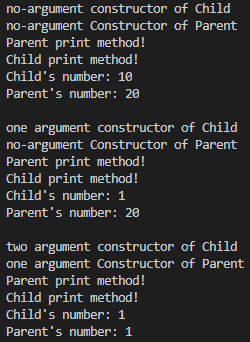

# 목표
자바의 상속에 대해 학습하세요.

## 학습 내용
* [자바 상속](#자바-상속)
  * [상속이란](#상속이란)
  * [상속하는 방법](#상속하는-방법)
  * [자바 상속 특징](#자바-상속-특징)
  * [상속을 사용하는 이유](#상속을-사용하는-이유)
  * [상속과 접근제어 지시자](#상속과-접근제어-지시자)
  * [Subclass](#Subclass)
  * [상속과 Casting](#상속과-Casting)
* [super 키워드](#super-키워드)
* [Method Overriding과 Hiding](#Method-Overriding과-Hiding)
  * Instance Method에 대한 메서드 오버라이딩
  * Static Method의 Hiding
  * 메서드 오버라이딩과 접근제어 지시자
* [추상 클래스](#추상-클래스)
  * 추상 클래스를 써야 할 때
* [final 키워드](#final-키워드)
  * final class
  * final method
  * final variable
* [Object 클래스](#Object-클래스)
* [Polymorphism](#Polymorphism)
* [Dynamic Method Dispatch](#Dynamic-Method-Dispatch)
* [Double Dispatch](#Double-Dispatch)
  * Double Dispatch 란
  * Double Dispatch의 원리를 이용한 코드 구현
* [참고 사이트](#참고-사이트)

### 자바 상속

#### 상속이란
`Java` 언어에서 상속이란 어떤 클래스가 다른 클래스로부터 필드와 메서드를 물려받는 것을 의미합니다.

#### 상속하는 방법
클래스를 정의할때 `extends` 키워드를 이용하여 다른 클래스를 상속받을 수 있습니다.

```java
public class Child extends Parent {
    // child 클래스는 parent 클래스를 상속했습니다.
}

public class Parent {
    // 암묵적으로 Parent는 Object 클래스를 상속하고 있습니다.
}
```

#### 자바 상속 특징
`Java` 언어의 상속은 다음의 특징을 가지고 있습니다.

- **`Java` 언어에서는 단일 상속만을 지원합니다. 따라서 하나의 클래스가 여러 클래스를 상속할 수 없습니다.**
- 다른 클래스로부터 상속된(혹은 파생된) 클래스를 `subclass` 혹은 `child class`라고 합니다.
- `subclass`가 파생된 클래스를 `superclass` 혹은 `parent class`라고 합니다.
- 상속은 패키지에 상관없이 가능합니다.
- **상속은 한방향으로만 연속적으로 생길 수 있습니다. 따라서 아래와 같은 코드는 작성될 수 없습니다.**
    ```java
    public class Child extends Parent {
    }

    public class Parent extends Grandparent {
    }

    public class Grandparent extends Child {
        // 컴파일 에러가 발생합니다. 이러한 순환 상속은 불가능하기 때문입니다.
        // extends Child를 제거하면 아무런 문제가 없습니다.
    }
    ```
- **`Object`라는 클래스를 제외하고 모든 클래스는 단 하나의 `superclass`를 가지고 있습니다.**
- **만약 `superclass`가 클래스에 명시되어 있지 않다면, 그 클래스는 암묵적으로 `Object` 클래스를 상속받습니다.**
      
    이미지 출처(source) - [Oracle 공식 튜토리얼](https://docs.oracle.com/javase/tutorial/java/IandI/subclasses.html)
- **`subclass`는 `superclass`의 모든 멤버들(필드, 메서드, 중첩 클래스)을 상속받습니다.**
    ```java
    public class Child extends Parent {
        // Child 클래스는 Parent 클래스의 number, method1, InnerClass를 모두 상속 받습니다. 
    }

    public class Parent {
        public int number;

        public void method1() {
        }
        
        public class InnerClass {
        }
    }

    public class Main {
        public static void main(String[] args) {
            Child child = new Child();
            
            child.number = 10;
            child.method1();
            child.new InnerClass();
        }
    }
    ```
- **`생성자`는 상속되지 않지만, `subclass`에서 `superclass`의 `생성자`를 호출 할 수 있습니다.**

#### 상속을 사용하는 이유
**`Java` 언어에서 상속을 하는 이유는 이미 존재하는 클래스의 메서드와 필드를 재사용할 수 있기때문입니다.** 즉, 여러분이 새 클래스를 만들고자 하고, 구현하고자 하는 코드가 이미 다른 클래스에 존재한다면, 여러분은 새로 작성할 필요없이 클래스 상속을 통해 이미 작성한 코드를 재사용할 수 있게됩니다. **하지만 단순히 재사용만을 위해 상속을 사용하게되면 OOP의 목적과는 맞지 않는 클래스가 될 수 있습니다. 따라서 상속을 사용할때는 OOP의 목적에 맞으면서 재사용이 가능할때 적절히 사용하는게 좋습니다.**

#### 상속과 접근제어 지시자
- **`subclass`는 `superclass`의 `public` 과 `protected` 멤버만 상속받을 수 있습니다.** 
    ```java
    // package path: .../child
    public class Child extends Parent {
        public void method1() {
            System.out.println(this.number); // 컴파일 에러 - 현재 subclass가 다른 패키지에 있기때문에, default 접근제어 지시자가 붙은 필드가 상속되지 않습니다.
            System.out.println(this.protected_number);
            System.out.println(this.public_number);
            System.out.println(this.private_number); // 컴파일 에러 - private 접근제어 지시자가 붙은 필드는 상속되지 않습니다.
        }
    }

    // package path: .../parent
    public class Parent {
        int number = 10;
        protected int protected_number = 20;
        public int public_number = 30;
        private int private_number = 40;
    }
    ```

- 만약 `subclass`가 `superclass`와 동일한 패키지에 존재한다면, `superclass`의 `package-private` 멤버(`default` 접근제어 지시자 멤버) 또한 상속받을 수 있습니다.
    ```java
    // package path: .../parent
    public class Child extends Parent {
        public void method1() {
            System.out.println(this.number); // 같은 패키지에 있기때문에, default접근제어 지시자가 붙은 필드도 상속이됩니다.
        }
    }

    // package path: .../parent
    public class Parent {
        int number = 10;
    }
    ```

- 기본적으로 `superclass`의 `private` 멤버는 상속되지 않지만, 만약 `superclass`의 `public` 혹은 `protected` 메서드가 `private` 멤버에 접근하고 있으면, 이 메서드를 통해 `superclass`의 `private` 멤버에 접근이 가능합니다.
    ```java
    public class Child extends Parent {
        public void method1() {
            System.out.println(this.number); // 10이 출력됩니다.
        }
    }

    public class Parent {
        private int number = 10;

        protected int getPrivateNumber() {
            return this.number;
        }
    }
    ```

- 중첩 클래스는 둘러싼 클래스의 모든 `private` 멤버에 접근이 가능하기때문에, `subclass`에 상속된 중첩클래스를 통해 `superclass`의 `private` 멤버에 간접적으로 접근할 수 있습니다.

#### Subclass
`subclass`에서는 다음과 같은 일들을 할 수 있습니다.

- 상속된 필드들은 다른 필드들처럼 직접적으로 사용이 가능합니다.(`.`연산자 이용)
- `subclass`에서 동일한 이름의 필드를 선언할 수 있습니다. 하지만 이는 `superclass`의 필드를 가리기 때문에 추천하는 방식은 아닙니다.
- `subclass`에는 새로운 필드를 추가할 수 있습니다.
- 상속된 메서드 역시 다른 메서드처럼 직접적으로 사용이 가능합니다.
- `subclass`에서 동일한 메서드 시그니처를 갖는 메서드를 작성할 수 있습니다. 이럴 경우, `superclass`의 메서드를 덮어씁니다.(method overriding)
- `subclass`에서 동일한 메서드 시그니처를 갖는 `static` 메서드를 작성할 수 있습니다. 이럴 경우, `superclass`의 메서드를 가리게됩니다(hiding).
- `subclass`에 새로운 메서드를 추가할 수 있습니다.
- `subclass`에 `superclass`의 생성자를 호출 할 수 있는 생성자를 선언할 수 있습니다.(`super` 키워드 이용)

#### 상속과 Casting
```java
public class Child extends Parent {

}

public class Parent {

}

public class main {
    public static void main(String[] args) {
        Child child = new Child();
        Parent parent = new Child();
        Object object = new Child();
    }
}
```

위의 코드를 보면 **`Child` 클래스 타입의 인스턴스는 타입 캐스팅을 명시적으로 선언하지 않아도 각각 `Parent`, `Object` 클래스 타입으로 캐스팅될 수 있습니다.**  
이러한 이유는, `Child` 클래스가 `Parent` 클래스의 `subclass`이기 때문입니다.(암묵적 형변환이 가능)  
쉽게 이해하자면, `subclass`는 이미 `superclass`의 모든 데이터를 가지고 있습니다. 따라서 `superclass`로 타입을 변경하더라도 `superclass`가 필요로 하는 데이터가 전부 있기 때문에 문제가 없습니다.  

**하지만 반대로 `Parent` 혹은 `Object` 클래스 타입의 인스턴스는 `Child` 타입으로 캐스팅 될 수 없습니다.** 따라서 `Child child = new Parent();`라는 코드를 작성하면 컴파일 에러가 발생합니다.  
만약 강제 캐스팅을 위해 `Child child = (Child) new Parent();` 라고 작성하게되면, 컴파일에러는 사라지게 되지만, 런타임시 `ClassCastException` 예외가 발생하게됩니다.
이러한 이유는 `superclass`는 자기를 상속받는 클래스가 누구인지 알수도 없고, 또한 그 `subclass`가 더 많은 데이터를 가지고 있을 수도 있기때문에, `superclass`가 `subclass`가 필요로 하는 데이터를 모두 가진다고 확신할 수 없기때문입니다.

만약 아래의 코드처럼 `Child`의 인스턴스를 생성하면서 `Parent`나 `Object`로 형변환 된 변수를 다시 `Child` 타입으로 명시적 캐스팅을 한다면, 이는 문제가 없이 캐스팅이 됩니다.
그러한 이유는 이미 생성할 당시 `subclass`의 데이터로 생성하였고 이를 `superclass`로 변경하였어도 실제 `subclass`의 데이터는 모두 가지고 있는 상태이기 때문에 캐스팅시, `subclass`가 필요로 하는 데이터를 모두 가진다는 것을 확신할 수 있기 때문입니다.
```java
public class Child extends Parent {

}

public class Parent {

}

public class main {
    public static void main(String[] args) {
        Child child = new Child();
        Parent parent = new Child();
        Object object = new Child();

        Child child2 = (Child) parent;
        Child child3 = (Child) object;
    }
}
```

하지만 보편적으로 **메서드의 파라미터로 받는 클래스가 캐스팅이 가능한 클래스인지 알기가 어렵습니다. 따라서 `subclass`타입으로 캐스팅을 하기전, `instanceof` 연산자를 이용하여 캐스팅이 가능한지 확인하는 것이 안전한 방법입니다.**


### super 키워드
- `super` 키워드는 오버라이딩된 `superclass`의 메서드나 혹은 가려진 `superclass`의 필드를 접근할 때 사용합니다. 
- `super` 키워드를 통해 `superclass`의 생성자를 호출 할 수 있습니다.
- **만약 `subclass`에서 `superclass`의 생성자를 명시적으로 호출하지 않으면, 컴파일러가 자동으로 `superclass`의 `no-argument` 생성자를 호출하는 코드를 삽입합니다. 따라서 만약 `superclass`에 `no-argument` 생성자가 존재하지 않을 경우, 컴파일 에러가 발생하게됩니다.**

```java
public class Child extends Parent {
    private int number = 10;
    private String text = "";

    public Child() {}

    public Child(int number) {
        this.number = number;
    }

    public Child(int number, String text) {
        super(number);
        this.number = number;
        this.text = text;
    }

    @Override
    public void print() {
        super.print();
        System.out.println("Child print method!");
        System.out.println("Child's number: "+this.number);
        System.out.println("Parent's number: "+super.number);
    }
}

public class Parent {
    protected int number = 20;

    public Parent() {
        System.out.println("no-argument Constructor of Parent");
    }

    public Parent(int number) {
        System.out.println("one argument Constructor of Parent");
        this.number = number;
    }

    public void print() {
        System.out.println("Parent print method!");
    }
}

public class main {
    public static void main(String[] args) {
        System.out.println("no-argument constructor of Child");
        Child child1 = new Child();
        child1.print();
        System.out.println();

        System.out.println("one argument constructor of Child");
        Child child2 = new Child(1);
        child2.print();
        System.out.println();

        System.out.println("two argument constructor of Child");
        Child child3 = new Child(1, "test");
        child3.print();
        System.out.println();
    }
}
```

위 코드의 실행 결과 값은 다음과 같습니다.  
  


### Method Overriding과 Hiding

1. Instance Method에 대한 메서드 오버라이딩
    - `메서드 오버라이딩`란 `subclass`에서 `superclass`의 메소드의 **메서드 시그니처**와 **리턴타입**이 동일한 메서드를 정의하여 `superclass`의 메서드를 재정의하는 것을 의미합니다.  
    - `메서드 오버라이딩`된 메서드에는 `Override`라는 어노테이션을 지정할 수 있습니다. 이 어노테이션은 컴파일러에게 해당 메서드가 오버라이딩된 메서드라는 것을 알려줍니다. 만약 `Override` 어노테이션이 붙은 메서드가 `superclass`에 존재하지 않는 경우, 에러를 만들어냅니다.
    - **오버라이딩된 메서드는 오버라이딩된 메서드에서 반환 된 타입의 하위 타입(`subclass`)을 반환 할 수도 있습니다. 이러한 하위 타입을 `covariant return type`이라고 합니다.**
        ```java
        public class GrandParent {
            private String name = "grandParent";
    
            public GrandParent() {
            }
    
            public GrandParent(String name) {
                this.name = name;
            }
    
            public String getName() {
                return this.name;
            }
        }
    
        public class Parent extends GrandParent {
            private int age = 10;
    
            public Parent() {
                super("parent");
            }
    
            GrandParent getParent() {
                return new GrandParent();
            }
    
            public int getAge() {
                return this.age;
            }
        }
    
        public class Child {
            GrandParent getParent() {
                System.out.println("Child - getParent");
                return new GrandParent();
            }
        }
    
        public class GrandChild extends Child {
    
            // 반환타입이 Parent 이지만, 메서드 오버라이딩이 정상적으로 되며 또한 Override 어노테이션이 정상적으로 붙습니다.
            @Override
            Parent getParent() { 
                System.out.println("GrandChild - getParent");
                super.getParent();
                return new Parent();
            }
        }
    
        public class Main {
            public static void main(String[] args) {
                Child child = new GrandChild();
    
                // "GrandChild - getParent" 출력후, super를 통해 Child의 getParent를 호출합니다.
                GrandParent grandParent = child.getParent();
    
                // 문제없이 캐스팅이 됩니다.
                Parent parent = (Parent) grandParent;
    
                System.out.println(parent.getAge()); // 10 출력
                System.out.println(parent.getName()); // parent 출력
            }
        }
        ```

2. Static Method의 Hiding
    - `static method`의 경우 `subclass`에서 동일한 메서드를 재정의하게되면 `superclass`의 메서드를 가리게됩니다. 따라서 `static method`는 하위 혹은 상위 클래스의 호출에 영향을 받습니다.
        ```java
        public class Parent {
            public static void print() {
                System.out.println("Parent static method!");
            }
        }

        public class Child extends Parent {
            public static void print() {
                System.out.println("Child static method!");
            }
        }

        public class GrandChild extends Child {
        }

        public class TestClass extends Parent {
        }

        public class Main {
            public static void main(String[] args) {
                Parent.print(); // Parent static method! 출력
                Child.print(); // Child static method! 출력
                GrandChild.print(); // Child static method! 출력
                TestClass.print(); // Parent static method! 출력
            }
        }
        ```

3. 메서드 오버라이딩과 접근제어 지시자
    - 메서드 오버라이딩시, 접근제어 지시자는 변경이 가능하지만, `superclass`에 정의된 접근제어 지시자보다 더 많은 제한을 가진 접근제어 지시자로 변경할 수 없습니다.
        > 만약 `superclass`의 메서드가 `protected`면, 오버라이딩시 `public`으로 변경이 가능하지만, `private`로는 불가능합니다.
    - `superclass`의 인스턴스 메서드를 `static` 메서드로 변경할 수 없습니다.
    - `superclass`의 `static` 메서드를 인스턴스 메서드로 변경할 수 없습니다.

### 추상 클래스
추상 클래스란 `abstract` 키워드가 선언된 클래스를 말합니다. 추상클래스는 인스턴스화가 불가능하지만, 다른 클래스의 `subclass`나 `superclass`가 될 수 있습니다.

추상 메서드(abstract method)란 메서드의 구현부 없이 선언된 메서드를 의미합니다. 추상 메서드는 리턴 타입 앞에 `abstract` 키워드를 붙여 선언할 수 있습니다.

```java
public class GrandParent {

}

public abstract class Parent extends GrandParent { // 추상 클래스입니다. 다른 클래스의 하위 클래스가 될 수 있습니다.
    public void print() {
        System.out.println("Parent abstract class's print method!");
    }

    public abstract void method1(); // 추상 메서드입니다.
}

public class Child extends Parent {
    @Override
    public void method1() { // 추상 클래스의 하위 클래스는 추상 메서드를 무조건 구현해야합니다.
        System.out.println("Child class's method!");
    }
}
```

**추상클래스를 써야할때**
- 여러 관련 클래스들에서 코드를 공유하고 싶을때.
- 추상 클래스를 상속한 클래스가 많은 공통 메서드 및 필드를 가지거나 `public` 외의 다양한 접근 제어 지시자가 필요로 할 때.
- `non-static` 이나 `non-final` 필드를 선언하고 싶을때.
- `interface`를 구현하지만 모든 메서드를 구현하고 싶지 않을때.


### final 키워드
1. final class  
    final class는 Class 앞에 `final` 키워드를 붙인 것을 말합니다. 이러한 클래스는 보통 상속을 금지하기 위해 사용됩니다. 
    
    ```java
    public final class ConstantClass {
    
    }
    
    public class Child extends ConstantClass { // 컴파일 에러가 발생합니다.
    
    }
    ```

2. final method  
    final method는 method에 `final` 키워드를 붙인 것을 말합니다. 이러한 메서드는 상속시, 재정의가 불가능합니다.
    
    ```java
    public class Parent {
        public final void print() {
            System.out.println("Parent class's print method!");
        }
    }
    
    public class Child extends Parent {
        @Override
        public final void print() { // 컴파일 에러가 발생합니다.
            System.out.println("Child class's print method!");
        }
    }
    ```

3. final variable  
    final variable은 변수 앞에 `final` 키워드를 붙인 것을 말합니다. 이러한 변수는 한번 값이 할당되면 재할당이 불가능합니다.
    
    ```java
    public class Main {
        final int number = 10;
    
        public void method() {
            this.number = 20; // 컴파일 에러 발생
        }
    }
    ```

### Object 클래스
`Object` 클래스는 `java.lang` 패키지에 있으며, class 계층 트리에서 가장 위에 있습니다. 모든 클래스는 직접적 혹은 간접적으로 `Object` 클래스를 상속하기때문에 `Object` 클래스의 메서드를 가지고 있습니다. 몇몇 메서드의 경우 사용하고자 할 때, 클래스에 맞게 오버라이딩해야할 수도 있습니다.

|메서드|설명|
|---|---|
|protected Object clone() throws CloneNotSupportedException| 객체의 복사본을 생성하여 리턴합니다. 이 메서드를 사용하기 위해선 `Cloneable` 인터페이스를 구현해야합니다.|
|public boolean equals(Object obj)| 파라미터 객체가 현재 객체와 같은지 나타냅니다.|
|protected void finalize() throws Throwable| 현재 객체가 더 이상 참조되지 않는다고 판단되었을때, `garbage collector`에 의해 호출됩니다. Java 9 부터는 deprecated 되었습니다.|
|public final Class getClass()| 객체의 런타임 클래스를 반환합니다.|
|public int hashCode()| 객체의 hash code값을 반환합니다.|
|public String toString()| 객체를 표현하는 string 값을 반환합니다.|
|public final void notify()| 객체 모니터에서 대기 중인 하나의 스레드를 깨웁니다.|
|public final void notifyAll()| 객체 모니터에서 대기 중인 모든 스레드를 깨웁니다.|
|public final void wait()| 현재 스레드를 깨울때까지 대기시킵니다. |
|public final void wait(long timeout)| 현재 스레드를 일정 실시간이 경과하거나 다시 깨울때까지 대기시킵니다. |
|public final void wait(long timeout, int nanos)| 현재 스레드를 일정 실시간이 경과하거나 다시 깨울때까지 대기시킵니다. |

### Polymorphism
`Java` 언어에서 Polymorphism(다형성)이란 한 클래스 타입의 객체가 그 상위 클래스 타입으로 표현될 수 있는 것을 말합니다. 이러한 다형성을 이용하면 다양한 객체를 하나의 클래스 타입으로 묶어서 표현할 수 있게됩니다. 

```java
public abstract class Weapon {}

public class Sword extends Weapon {}

public class Arrow extends Weapon {}

public class Wand extends Weapon {}

public class Main {
    public static void main(String[] args) {
        // 리스트 내 각 요소는 서로 다른 객체지만 모두 Weapon이라는 상위 클래스 타입으로 표현할 수 있습니다. 이러한 성질을 다형성이라고 합니다.
        List<Weapon> weapons = Arrays.asList(new Sword(), new Arrow(), new Wand());
    }
}
```

### Dynamic Method Dispatch
**`Dynamic Method Dispatch`란 런타임 시점에 호출되는 메서드가 결정되는 것을 의미합니다.**

앞서 봐왔듯이 `subclass`는 `메서드 오버라이딩`을 통해 `superclass`의 메서드를 재정의할 수 있고, `Polymorphism` 특성에 의해 `superclass`로 표현될 수 있습니다. 따라서 만약 메서드의 호출이 컴파일 시점에 모두 결정된다면, 우리는 `subclass`를 `superclass`타입으로 표현할 시, 재정의된 메서드를 호출 할 수 없게됩니다. 하지만 `Java`에서는 `Dynamic Method Dispatch`를 지원하기 때문에 `subclass`를 `superclass`타입으로 표현하여도 재정의된 메서드를 호출할 수 있게됩니다.

```java
public abstract class Weapon {
    void attack() {
        System.out.println("attack by Weapon!");
    }
}

public class Sword extends Weapon {
    @Override
    void attack() {
        System.out.println("attack by Sword!");
    }
}

public class Arrow extends Weapon {
    @Override
    void attack() {
        System.out.println("attack by Arrow!");
    }
}

public class Wand extends Weapon {
    @Override
    void attack() {
        System.out.println("attack by Wand!");
    }
}

public class Main {
    public static void main(String[] args) {
        List<Weapon> weapons = Arrays.asList(new Sword(), new Arrow(), new Wand()); //하위 클래스가 상위 클래스로 표현되어 있습니다.
        weapons.forEach(w -> w.attack()); // 상위 클래스의 메서드를 호출하였지만, 각각 하위 클래스에서 재정의된 메서드가 호출됩니다.
        
        // 위 메서드를 실행하면 아래와 같이 출력됩니다.
        // attack by Sword!
        // attack by Arrow!
        // attack by Wand!

        // 만약 Dynamic Method Dispatch를 지원하지 않는다면, 모두 "attack by Weapon!"이라고 출력될 것입니다.
    }
}
```

### Double Dispatch
**`Double Dispatch`란 호출하고자 하는 메서드가 런타임 시점에 호출하는 객체의 타입과 argument의 타입으로 인해 정해지는 것을 의미합니다.**  

`Double Dispatch`를 메서드 오버로딩과 헷갈릴 수 있으실텐데, 둘은 완전히 다른 것입니다. 메서드 오버로딩의 경우 호출하는 객체의 타입은 정해져 있고, argument의 타입만 다른 것입니다. 하지만 `Double Dispatch`는 호출하는 객체의 타입과 arugment의 타입 모두 런타임 시점에 결정되는 것을 의미합니다.

**자바에서는 현재 `Double Dispatch`를 지원하고 있지 않습니다.** 하지만 `Visitor` 패턴을 통해 유사한 행동을 구현할 수 있습니다.  

지금부터 단계적으로 앞서 배운 내용을 사용하고, `Sigle Dispatch`에서 `Double Dispatch`의 원리를 이용한 방법으로의 전환까지 해보도록 하겠습니다. 또한 코드 구현 후, 어떠한 장점이 있는지도 알아보도록 하겠습니다.

우선 다음과 같은 초기 요구사항이 있었다고 가정하겠습니다.
- 게임 내 직업은 Warrior, Magician, Archer가 있다.
- 게임 내 무기는 Sword, Arrow, Wand가 있다.
- 무기는 attackPoint라는 메서드를 통해 공격력을 반환한다.
- Warrior는 Sword를 사용할 수 있다.
- Magician Wand를 사용할 수 있다.
- Archer가 Arrow를 사용할 수 있다.
- 각 직업은 attack이라는 메서드를 통해 각 직업별 무기 공격을 할 수 있다.

위의 초기 요구사항에 맞게 우선 직업과 기본적인 무기를 정의하겠습니다.

```java
public class Sword {
    public int attackPoint() {
        return 10;
    }
}

public class Arrow {
    public int attackPoint() {
        return 10;
    }
}

public class Wand {
    public int attackPoint() {
        return 10;
    }
}

public class Warrior {
    private Sword sword;

    public Warrior(Sword sword) {
        this.sword = sword;
    }

    public void attack() {
        System.out.println("Warrior attack! - attack point: " + this.sword.attackPoint());
    }
}

public class Magician {
    private Wand wand;

    public Magician(Wand wand) {
        this.wand = wand;
    }

    public void attack() {
        System.out.println("Magician attack! - attack point: " + this.wand.attackPoint());
    }
}

public class Archer {
    private Arrow arrow;

    public Archer(Arrow arrow) {
        this.arrow = arrow;
    }

    public void attack() {
        System.out.println("Archer attack! - attack point: " + this.arrow.attackPoint());
    }
}

public class Main {
    public static void main(String[] args) {
        Warrior warrior = new Warrior(new Sword());
        Magician magician = new Magician(new Wand());
        Archer archer = new Archer(new Arrow());

        warrior.attack();
        magician.attack();
        archer.attack();

        // 위 메서드 실행시, 다음을 출력
        // Warrior attack! - attack point: 10
        // Magician attack! - attack point: 10
        // Archer attack! - attack point: 10
    }
}
```

현재 각 직업과 무기 그리고 공격 메서드까지 구현되었습니다.  

이제 다음의 요구사항이 추가되었습니다.

- 직업은 다양한 종류가 존재할 수 있다. (추가 가능성)
- 무기는 다양한 종류가 존재할 수 있다. (추가 가능성)
- 같은 무기일지라도 공격력이 다를 수 있다.
- 모든 무기는 직업에 상관없이 공격에 사용이 가능하다.

다양한 종류가 존재할 수 있다고 하였으니 이제 각 상위 클래스를 정의하여 공통의 코드를 묶어보도록 하겠습니다. 또한 모든 무기는 직업에 상관없이 착용이 가능하므로, 각 직업 내 무기변수를 상위 클래스로 표현하도록 하겠습니다.

```java
public abstract class Weapon {
    protected int attackPoint;

    public Weapon(int attackPoint) {
        this.attackPoint = attackPoint;
    }

    public abstract int attackPoint();
}

public abstract class Character {
    public abstract void attack(Weapon weapon);
}

public class Sword extends Weapon {
    
    public Sword(int attackPoint) {
        super(attackPoint);
    }
    
    @Override
    public int attackPoint() {
        return this.attackPoint;
    }
}

public class Arrow extends Weapon {

    public Arrow(int attackPoint) {
        super(attackPoint);
    }

    @Override
    public int attackPoint() {
        return this.attackPoint;
    }
}

public class Wand extends Weapon {

    public Wand(int attackPoint) {
        super(attackPoint);
    }

    @Override
    public int attackPoint() {
        return this.attackPoint;
    }
}

public class Warrior extends Character {
    @Override
    public void attack(Weapon weapon) {
        System.out.println("Warrior attack! - "+ weapon.getClass().getSimpleName() +" attack point: " + weapon.attackPoint());
    }
}

public class Magician extends Character {
    @Override
    public void attack(Weapon weapon) {
        System.out.println("Magician attack! - "+ weapon.getClass().getSimpleName() +" attack point: " + weapon.attackPoint());
    }
}

public class Archer extends Character {
    @Override
    public void attack(Weapon weapon) {
        System.out.println("Archer attack! - "+ weapon.getClass().getSimpleName() +" attack point: " + weapon.attackPoint());
    }
}

public class Main {
    public static void main(String[] args) {
        List<Weapon> weapons = Arrays.asList(new Sword(10), new Arrow(10), new Wand(10));
        List<Character> characters = Arrays.asList(new Warrior(), new Magician(), new Archer());
        
        characters.forEach(c -> weapons.forEach(w -> c.attack(w)));

        // 위 메서드 실행시, 다음을 출력
        // Warrior attack! - Sword attack point: 10
        // Warrior attack! - Arrow attack point: 10
        // Warrior attack! - Wand attack point: 10
        // Magician attack! - Sword attack point: 10
        // Magician attack! - Arrow attack point: 10
        // Magician attack! - Wand attack point: 10
        // Archer attack! - Sword attack point: 10
        // Archer attack! - Arrow attack point: 10
        // Archer attack! - Wand attack point: 10
    }
}
```

이제 앞서 배웠던 상속을 통해 각 공통 코드를 상위 클래스로 추출하고, 같은 무기여도 다른 공격력을 가질 수 있기때문에 `attackPoint`라는 변수를 통해 다른 값을 가질 수 있도록 변경하였습니다. 그리고 각 무기는 `Weapon`이라는 상위클래스로 표현하여 각 직업에서 모든 무기를 공격하는데 사용할 수 있도록 하였습니다.

또한 위의 `main` 메소드를 보면 현재 모든 직업을 `Character`라는 상위클래스로 표현하였고 아래에 이를 순환하면서 `attack`이라는 메서드를 호출하는 것을 볼 수 있습니다. 여기서 앞서 배웠던 `Dynamic method dispatch`가 적용되어 각 직업별로 재정의된 `attack` 메서드가 호출되었습니다. `Weapon` 또한 같은 방식으로 적용되어 실제 클래스 타입의 이름이 나타나는 것을 볼 수 있습니다.

이제 다음의 요구사항이 추가되었습니다.

- 직업은 추후 늘어날 예정이지만, 주기가 매우 느릴예정이다.
- 무기는 매주 최소 2개 이상씩 추가될 예정이다.
- 무기는 각 직업별로 다른 공격력을 반환해야한다.

요구사항을 보니, 앞으로 무기는 엄청나게 많이 추가될 것으로 예상됩니다. 또한 이때까지는 무기는 직업과 상관없이 고정된 공격력을 반환했는데, 이제 직업별로 다른 공격력을 반환해야합니다.

우선 직업별로 다른 공격력을 반환하기위해 코드를 변경하도록 해보겠습니다.  
직업별로 다른 공격력을 반환하기 위해서는 2가지 방식으로 코드를 변경할 수 있습니다.
1. 직업내에 무기별 공격력 계산
2. 무기내에 직업별 공격력 계산

우선 1번 방식으로 코드를 변경해보도록 하겠습니다.

```java
public abstract class Character {
    public abstract void attack(Sword sword);
    public abstract void attack(Arrow arrow);
    public abstract void attack(Wand wand);
}

public class Warrior extends Character {
    @Override
    public void attack(Sword sword) {
        int attackPoint = sword.attackPoint();
        System.out.println("Warrior attack! - sword attack point: " + attackPoint);
    }

    @Override
    public void attack(Arrow arrow) {
        int attackPoint = arrow.attackPoint() * 0.5;
        System.out.println("Warrior attack! - arrow attack point: " + attackPoint);
    }

    @Override
    public void attack(Wand wand) {
        int attackPoint = wand.attackPoint() * 0.3;
        System.out.println("Warrior attack! - wand attack point: " + attackPoint);
    }
}

public class Main {
    public static void main(String[] args) {
        List<Weapon> weapons = Arrays.asList(new Sword(10), new Arrow(10), new Wand(10));
        List<Character> characters = Arrays.asList(new Warrior(), new Magician(), new Archer());
        
        characters.forEach(c -> weapons.forEach(w -> c.attack(w))); // 컴파일 에러!
    }
}
```

**만약 위와 같이 코드를 수정하게 되면 다음의 2가지 문제가 발생합니다.**
1. 우선 `Java`에서는 `Double dispatch`를 지원안하기때문에, `main`메서드에서 실행하던 `c.attack(w)` 코드에 컴파일에러가 발생하게됩니다. 이러한 이유는 메서드 오버로딩의 경우, 컴파일 시점에 모든게 결정되어 그 상위 클래스 타입으로 argument를 줄 수 없기때문입니다. 즉 메서드의 호출에 대해서는 런타임 시점에 호출자에 의해 결정되기때문에 상위타입으로 호출할 수 있지만, argument를 통해 런타임시점에 정할 수는 없습니다.
2. 1번 문제로 인해 `attack`메서드 호출시, 상위 타입으로 넘겨주지 않고, 하위 타입으로 바로 넘겨줄 경우 문제없이 작동합니다. 하지만 이제 '`무기는 매주 최소 2개 이상씩 추가될 예정이다.`'라는 요구사항으로 인해 코드 유지보수에 문제가 생길 것으로 예상할 수 있습니다. 왜냐하면 무기가 추가 될때마다 각 직업별로 그 무기에 맞게 메서드를 계속해서 추가해줘야하므로 우리는 매주 최소 2개 이상의 메서드를 추가해야하기때문입니다.~~(본격 노가다 작업)~~ 이는 OOP의 OCP 원칙을 위반하는 사항입니다.

따라서 1번의 방식으로는 코드 변경이 어려울 것으로 볼 수 있습니다.  
그럼 이제 2번의 방식으로 코드를 변경하도록 하겠습니다.

```java
public abstract class Weapon {
    protected int attackPoint;

    public Weapon(int attackPoint) {
        this.attackPoint = attackPoint;
    }

    public abstract double attackPoint(Warrior warrior);
    public abstract double attackPoint(Magician magician);
    public abstract double attackPoint(Archer archer);
}

public abstract class Character {
    public abstract void attack(Weapon weapon);
}

public class Sword extends Weapon {
    
    public Sword(int attackPoint) {
        super(attackPoint);
    }
    
    @Override
    public double attackPoint(Warrior warrior) {
        return this.attackPoint;
    }

    @Override
    public double attackPoint(Magician magician) {
        return this.attackPoint * 0.3;
    }

    @Override
    public double attackPoint(Archer archer) {
        return this.attackPoint * 0.5;
    }
}

public class Arrow extends Weapon {
    
    public Arrow(int attackPoint) {
        super(attackPoint);
    }
    
    @Override
    public double attackPoint(Warrior warrior) {
        return this.attackPoint * 0.5;
    }

    @Override
    public double attackPoint(Magician magician) {
        return this.attackPoint * 0.3;
    }

    @Override
    public double attackPoint(Archer archer) {
        return this.attackPoint;
    }
}

public class Wand extends Weapon {
    
    public Wand(int attackPoint) {
        super(attackPoint);
    }
    
    @Override
    public double attackPoint(Warrior warrior) {
        return this.attackPoint * 0.3;
    }

    @Override
    public double attackPoint(Magician magician) {
        return this.attackPoint;
    }

    @Override
    public double attackPoint(Archer archer) {
        return this.attackPoint * 0.3;
    }
}

public class Warrior extends Character {
    @Override
    public void attack(Weapon weapon) {
        System.out.println("Warrior attack! - "+ weapon.getClass().getSimpleName() +" attack point: " + weapon.attackPoint(this));
    }
}

public class Magician extends Character {
    @Override
    public void attack(Weapon weapon) {
        System.out.println("Magician attack! - "+ weapon.getClass().getSimpleName() +" attack point: " + weapon.attackPoint(this));
    }
}

public class Archer extends Character {
    @Override
    public void attack(Weapon weapon) {
        System.out.println("Archer attack! - "+ weapon.getClass().getSimpleName() +" attack point: " + weapon.attackPoint(this));
    }
}

public class Main {
    public static void main(String[] args) {
        List<Weapon> weapons = Arrays.asList(new Sword(10), new Arrow(10), new Wand(10));
        List<Character> characters = Arrays.asList(new Warrior(), new Magician(), new Archer());
        
        characters.forEach(c -> weapons.forEach(w -> c.attack(w)));

        // 위 메서드 실행시, 다음을 출력
        // Warrior attack! - Sword attack point: 10.0
        // Warrior attack! - Arrow attack point: 5.0 
        // Warrior attack! - Wand attack point: 3.0  
        // Magician attack! - Sword attack point: 3.0
        // Magician attack! - Arrow attack point: 3.0
        // Magician attack! - Wand attack point: 10.0
        // Archer attack! - Sword attack point: 5.0  
        // Archer attack! - Arrow attack point: 10.0 
        // Archer attack! - Wand attack point: 3.0
    }
}
```

코드의 변경 사항을 보도록 하겠습니다.  
- 우선 `weapon`이라는 상위 클래스에 각 직업을 파라미터로 받는 `attackPoint` 라는 메서드가 오버로딩되어 있습니다. 이 오버로딩된 메서드는 직업별로 서로 다른 공격력을 반환할 예정입니다. 
- **각 직업 클래스에서 메서드가 추가되거나 변경된 점은 없고, `weapon`의 `attackPoint`를 호출할때 `this`를 넘겨주고 있습니다.**
- main 클래스의 코드에 변경이 없고, 컴파일 에러 또한 발생하지 않습니다.

**위와 같이 코드를 변경하면 다음의 2가지 장점이 있습니다.**
1. **`this`를 넘김으로서 `arugment`의 타입이 확정되어 있기때문에, 우리는 `weapon`의 `attackPoint`를 각 실제 구현 클래스의 오버로딩된 메서드로 정확히 호출 할 수 있습니다. 이러한 방식이 `Double dispatch`원리를 이용한 방식입니다.** 즉, `attack` 메서드의 호출만 보면 마치 호출자와 argument 타입으로 호출할 메서드를 결정하는 것처럼 보이기때문에, 이러한 방식이 `Double dispatch`원리를 이용한 것으로 볼 수 있습니다.
    > `character`의 실제 클래스 타입의 `attack` 호출(1) 과 `weapon`의 실제 클래스 타입의 오버로딩된 `attackPoint` 호출(2)과 같이 런타임 시점에 2번의 메서드 결정이 일어납니다.
2. 새 요구사항인 '`무기는 매주 최소 2개 이상씩 추가될 예정이다.`'에도 아무런 문제없이 대응이 가능합니다. 왜냐하면 무기가 아무리 추가되더라도 이제 각 직업 클래스와 `main` 메서드를 고칠 필요가 없기 때문입니다. 이러한 방식은 OOP의 OCP원칙을 잘 지켜낸다고 볼 수 있습니다.

위의 과정을 통해 우리는 앞서 배운 상속의 내용과 `Dynamic method dispatch` 그리고 `Double dispatch`의 원리까지 모두 코드속에 녹여내 볼 수 있었습니다. 

그리고 여기서 한가지 의문이 생길 수 있습니다. **만약 직업이 늘어난다면 어떨까요?**

직업이 추가되게되면, 어쩔 수 없이 모든 무기에 그 직업에 맞는 코드를 추가해야합니다. 여기까지만 생각하면 조삼모사가 아닌가 싶을겁니다. 왜냐하면 1번 방식의 코드도 무기 추가시 직업 클래스의 변경이 생기는 점을 단점으로 말했기 때문입니다.

하지만 요구사항을 설계 단계에서 생각해보면 직업은 추가되는 주기가 매우 느리다고 하였기때문에, 흔히 보는 대규모 업데이트처럼 오랜 시간을 투자할 수 있을 것입니다. 따라서 유지보수 관점에서 보았을때 이는 크게 악영향을 끼치지 않을 것으로 판단할 수 있습니다.

> 만약 `Double dispatch`를 응용한 더 좋은 코드를 알고 싶으시다면, `Visitor` 패턴에 대해 공부하시는 것을 추천드립니다. 

> 완성된 코드는 [GitHub gist 코드](https://gist.github.com/ByungJun25/d14b8154437cc886d757111cad5f18d5)에서 보실 수 있습니다.

### 참고 사이트
* [Oracle - java documentation](https://docs.oracle.com/javase/tutorial/java/IandI/subclasses.html)
* [토비의 봄 TV 1회](https://www.youtube.com/watch?v=s-tXAHub6vg&list=PLZurYav1io3IAh9_13_gb881_EHeRITO4&index=2&t=3692s)
* [baeldung - Double dispatch in DDD](https://www.baeldung.com/ddd-double-dispatch)
