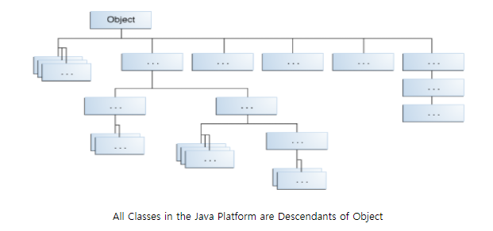

# 목표
자바의 상속에 대해 학습하세요.

## 학습 내용
* [자바 상속](#자바-상속)
  * [상속이란](#상속이란)
  * [상속하는 방법](#상속하는-방법)
  * [자바 상속 특징](#자바-상속-특징)
  * [상속을 사용하는 이유](#상속을-사용하는-이유)
  * [상속과 접근제어 지시자](#상속과-접근제어-지시자)
  * [Subclass](#Subclass)
  * [상속과 Casting](#상속과-Casting)
* [super 키워드](#super-키워드)
* [메서드 오버라이딩](#메서드-오버라이딩)
* [Dynamic Method Dispatch](#Dynamic-Method-Dispatch)
* [추상 클래스](#추상-클래스)
* [final 키워드](#final-키워드)
* [Object 클래스](#Object-클래스)
* [참고 사이트](#참고-사이트)

## 추가 학습 내용
* [Double Dispatch](#Double-Dispatch)
* [Visitor 패턴](#Visitor-패턴)


### 자바 상속

#### 상속이란
`Java` 언어에서 상속이란 어떤 클래스가 다른 클래스로부터 필드와 메서드를 물려받는 것을 의미합니다.

#### 상속하는 방법
클래스를 정의할때 `extends` 키워드를 이용하여 다른 클래스를 상속받을 수 있습니다.

```java
public class Child extends Parent {
    // child 클래스는 parent 클래스를 상속했습니다.
}

public class Parent {
    // 암묵적으로 Parent는 Object 클래스를 상속하고 있습니다.
}
```

#### 자바 상속 특징
`Java` 언어의 상속은 다음의 특징을 가지고 있습니다.

- **`Java` 언어에서는 단일 상속만을 지원합니다. 따라서 하나의 클래스가 여러 클래스를 상속할 수 없습니다.**
- 다른 클래스로부터 상속된(혹은 파생된) 클래스를 `subclass` 혹은 `child class`라고 합니다.
- `subclass`가 파생된 클래스를 `superclass` 혹은 `parent class`라고 합니다.
- 상속은 패키지에 상관없이 가능합니다.
- **상속은 한방향으로만 연속적으로 생길 수 있습니다. 따라서 아래와 같은 코드는 작성될 수 없습니다.**
    ```java
    public class Child extends Parent {
    }

    public class Parent extends Grandparent {
    }

    public class Grandparent extends Child {
        // 컴파일 에러가 발생합니다. 이러한 순환 상속은 불가능하기 때문입니다.
        // extends Child를 제거하면 아무런 문제가 없습니다.
    }
    ```
- **`Object`라는 클래스를 제외하고 모든 클래스는 하나의 `superclass`를 무조건 가지고 있습니다.**
- **만약 `superclass`가 클래스에 명시되어 있지 않다면, 그 클래스는 암묵적으로 `Object` 클래스를 상속받습니다.**
      
    이미지 출처(source) - [Oracle 공식 튜토리얼](https://docs.oracle.com/javase/tutorial/java/IandI/subclasses.html)
- **`subclass`는 `superclass`의 모든 멤버들(필드, 메서드, 중첩 클래스)을 상속받습니다.**
    ```java
    public class Child extends Parent {
        // Child 클래스는 Parent 클래스의 number, method1, InnerClass를 모두 상속 받습니다. 
    }

    public class Parent {
        public int number;

        public void method1() {
        }
        
        public class InnerClass {
        }
    }

    public class Main {
        public static void main(String[] args) {
            Child child = new Child();
            
            child.number = 10;
            child.method1();
            child.new InnerClass();
        }
    }
    ```
- **`생성자`는 상속되지 않지만, `subclass`에서 `superclass`의 `생성자`를 호출 할 수 있습니다.**

#### 상속을 사용하는 이유
**`Java` 언어에서 상속을 하는 이유는 이미 존재하는 클래스의 메서드와 필드를 재사용할 수 있기때문입니다.** 즉, 여러분이 새 클래스를 만들고자 하고, 구현하고자 하는 코드가 이미 다른 클래스에 존재한다면, 여러분은 새로 작성할 필요없이 클래스 상속을 통해 이미 작성한 코드를 재사용할 수 있게됩니다. **하지만 단순히 재사용만을 위해 상속을 사용하게되면 OOP의 목적과는 맞지 않는 클래스가 될 수 있습니다. 따라서 상속을 사용할때는 OOP의 목적에 맞으면서 재사용이 가능할때 적절히 사용하는게 좋습니다.**

#### 상속과 접근제어 지시자
- **`subclass`는 `superclass`의 `public` 과 `protected` 멤버만 상속받을 수 있습니다.** 
    ```java
    // package path: .../child
    public class Child extends Parent {
        public void method1() {
            System.out.println(this.number); // 컴파일 에러 - 현재 subclass가 다른 패키지에 있기때문에, default 접근제어 지시자가 붙은 필드가 상속되지 않습니다.
            System.out.println(this.protected_number);
            System.out.println(this.public_number);
            System.out.println(this.private_number); // 컴파일 에러 - private 접근제어 지시자가 붙은 필드는 상속되지 않습니다.
        }
    }

    // package path: .../parent
    public class Parent {
        int number = 10;
        protected int protected_number = 20;
        public int public_number = 30;
        private int private_number = 40;
    }
    ```

- 만약 `subclass`가 `superclass`와 동일한 패키지에 존재한다면, `superclass`의 `package-private` 멤버(`default` 접근제어 지시자 멤버) 또한 상속받을 수 있습니다.
    ```java
    // package path: .../parent
    public class Child extends Parent {
        public void method1() {
            System.out.println(this.number); // 같은 패키지에 있기때문에, default접근제어 지시자가 붙은 필드도 상속이됩니다.
        }
    }

    // package path: .../parent
    public class Parent {
        int number = 10;
    }
    ```

- 기본적으로 `superclass`의 `private` 멤버는 상속되지 않지만, 만약 `superclass`의 `public` 혹은 `protected` 메서드가 `private` 멤버에 접근하고 있으면, 이 메서드를 통해 `superclass`의 `private` 멤버에 접근이 가능합니다.
    ```java
    public class Child extends Parent {
        public void method1() {
            System.out.println(this.number); // 10이 출력됩니다.
        }
    }

    public class Parent {
        private int number = 10;

        protected int getPrivateNumber() {
            return this.number;
        }
    }
    ```

- 중첩 클래스는 둘러싼 클래스의 모든 `private` 멤버에 접근이 가능하기때문에, `subclass`에 상속된 중첩클래스를 통해 `superclass`의 `private` 멤버에 간접적으로 접근할 수 있습니다.

#### Subclass
`subclass`에서는 다음과 같은 일들을 할 수 있습니다.

- 상속된 필드들은 다른 필드들처럼 직접적으로 사용이 가능합니다.(`.`연산자 이용)
- `subclass`에서 동일한 이름의 필드를 선언할 수 있습니다. 하지만 이는 `superclass`의 필드를 가리기 때문에 추천하는 방식은 아닙니다.
- `subclass`에는 새로운 필드를 추가할 수 있습니다.
- 상속된 메서드 역시 다른 메서드처럼 직접적으로 사용이 가능합니다.
- `subclass`에서 동일한 메서드 시그니처를 갖는 메서드를 작성할 수 있습니다. 이럴 경우, `superclass`의 메서드를 덮어씁니다.(method overriding)
- `subclass`에서 동일한 메서드 시그니처를 갖는 `static` 메서드를 작성할 수 있습니다. 이럴 경우, `superclass`의 메서드를 가리게됩니다(hiding).
- `subclass`에 새로운 메서드를 추가할 수 있습니다.
- `subclass`에 `superclass`의 생성자를 호출 할 수 있는 생성자를 선언할 수 있습니다.(`super` 키워드 이용)

#### 상속과 Casting
```java
public class Child extends Parent {

}

public class Parent {

}

public class main {
    public static void main(String[] args) {
        Child child = new Child();
        Parent parent = new Child();
        Object object = new Child();
    }
}
```

위의 코드를 보면 **`Child` 클래스 타입의 인스턴스는 타입 캐스팅을 명시적으로 선언하지 않아도 각각 `Parent`, `Object` 클래스 타입으로 캐스팅될 수 있습니다.**  
이러한 이유는, `Child` 클래스가 `Parent` 클래스의 `subclass`이기 때문입니다.(암묵적 형변환이 가능)  
쉽게 이해하자면, `subclass`는 이미 `superclass`의 모든 데이터를 가지고 있습니다. 따라서 `superclass`로 타입을 변경하더라도 `superclass`가 필요로 하는 데이터가 전부 있기 때문에 문제가 없습니다.  

**하지만 반대로 `Parent` 혹은 `Object` 클래스 타입의 인스턴스는 `Child` 타입으로 캐스팅 될 수 없습니다.** 따라서 `Child child = new Parent();`라는 코드를 작성하면 컴파일 에러가 발생합니다.  
만약 강제 캐스팅을 위해 `Child child = (Child) new Parent();` 라고 작성하게되면, 컴파일에러는 사라지게 되지만, 런타임시 `ClassCastException` 예외가 발생하게됩니다.
이러한 이유는 `superclass`는 자기를 상속받는 클래스가 누구인지 알수도 없고, 또한 그 `subclass`가 더 많은 데이터를 가지고 있을 수도 있기때문에, `superclass`가 `subclass`가 필요로 하는 데이터를 모두 가진다고 확신할 수 없기때문입니다.

만약 아래의 코드처럼 `Child`의 인스턴스를 생성하면서 `Parent`나 `Object`로 형변환 된 변수를 다시 `Child` 타입으로 명시적 캐스팅을 한다면, 이는 문제가 없이 캐스팅이 됩니다.
그러한 이유는 이미 생성할 당시 `subclass`의 데이터로 생성하였고 이를 `superclass`로 변경하였어도 실제 `subclass`의 데이터는 모두 가지고 있는 상태이기 때문에 캐스팅시, `subclass`가 필요로 하는 데이터를 모두 가진다는 것을 확신할 수 있기 때문입니다.
```java
public class Child extends Parent {

}

public class Parent {

}

public class main {
    public static void main(String[] args) {
        Child child = new Child();
        Parent parent = new Child();
        Object object = new Child();

        Child child2 = (Child) parent;
        Child child3 = (Child) object;
    }
}
```

하지만 보편적으로 **메서드의 파라미터로 받는 클래스가 캐스팅이 가능한 클래스인지 알기가 어렵습니다. 따라서 `subclass`타입으로 캐스팅을 하기전, `instanceof` 연산자를 이용하여 캐스팅이 가능한지 확인하는 것이 안전한 방법입니다.**


### super 키워드


### 메서드 오버라이딩


### Dynamic Method Dispatch


### 추상 클래스


### final 키워드


### Object 클래스


### Double Dispatch


### Visitor 패턴


