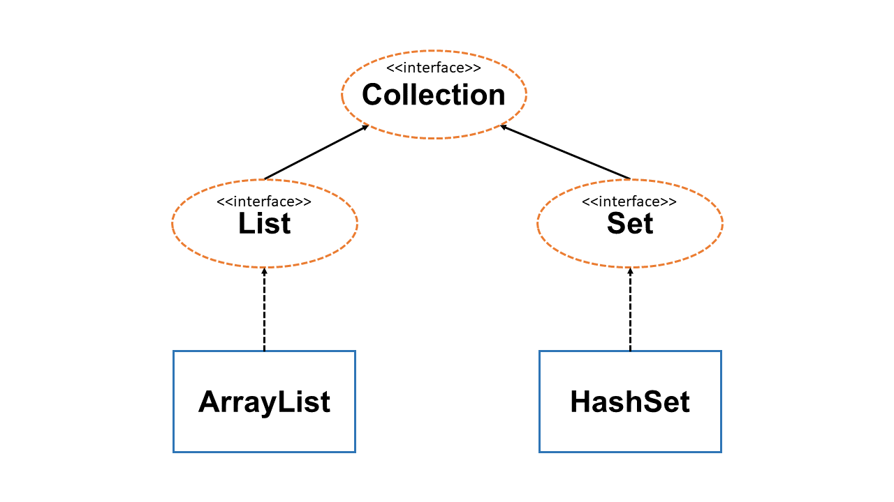

# 목표
자바의 인터페이스에 대해 학습하세요.

## 학습 내용
* [Interface](#Interface)
  * [Interface란](#Interface란)
  * [Interface 정의하기](#Interface-정의하기)
  * [Interface 구현하기](#Interface-구현하기)
    * 서로 같은 리턴타입의 중복 method 선언시, 구현 메서드는?
    * 서로 다른 리턴타입의 중복 method 선언시, 구현 메서드는?
  * [Interface 레퍼런스를 통해 구현체 사용하기](#Interface-레퍼런스를-통해-구현체-사용하기)
  * [Interface의 default method](#Interface의-default-method)
    * default method 생성 및 사용
    * 중복 default method 존재시
    * default method 와 this 키워드
    * default method 와 super 키워드
  * [Interface의 static method](#Interface의-static-method)
  * [Interface의 private method](#Interface의-private-method)
  * [Interface의 상속](#Interface의-상속)
    * 싱글 상속
    * 다중 상속
    * 서로 다른 인터페이스에 존재하는 메서드 시그니처가 같은 추상 메서드의 상속 (리턴타입이 같을 때 / 다를 때)
    * 서로 다른 인터페이스에 존재하는 메서드 시그니처가 같은 `default` 메서드의 상속 (리턴타입이 같을 때 / 다를 때)
* [참고 사이트](#참고-사이트)

# Interface

## Interface란
`Interface`는 클래스들이 구현해야 하는 동작을 지정하는데 사용되는 추상 자료형입니다. 우리가 어떤 프로그램을 여러명이서 개발한다고 하였을때, 각자가 맡은 기능에 대해 인터페이스를 정의해두면, 우리는 그 기능이 내부적으로 어떻게 구현되었는지 몰라도 그 기능을 사용하는데 문제가 없을것입니다. 예를 들자면, `A 개발자`가 `A1`이라는 기능을 만드는데 이 기능은 `A()`라고 호출하면 된다고 인터페이스를 정의하였으면, `B 개발자`는 `A1`기능을 이용하는 `B1`이라는 기능을 만들때, `A()`으로 `A1`기능을 호출하기만 하면될뿐, `A1`이 어떻게 구성되어있는지는 몰라도 되는것입니다.

`Interface`는 다음의 특징을 가지고 있습니다.
- 상수와 메서드 헤더만 선언할 수 있습니다.
- 인스턴스화 될 수 없습니다.
- 다른 클래스에 의해 구현될 수 있습니다.
- 일반 클래스를 상속할 수 없습니다.
- **여러 다른 인터페이스를 상속 할 수 있습니다.**
- `Java 8`부터 메서드 body를 구현할 수 있는 `default`와 `static` 메서드를 선언 할 수 있습니다.
-  `Java 9`부터 `private`와 `private static` 메서드를 선언 할 수 있습니다.

## Interface 정의하기
`Interface`는 `interface` 키워드를 이용하여 선언할 수 있습니다.  

```java
public interface InterfaceName extends OtherInterface, OtherInterface2 {
    
    int number = 10;

    void method();

    default void print() {
        System.out.println("print method!");
    }

    static void staticMethod() {
        System.out.println("staticMethod!");
    }

    private void privateMethod() {
        System.out.println("privateMethod!");
    }

    private static void privateStaticMethod() {
        System.out.println("privateStaticMethod!");
    }
}
```

`Interface`를 정의할때는 다음의 조건이 있습니다.
- `interface`에는 `public`과 `package-private` 접근 지시 제어자만 사용할 수 있습니다.
- 상수(`static final` 키워드가 붙은 변수)와 메서드 헤더만 선언 할 수 있습니다.
- 모든 변수는 암묵적으로 `public static final`로 취급됩니다.
- 모든 메서드 시그니처는 암묵적으로 `public`으로 취급됩니다.
- 인터페이스 내의 모든 메서드는 이미 정의상 추상적이기 때문에, `abstract` 키워드가 필요하지 않습니다.

## Interface 구현하기
`Interface`는 앞서 말했다시피, 스스로 인스턴스화 될 수 없습니다. 따라서 일반 `class`에서 `implements`라는 키워드로 구현할 수 있습니다. 또한 하나의 클래스가 여러 인터페이스를 구현할 수 있습니다.

`Interface`구현시, `interface`를 구현하는 클래스는 `interface`의 모든 메서드를 구현해야합니다. 만약 모든 메서드를 구현하지 않는다면, 해당 클래스는 `abstract` 키워드로 표시되어야합니다. 

`Interface`는 구현 예는 아래와 같습니다.

```java
public interface MyInterface {
    void myMethod();
}

public interface OtherInterface {
    void otherMethod();
}

// 인터페이스의 모든 메서드를 구현해야합니다.
public class MyClass implements MyInterface, OtherInterface {
    @Override
    public void myMethod() {
        // 메서드 구현
    }

    @Override
    public void otherMethod() {
        // 메서드 구현
    }
}

// 일부만 구현시 abstract 키워드를 붙여야합니다.
public abstract class OtherClass implements MyInterface, OtherInterface {
    @Override
    public void otherMethod() {
        // 메서드 구현
    }
}
```

앞서 하나의 클래스가 여러 인터페이스를 구현할 수 있는데, 만약에 서로 다른 인터페이스가 완전히 동일한 메서드를 가지고 있으면 어떻게 될까요?
> **만약 서로 다른 클래스가 완전히 동일한 메서드를 선언하고 있다면, 구현 클래스에서는 하나의 구현 메서드만 있으면 됩니다.** 

```java
public interface MyInterface {
    void print();
}

public interface OtherInterface {
    void print();
}

// 인터페이스의 모든 메서드를 구현해야합니다.
public class MyClass implements MyInterface, OtherInterface {
    @Override
    public void print() {
        // 메서드 구현
    }
}
```

그런데 만약 같은 메서드 시그니처이지만 반환 값이 다르다면 어떻게 될까요?
> **만약 서로 다른 리턴타입의 동일한 메서드를 선언하고 있다면, 이는 구현 클래스에서 구현할 수 없습니다.**

```java
public interface MyInterface {
    String method();
}

public interface OtherInterface {
    int method();
}

// 인터페이스의 모든 메서드를 구현해야합니다.
public class MyClass implements MyInterface, OtherInterface {
    @Override
    public String method() {
        // 컴파일 에러 발생
    }

    /*
    @Override
    public int method() {
        // 컴파일 에러 발생
    }
    */
}
```

## Interface 레퍼런스를 통해 구현체 사용하기
`Interface`는 레퍼런스 타입으로 사용이 가능합니다. 따라서 `interface`를 구현하는 모든 클래스는 구현한 `interface` 타입으로 참조변수를 선언할 수 있습니다.([다형성](https://github.com/ByungJun25/study/tree/main/java/whiteship-study/6week#Polymorphism))

`Interface`의 레퍼런스를 통해 메소드를 호출하게되면, 실구현체 내의 구현된 메소드를 호출하게 됩니다.

자바의 `Collection` 타입이 대표적인 `Interface`의 사용 예입니다.

  
**위 그림은 `Collection`의 계층도 일부만 표현하고 있습니다. 보다 자세한 계층도는 `Java Collection hierarchy`로 검색하시면 보실 수 있습니다.**

```java
public class Main {
    public static void main(String[] args) {
        Collection<Integer> listCollection = new ArrayList<>(); // ArrayList는 List interface를 구현하고 있는데, List interface는 Collection interface를 상속 받고 있습니다.
        Collection<Integer> setCollection = new HashSet<>(); // HashSet은 Set interface를 구현하고 있는데, Set interface는 Collection interface를 상속 받고 있습니다.

        listCollection.add(1); // ArrayList에 구현된 add 메서드를 호출합니다.
        setCollection.add(1); // HashSet에 구현된 add 메서드를 호출합니다.
    }
}
```

## Interface의 default method
`Java 8`부터 `interface`에 `default` 메서드를 선언할 수 있게 되었습니다. `default` 메서드는 일반 메서드 헤더의 선언과 다르게 구현부(body)를 가질 수 있습니다. 따라서 `interface`를 구현하는 클래스에서 메서드를 구현하지 않아도, `interface` 내에 구현된 부분을 호출할 수 있습니다.

`default` 메서드는 어떠한 리팩토링 없이 하위호환성을 보존하기 위해서 나왔습니다. 기존에는 `interface`에 메서드 선언이 추가되면 그 `interface`를 구현하는 하위 모든 클래스에서 선언된 메서드를 구현해야 했습니다. 이로 인해 동일한 코드가 여러 군데에 존재하는 경우가 빈번했습니다. 하지만 `default` 메서드가 나오면서, 이제 `interface`에 새로운 메서드를 추가하더라도, 구현 클래스에서 메서드 구현에 따른 추가 작업이 필요 없어졌습니다. 또한 동일한 코드가 한 군데로 모아짐에 따라 유지 보수도 훨씬 간편해졌습니다.

`default` 메서드는 암묵적으로 `public`으로 취급됩니다. 따라서 `public` 키워드를 생략할 수 있습니다.

`default` 메서드 역시 구현 클래스에서 `override`를 할 수 있습니다. `override`를 하지 않고 `this` 키워드를 통해 바로 접근할 수도 있습니다.

`default` 메서드는 다음과 같이 선언하고 사용할 수 있습니다.

```java
public interface MyInterface {
    default void print() {
        System.out.println("default print method");
    }
}

public interface OtherInterface {
    default void method() {
        System.out.println("default method");
    }
}

public class Main implements MyInterface, OtherInterface {
    public static void main(String[] args) {
        MyInterface mainClass= Main();
        mainClass.print(); // Main클래스에서 어떤 메서드도 구현하지 않았지만, MyInterface에 정의된 default 메서드가 문제없이 호출됩니다.
        mainClass.method(); // override된 Main클래스 내의 method()가 호출됩니다.
    }

    @Override
    public void method() {
        System.out.println("Main default method");
    }
}
```

그렇다면 만약 두 `interface`에 동일한 `default` 메서드가 선언되어 있다면 어떻게 될까요?
> **서로 다른 인터페이스에 동일한 default 메서드가 존재한다면 무조건 override를 해야합니다. override를 하지 않으면 컴파일 에러가 발생합니다.**

```java
public interface MyInterface {
    default void print() {
        System.out.println("MyInterface default print method");
    }
}

public interface OtherInterface {
    default void print() {
        System.out.println("OtherInterface default print method");
    }
}

public class Main implements MyInterface, OtherInterface {
    public static void main(String[] args) {
        MyInterface mainClass= Main();
        mainClass.print(); // Main클래스에서 재정의한 print 메서드가 호출됩니다.
    }

    // 서로 다른 인터페이스에 동일한 default 메서드가 존재한다면 무조건 override를 해야합니다.
    @Override
    public void print() {
        System.out.println("Main default method");
    }
}
```

만약 구현 클래스에서 인터페이스에 있는 `default` 메서드를 호출하고 싶을때는어떻게 해야할까요?
> **`super` 키워드를 이용하면 인터페이스에 있는 `default` 메서드를 호출 할 수 있습니다. 만약 재정의(override)를 하지 않았다면, `this` 키워드를 통해서도 호출할 수 있습니다.**

```java
public interface MyInterface {
    default void print() {
        System.out.println("MyInterface default print method");
    }
    default void method() {
        System.out.println("MyInterface default method");
    }
}

public interface OtherInterface {
    default void print() {
        System.out.println("OtherInterface default print method");
    }
}

public class Main implements MyInterface, OtherInterface {
    public static void main(String[] args) {
        MyInterface mainClass= Main();
        mainClass.print(); // Main클래스에서 재정의한 print 메서드가 호출됩니다.
    }

    // 서로 다른 인터페이스에 동일한 default 메서드가 존재한다면 무조건 override를 해야합니다.
    @Override
    public void print() {
        MyInterface.super.print(); // MyInterface에 정의된 default 메서드가 호출됩니다.
        OtherInterface.super.print(); // OtherInterface 정의된 default 메서드가 호출됩니다.
    }

    public void test() {
        MyInterface.super.print(); // 일반 메서드에서도 super키워드를 통해 interface의 default 메서드를 호출 할 수 있습니다.
        this.method(); // 만약 override하지 않았으면 interface의 default 메서드가 호출되고, override하였다면 override된 메서드가 호출됩니다.
    }
}
```

> 여담으로 `default` 메서드는 재귀호출도 가능합니다. 하지만 아시다시피, 인터페이스에는 변수 선언이 불가능하기에, 멈출 조건을 메서드 내에서 구현해야합니다(리턴 값을 주도록해서 조건을 구성해야합니다).

## Interface의 static method
`Java 8`부터 `interface`에 `static` 메서드를 선언할 수 있게 되었습니다. 이를 통해 이제 utility 클래스를 정의할 필요없이 관련된 utility 메서드를 모아둘 수 있게 되었고, 보다 높은 응집도를 가진 코드를 짤 수 있게되었습니다.

`interface`의 `static` 메서드는 일반 `static` 메서드와 동일합니다.

```java
public interface MyInterface {
    static void print() {
        System.out.println("MyInterface default print method");
    }
}

public class Main {
    public static void main(String[] args) {
        MyInterface.print(); // MyInterface의 static print 메서드를 호출합니다.
    }
}
```

## Interface의 private method
`Java 9`부터 `interface`에 `private` 메서드를 선언할 수 있게 되었습니다. 이를 통해 이제 좀 더 유연한 코드를 만들 수 있게되었습니다.
> 개인적인 생각으로 추가되는 게 당연하다고 생각합니다. 왜냐하면 java 8부터 `default` 메서드를 지원하게 되어, 메서드의 구현이 가능하게 되었는데 `private`를 만들 수 없다면, 하나의 메서드가 엄청나게 긴 코드를 가질 수밖에 없게 됩니다.(안 그러면 전부다 공개 메서드로 쪼개야 하는데 이렇게 되면 외부에서 어떤 메서드를 호출해야 할지 알 수가 없습니다.) 관련 있는 코드를 메서드 별로 쪼개기 위해선 `private` 메서드가 필수일 수밖에 없습니다.

`interface`의 `private` 메서드는 일반 `private` 메서드와 동일합니다.

```java
public interface MyInterface {
    default void print() {
        System.out.println(this.getText());
    }
    
    private String getText() {
        return "MyInterface default print method";
    }
}

public class Main implements MyInterface {
    public static void main(String[] args) {
        MyInterface mainClass = new Main();
        mainClass.print();
    }
}
```

## Interface의 상속
`Interface`는 상속이 가능합니다. 상속을 통해 다양하게 기능을 확장할 수 있습니다. 상속된 인터페이스를 구현하는 클래스는 인터페이스가 상속받은 추상 메서드와 인터페이스에 정의된 추상 메서드 모두 구현해야합니다. (싱글 상속 자체는 일반 클래스의 상속과 동일하게 동작한다고 보시면 됩니다.)

자식 인터페이스에서 부모 인터페이스의 추상 메서드를 `default` 메서드로 `override` 할 수도 있습니다.

`default` 메서드 상속시, 일반 클래스의 상속과 다른점이라면, 상위 인터페이스 메서드에 접근할 시, `[인터페이스명].super`로 접근할 수 있다는 점입니다.

```java
public interface MyInterface {
    void method();
    default void print() {
        System.out.println("MyInterface default method");
    }
    void test();
}

public interface OtherInterface extends MyInterface {
    void otherMethod();
    @Override
    default void print() {
        MyInterface.super.print(); // super 키워드를 통해 상위 인터페이스의 default 메서드에 접근이 가능합니다.
        System.out.println("OtherInterface default method");
    }
    @Override
    default void test() {
        System.out.println("Override test method of MyInterface") // 상위 인터페이스의 추상 메서드를 defaul 메서드로 override 할 수 있습니다.
    }
}

public class Main implements OtherInterface {
    public static void main(String[] args) {
        Main main = new Main();

        main.test(); // OtherInterface에 재정의된 test 메서드가 호출됩니다.
        main.print();  // OtherInterface에 재정의된 print 메서드가 호출됩니다.
    }

    @Override
    public void method() {
        this.print(); // OtherInterface에 재정의된 print 메서드가 호출됩니다.
    }

    @Override
    public void otherMethod() {
        this.print(); // OtherInterface에 재정의된 print 메서드가 호출됩니다.
    }
}
```

또한 `interface`는 **클래스와 다르게 다중 상속을 지원합니다.** 다중 상속을 하기 위해서는 `extends` 키워드 뒤에 `,`를 이용하여 여러 인터페이스를 작성하면 됩니다. 

```java
public interface MyInterface {
    void myMethod();
    void method();
}

public interface OtherInterface {
    void otherMethod();
}

public interface MainInterface extends MyInterface, OtherInterface {
    // myMethod 와 otherMethod를 상속 받습니다.
}
```

이러한 다중 속성으로 인해 상속시 아래와 같이 제한 조건이 있습니다.

- 메서드 시그니처는 같지만 리턴 타입이 다른 추상 메서드가 서로 다른 인터페이스에 존재할 경우, 이를 다중 상속하면 컴파일 에러가 발생합니다. (이는 `default` 메서드에도 동일하게 적용됩니다.)

    ```java
    public interface MyInterface {
        int method();
        default int getValue() {
            return 1;
        }
    }
    
    public interface OtherInterface {
        String method();
        default String getValue() {
            return "text";
        }
    }
    
    public interface MainInterface extends MyInterface, OtherInterface {
        // 컴파일 에러!
    }
    ```

- 메서드 시그니처와 리턴 타입이 같은 추상 메서드의 경우에는 문제가 없습니다. 또한 구현 클래스에서 하나의 구현만 존재하면 됩니다.

    ```java
    public interface MyInterface {
        void method();
    }
    
    public interface OtherInterface {
        void method();
    }
    
    public interface MainInterface extends MyInterface, OtherInterface {
        
    }

    public class Main implements MainInterface {
        @Override
        public void method() {
            // 구현 코드
        }
    }
    ```

- 메서드 시그니처와 리턴 타입이 같은 `default` 메서드가 서로 다른 인터페이스에 정의되어 있는 경우, 이를 다중 상속할 시, 자식 인터페이스에서 **무조건 재정의를 해줘야합니다.**

    ```java
    public interface MyInterface {
        default void print() {
            System.out.println("MyInterface default method")
        }
    }
    
    public interface OtherInterface {
        default void print() {
            System.out.println("OtherInterface default method")
        }
    }
    
    public interface MainInterface extends MyInterface, OtherInterface {
        // 재정의를 하지 않으면 컴파일 에러가 발생합니다.
        @Override
        default void print() {
            System.out.println("MainInterface default method")
        }
    }

    public class Main implements MainInterface {
        public static void main(String[] args) {
            Main main = new Main();
            main.print(); // MainInterface default method 가 출력됩니다.
        }
    }
    ```

## 참고 사이트
* [Oracle Java Document](https://docs.oracle.com/javase/tutorial/java/IandI/createinterface.html)
* [Wikipedia - Interface](https://en.wikipedia.org/wiki/Interface)
* [bealdung - Static and Default Methods in Interfaces in Java](https://www.baeldung.com/java-static-default-methods)