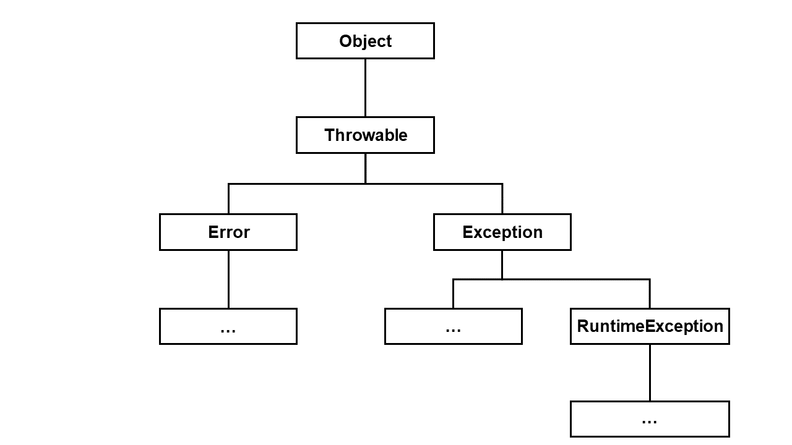

# 목표
자바의 예외 처리에 대해 학습하세요.

## 학습 내용
* [Exception과 Error](#Exception과-Error)
  * [java의 예외 계층 구조](#java의-예외-계층-구조)
  * [Error란](#Error란)
  * [Exception이란](#Exception이란)
    * [Checked Exception](#Checked-Exception)
    * [Unchecked(Runtime) Exception](#UncheckedRuntime-Exception)
    * [Exception 표시](#Exception-표시)
    * [Unchecked Exception 오해](#Unchecked-Exception-오해)
* [throw와 throws](#throw와-throws)
  * [throw](#throw)
  * [throws](#throws)
* [try, catch 그리고 finally](#try-catch-그리고-finally)
  * [try-catch](#try-catch)
  * [finally](#finally)
  * [try-with-resources](#try-with-resources)
  * [Multiple catch Blocks](#Multiple-catch-Blocks)
  * [Union catch Blocks](#Union-catch-Blocks)
* [커스텀 예외](#커스텀-예외)
  * [커스텀 예외가 필요한 이유](#커스텀-예외가-필요한-이유)
  * [Custom Checked Exception](#Custom-Checked-Exception)
  * [Custom Unchecked Exception](#Custom-Unchecked-Exception)
  * [Custom 예외생성시 참고할 점](#Custom-예외생성시-참고할-점)
* [참고 사이트](#참고-사이트)

# Exception과 Error

## java의 예외 계층 구조
java가 제공하는 예외에는 `Error`와 `Exception`이 있는데 모두 `throwable`을 상속하고 있습니다. 계층 구조는 다음과 같습니다.

  

## Error란
`Error`란 프로그램에서 복구할 수 없는 심각한 장애를 의미합니다. 보통 `JVM`이나 기타 하드웨어등의 시스템에 문제가 생겨 발생합니다. 또한 `Error`가 발생하면 프로그램은 비정상적으로 종료됩니다. `Error`의 대표적인 예로는 `StackOverFlow`, `OutOfMemory`등이 있습니다.

```java
public class ErrorExample {
  public static void main(String[] args) {
    ErrorExample.infiniteLoop(0); // java.lang.StackOverflowError 발생
  }

  public static void infiniteLoop(int number) {
    infiniteLoop(number++);
  }
}
```

## Exception이란
`Exception`이란 프로그램 내에서 복구할 수 있는 장애를 의미합니다. 보통 프로그램 실행중에 발생하며, 정상적인 프로그램 흐름을 방해합니다. 하지만 복구 코드를 구성하여 `Exception`이 발생할 경우 이를 복구할 수 있습니다. `Exception`이 발생하면, 런타임 시스템은 `callstack`내에서 이를 핸들링할 수 있는 메서드를 찾기 시작합니다. 만약 `callstack`내에서 해당 `Exception`을 핸들링 할 수 있는 메서드를 찾을 수 없다면, 런타임 시스템은 종료됩니다.

```java
public class ExceptionExample {
  public static void main(String[] args) {
    try {
      Integer.parseInt("test");
    } catch (NumberFormatException e) {
      System.out.println("NumberFormatException 발생");
    }
  }
}
```

## Checked Exception
`Checked Exception`이란 프로그램의 제어밖에서 발생하는 오류를 의미합니다. 대표적으로 `FileNotFoundException`이 있는데, 이는 파일이 존재하지 않을 경우 발생하는 `Exception`입니다. 이처럼 오류의 발생 원인이 내부가 아닌 외부에 있는것이 `Checked Exception`입니다. `java`는 이 `Checked Exception`을 컴파일 시점에 확인합니다. 즉, 우리가 `Checked Exception`을 가진 코드를 사용할때는 항상 이를 핸들링할 코드(`try-catch 혹은 throws`)를 구현해야합니다.

`Checked Exception`은 메서드를 호출하는 곳에서 이를 핸들링할 코드를 만들어야하는 합당한 이유가 있을때 사용하는 것이 좋습니다.

```java
public class IOExceptionExample {
  public static void main(String[] args) {
    try (FileReader reader = new FileReader("invalidFileName")) {
      // code..
    } catch (FileNotFoundException e) {
      System.out.println("FileNotFoundException 발생");
    } catch (IOException e) {
      System.out.println("IOException 발생");
    }
  }
}
```

## Common Checked Exceptions
1. IOException
  `IOException`은 `input`혹은 `output` 작업이 실패할때 발생하는 예외입니다. 예로 `FileNotFoundException`, `MalformedURLException`등이 있습니다.

    ```java
    public class IOExceptionExample {
      public static void main(String[] args) {
        try (FileReader reader = new FileReader("invalidFileName")) {
          // code..
        } catch (FileNotFoundException e) {
          System.out.println("FileNotFoundException 발생");
        } catch (IOException e) {
          System.out.println("IOException 발생");
        }
      }
    }
    ```

2. ParseException
  `ParseException`은 텍스트를 파싱하는 작업이 실패할때 발생하는 예외입니다.

    ```java
    public class ParseExceptionExample {
      public static void main(String[] args) {
        try {
          new SimpleDateFormat("MM-dd-yyyy").parse("test");
        } catch (ParseException e) {
          System.out.println("ParseException 발생");
        }
      }
    }
    ```

3. InterruptedException
  `InterruptedException`는 다른 쓰레드가 `waiting` 혹은 `timed_wating` 상태인 쓰레드를 인터럽트할때 발생하는 예외입니다. (`interrupt` 메서드를 통해 다른 쓰레드를 인터럽트 할 수 있습니다.)

    ```java
    public class InterruptedExceptionExample {
      public static void main(String[] args) {
        subThread subThread = new subThread();
        subThread.start();
        subThread.interrupt();
      }

      public static class subThread extends Thread {
        @Override
        public void run() {
          try {
            Thread.sleep(10000); // 10초가 sleep
          } catch (InterruptedException e) {
            System.out.println("InterruptedException 발생");
          }
        }
      }
    }
    ```

## Unchecked(Runtime) Exception
`Unchecked Exception`이란 프로그램이 실행될때, 사용하는 방법에 의해 발생하는 오류를 의미합니다. 대표적으로 `NullPointerException`이 있습니다. 이는 사용하고자 하는 객체의 포인터가 `null`을 가리킬때 발생하는 예외입니다. 이처럼 사용하는 상황과는 상관없이 사용 방법이 잘못되었을때 `Unchecked Exception`이 발생합니다. `java`는 이 `Unchecked Exception`을 컴파일 시점에 확인하지 않습니다. 따라서 `Unchecked Exception`은 `throws` 키워드를 이용하여 메서드에 선언할 필요도 없습니다. 그러므로 이를 핸들링할지 말지는 사용자가 직접 정해야합니다.

## Common Unchecked Exceptions
1. NullPointerException
  `NullPointerException`은 객체를 필요로 하는 곳에서 `null`을 사용하려고 시도할때 발생하는 예외입니다.

    ```java
    public class Example {
      public static void main(String[] args) {
        String text = null;
        text.length(); // nullPointerException 발생
      }
    }
    ```

2. ArrayIndexOutOfBoundsException
  `ArrayIndexOutOfBoundsException`은 잘못된 인덱스에 접근할때 발생하는 예외입니다.

    ```java
    public class Example {
      public static void main(String[] args) {
        int[] numbers = new int[5];
        int number = numbers[5]; // arrayIndexOutOfBoundsException 발생
      }
    }
    ```

3. StringIndexOutOfBoundsException
  `StringIndexOutOfBoundsException`은 텍스트의 길이보다 크거나 같은 인덱스에 접근할때 발생하는 예외입니다.

    ```java
    public class Example {
      public static void main(String[] args) {
        String text = "Test text";
        text.charAt(9); // stringIndexOutOfBoundsException 발생
      }
    }
    ```

4. NumberFormatException
  `NumberFormatException`은 텍스트가 변환하고자하는 숫자 데이터 형식에 맞지 않을때 발생하는 예외입니다.

    ```java
    public class Example {
      public static void main(String[] args) {
        int number = Integer.parseInt("text"); // numberFormatException 발생
      }
    }
    ```

5. ArithmeticException
  `ArithmeticException`은 산술 연산을 실행할때, 해당 연산이 잘못된 조건일때 발생하는 예외입니다.

    ```java
    public class Example {
      public static void main(String[] args) {
        int num1 = 3;
        int num2 = 0;
        int result = num1 / num2; // arithmeticException 발생
      }
    }
    ```

6. ClassCastException
  `ClassCastException`은 런타임시 객체를 다운 캐스팅할때, 맞는 인스턴스가 아닌 객체를 캐스팅할때 발생하는 예외입니다.

    ```java
    public static class Parent {}
    public static class Child extends Parent {}
    public static class Child2 extends Parent {}

    public class Example {
      public static void main(String[] args) {
        Parent child = new Child();
        Child2 child2 = (Child2) child; // ClassCastException 발생
      }
    }
    ```

7. IllegalArgumentException
  `IllegalArgumentException`은 어떤 메서드를 호출할때, 잘못된 변수를 전달하면 발생하는 예외입니다.

    ```java
    public class Example {
      public static void main(String[] args) {
        Thread.sleep(-1); // illegalArgumentException 발생
      }
    }
    ```

8. IllegalStateException
  `IllegalStateException`은 메서드 호출이 잘못된 시점에 호출되었을때 발생하는 예외입니다.

    ```java
    public class Example {
      public static void main(String[] args) {
        ListIterator<Object> it = new ArrayList<>().listIterator();
        it.remove(); // illegalStateException 발생
      }
    }
    ```

## Exception 표시
`Checked Exception`의 경우 컴파일러가 체크를 해주지 않기때문에, 우리는 다른 사용자에게 이 메서드가 Exception이 있다는 것을 알려야합니다. 이는 `javadoc`을 이용하면 쉽고 간편하게 구성할 수 있습니다. `javadoc`에서는 `@throws` 와 `@exception` 키워드를 통해 메서드 내의 `Exception`에 대한 설명을 추가할 수 있도록해줍니다.

사용 예시는 아래와 같습니다.

```java
/** 
 * @throws Exception explanation
 * @exception IllegalArgumentException explanation
*/
public void method() throws Exception {
  throw new IllegalArgumentException();
}
``` 

## Unchecked Exception 오해
`Springframework`에서는 `Transaction`설정과 관련하여 `Unchecked Exception`에 대해 `roll-back`기능을 지원합니다. 하지만 이는 `Springframework`의 `transaction`설정이 제공하는 것이지, 순수 자바 언어에서 지원하는 것이 아닙니다. 이 기능은 `springframework`가 구현한 기능일뿐, **`java`가 제공해주는 `Unchecked Exception`은 `roll-back` 기능이 없습니다.** 따라서 이를 `java`에서 제공해준다고 알고 있지 않기를 바랍니다.

> [Springframework 공식 문서](https://docs.spring.io/spring-framework/docs/current/reference/html/data-access.html#transaction-declarative-attransactional-settings)

**아래 `H2`를 이용한 순수 자바 sql 문의 예시를 보면 어떤 예외든지 `java`에서 제공하는 예외는 `roll-back` 처리를 해주지 않는것을 알 수 있습니다.**

```java
public class Example {
  public static void main(String[] args) throws SQLException {
    String url = "jdbc:h2:mem:";
    Connection con = DriverManager.getConnection(url);

    try (Statement stm = con.createStatement()) {
      stm.execute("CREATE TABLE TEST (id INTEGER not NULL, value VARCHAR(255), PRIMARY KEY(id))");
      Example.insert(stm, 1, "test1"); // test1 입력.
      
      Example.createRuntimException(); // 런타임 에러 발생.
      
      Example.insert(stm, 2, "test2"); // test2는 입력되지 않음.
    } catch (SQLException ex) {
      System.out.println(ex);
    } catch (RuntimeException e) {
      System.out.println("RuntimeException 발생");
    } catch (Exception exception) {
      System.out.println("Exception 발생");
    }

    try (Statement stm = con.createStatement(); ResultSet rs = stm.executeQuery("SELECT * FROM TEST")) {
      while(rs.next()) {
        String value = rs.getString("value");
        System.out.println("Value: "+value); // test1이 출력됨.
      }
    } catch (SQLException ex) {
      System.out.println(ex);
    } catch (RuntimeException e) {
      System.out.println("RuntimeException 발생");
    } catch (Exception exception) {
      System.out.println("Exception 발생");
    }

    try {
      con.close();
    } catch (SQLException ex) {
      System.out.println(ex);
    }
  }

  public static void insert(Statement stm, int id, String value) throws SQLException {
    stm.execute("INSERT INTO TEST VALUES ("+id+", '"+value+"')");
  }

  public static void createRuntimException() {
    throw new RuntimeException();
  }

  public static void createException() throws Exception {
    throw new Exception();
  }
}
```

> 구현된 코드는 [[Github - 소스코드]](https://github.com/ByungJun25/study/tree/main/java/whiteship-study/9week/java/src/main/java/com/bj25/study/java/exceptions/h2example)에서 보실 수 있습니다.

# throw와 throws

## throw
`throw` 키워드는 명시적으로 예외를 만들어낼때 사용됩니다. 요구하고자 하는 조건에 맞지 않는 경우가 호출될 경우, 이를 거절하기위해 `throw`키워드를 통해 예외를 만들어낼 수 있습니다. 또한 `throw` 키워드를 통해 앞서 발생된 예외에 새로운 내용을 추가하거나 혹은 더 자세한 예외로 만들어 낼 수도 있습니다.

다음의 예시를 통해 상황에 따라 어떻게 사용되는지 알아보도록 하겠습니다.

1. 요구하고자 하는 조건에 맞지 않는 변수로 호출할 경우, 이를 거절할때

```java
public void method(String text) {
  if(StringUtils.isBlank(text)) {
    throw new IllegalArgumentException("The text is required!");
  }
}
```

위와 같이 `throw` 키워드를 통해 예외를 만들어줌으로써, 메서드 호출자는 빈 문자열로 메서드를 호출할 수 없게됩니다. 따라서 호출자는 메서드 호출에 앞서 이를 검증하는 과정을 추가하거나 혹은 이 예외를 핸들링해줄 코드를 호출지점에 구성해야합니다.

2. 좀 더 명확한 예외로 전달하고 싶을때

```java
public void outerMethod(String text) {
  try {
    this.innerMethod(text);
  } catch (IOException e) {
    throw new InnerMethodException(e, "Reason"); // Runtime Exception이라고 가정.
  }
}

public void innerMethod(String text) throws IOException {
  // IOException이 발생하는 코드 존재
}
```

위의 예시 처럼 하위에서 예외가 발생하고, 그 예외를 처리하는 `try-catch`에서 다시 `throw` 키워드를 이용하여 보다 더 자세한 예외로 던지도록 할 수 있습니다.

## throws
`throws` 키워드는 `Checked Exception`에 한하여 현재 메서드에서 복구 코드를 구성하지 않고, 이에 대한 의무를 호출자에게 위임하기위해 사용됩니다. 이를 통해 가장 손쉽게 예외처리를 할 수 있을뿐만 아니라, 호출자가 예외에 대한 복구 코드를 구성해야하는 것을 강제하기 때문에 컴파일 타임에서 안전한 코드를 구성할 수 있습니다.

`throws` 키워드를 통해 여러 예외를 동시에 선언할 수도 있습니다.

```java
public void method() throws FileNotFoundException, ParseException, IOException {
  Scanner contents = new Scanner(new File("invalidFile"));
  new SimpleDateFormat("MM-dd-yyyy").parse(contents.nextLine());
}
```

# try, catch 그리고 finally

## try-catch
만약 예외를 던지는 메서드를 호출하고 이러한 예외에 대한 복구 코드를 직접 구성하고 싶다면, `try-catch` 문을 사용하면 됩니다.  
`try-catch` 문은 try 내부에 있는 코드를 실행하다가, 예외가 발생할 경우 이 예외를 다루는 catch 부분으로 이동하여 예외 처리 코드가 실행됩니다.  

`try-catch` 문은 다음과 같이 구성할 수 있습니다. 

```java
try {
  // 실행하고자 하는 코드 및 예외 발생 코드
} catch ([예외 클래스] [변수명]) {
  // 예외 처리 코드
}
```

또한 `try` 내에서 실행되는 코드는 예외가 발생하기 전까지는 정상적으로 모두 실행됩니다. 하지만 예외가 발생하면 예외가 발생된 지점 이후의 코드는 실행되지 않습니다.

```java
public class Example {
  public static void main(String[] args) {
    int i = 0;
    
    try {
      i++;
      Example.exception();
    } catch (Exception e) {
      System.out.println("1st try-catch: "+i); // 1이 출력됩니다.
    }

    i = 0;

    try {
      Example.exception();
      i++;
    } catch (Exception e) {
      System.out.println("2st try-catch: "+i); // 0이 출력됩니다.
    }
  }

  public static void exception() throws Exception {
    throw new Exception();
  }
}
```

## finally
우리는 앞서 `try-catch`문을 통해 예외를 다루는 방법에 대해 배웠습니다. 그런데 만약 예외가 발생하건 말건 무조건 실행해야 하는 코드가 있다면 이는 `finally` 키워드를 이용하여 실행할 수 있습니다.

```java
public void openFile() {
  Scanner scanner = null;
  try {
    scanner = new Scanner(new File("file"));
    String text = scanner.nextLine();
  } catch (FileNotFoundException e) {

  }
}
```

위 코드와 같이 파일을 열게되면, java는 파일 연결에 대한 자원을 OS에 반납하지 않습니다. 따라서 이러한 경우에는 예외가 발생하든 말든 무조건 `close` 메서드를 호출하여 자원을 반납해줘야 합니다. 따라서 위 코드를 아래와 같이 `finally`를 이용하여 수정할 수 있습니다. 또한 아래 코드를 보면 알 수 있듯이, `catch` 부분에서 메서드를 종료하더라도 `finally` 부분을 무조건 실행됩니다.

```java
public void openFile() {
  Scanner scanner = null;
  try {
    scanner = new Scanner(new File("file"));
    String text = scanner.nextLine();
  } catch (FileNotFoundException e) {
    return; // return을 하더라도 finally 부분이 실행됩니다.
  } finally {
    if(scanner != null) {
      scanner.close(); // 자원을 반납.
    }
  }
}
```

## try-with-resources
앞서 본 코드 예제에서 만약 `close` 메서드에서 예외가 발생하여 결국 자원을 반납하지 못한다면 어떻게 될까요? 이렇게 되면 우리는 또 이에 대한 복구 코드를 짜야 할 것입니다. 그러면 한없이 계속 이어지는 복구 코드가 만들어질 수도 있습니다. 하지만 다행스럽게도 `java 7`부터 `try-with-resources`라는 것을 지원합니다. 이는 `AutoCloseable`이라는 인터페이스를 구현한 클래스에 한해 `try`에 선언된 클래스의 `close` 메서드를 자동으로 호출해주는 기능입니다.

이를 이용하면 앞서 구현된 코드를 다음과 같이 간략하게 짤 수 있습니다.

```java
public void openFile() {
  try (Scanner scanner = new Scanner(new File("file"))) {
    String text = scanner.nextLine();
  } catch (FileNotFoundException e) {
    return;
  }
}
```

`try-with-resources`를 사용하기위해서는, `AutoCloseable`을 구현한 클래스를 `try` 부분에 선언해야합니다. 또한 이를 이용하면 `finally`를 통한 명시적 `close` 메서드 호출없이도 자동으로 `close` 메서드를 호출해주는 것을 보장해줍니다.

`try-with-resources`는 또한 아래와 같이 여러개의 리소스들을 선언할 수도 있습니다.

```java
public void example() {
  try (Statement stm = con.createStatement(); ResultSet rs = stm.executeQuery("SELECT 1+2")) {

  } catch (SQLException ex) {

  }
}
```

다음과 같이 `AutoCloseable`의 `close` 메서드를 재정의하면 `try-with-resources`에 사용이 가능합니다.

```java
public class CustomResources implements AutoCloseable {
  @Override
  public void close() throws Exception {
    // 구현 코드
  }
}

public class Main {
  public static void main(String[] args) {
    try (CustomResources crs = new CustomResources()) {

    } catch (Exception ex) {

    }
  }
}
```

## Multiple catch Blocks
앞서 배운 `try-catch` 및 `try-with-resources` 문은 모두 여러 `catch`를 가질 수 있습니다.

```java
/// try-catch
try {
  new SimpleDateFormat("MM-dd-yyyy").parse("test");
} catch (ParseException e) {
  System.out.println("ParseException 발생");
} catch (Exception ex) {
  System.out.println("Exception 발생");
}

/// try-with-resources
try (Statement stm = con.createStatement(); ResultSet rs = stm.executeQuery("SELECT 1+2")) {

} catch (SQLException ex) {

} catch (Exception e) {

}
```

하지만 여러개의 `catch`를 사용할때 주의사항이 있습니다. 바로 `Exception` 클래스의 선언 순서입니다. **상위 예외 클래스는 하위 예외 클래스보다 더 앞서 선언할 수 없습니다.**

## Union catch Blocks
앞서 `catch`를 여러개 만들 수 있다고 하였는데, 하나의 `catch`에 여러 예외를 가질 수도 있습니다.

```java
try {
  // code
} catch (NullPointerException | StringIndexOutOfBoundsException e) {
  System.out.println("NullPointerException 혹은 StringIndexOutOfBoundsException 발생");
}
```

이 문법도 주의사항이 있습니다. 바로 **상위 예외 클래스가 선언되어있다면, 하위 예외 클래스를 선언할 수 없다는 것입니다.**

# 커스텀 예외

## 커스텀 예외가 필요한 이유

## Custom Checked Exception
`Exception` 클래스를 상속하면 `Custom Checked Exception` 클래스를 만들 수 있습니다.

```java
public class CustomException extends Exception {
}

public class Main {
  public static void main(String[] args) {
    try {
      Main.method();
    } catch(CustomException ex) {

    }
  }

  public static void method() throws CustomException {
    throw new CustomException();
  }
}
```

## Custom Unchecked Exception
`RuntimeException` 클래스를 상속하면 `Custom Unchecked Exception` 클래스를 만들 수 있습니다.

```java
public class CustomRuntimeException extends RuntimeException {
}

public class Main {
  public static void main(String[] args) {
    Main.method();
  }

  public static void method() {
    throw new CustomRuntimeException();
  }
}
```

## Custom 예외생성시 참고할 점
* 커스텀 예외 클래스의 명칭은 java에서 제공하는 예외 클래스들처럼 이름에서 그 예외가 무엇인지 알 수 있도록 명명하는 것이 좋습니다.
* Super 클래스의 모든 생성자를 호출하는 각 생성자를 만들어 두는 것이 좋습니다.(이는 `Chained Exception`을 적극 활용할 수 있도록 해줍니다.)
* 중복되는 예외 클래스의 정의는 되도록 지양하도록 합니다. 중복된 예외는 오히려 원인을 밝히기 어렵게 만듭니다.

## 참고 사이트
* [Baeldung - Common Java Exceptions](https://www.baeldung.com/java-common-exceptions)
* [Baeldung - Checked and Unchecked Exceptions in Java](https://www.baeldung.com/java-checked-unchecked-exceptions)
* [Baeldung - Exception Handling in Java](https://www.baeldung.com/java-exceptions)
* [Baeldung - Java – Try with Resources](https://www.baeldung.com/java-try-with-resources)
* [Baeldung - Java Global Exception Handler](https://www.baeldung.com/java-global-exception-handler)
* [Baeldung - Performance Effects of Exceptions in Java](https://www.baeldung.com/java-exceptions-performance)
* [Baeldung - Create a Custom Exception in Java](https://www.baeldung.com/java-new-custom-exception)
* [Oracle - Chained Exceptions](https://docs.oracle.com/javase/tutorial/essential/exceptions/chained.html)